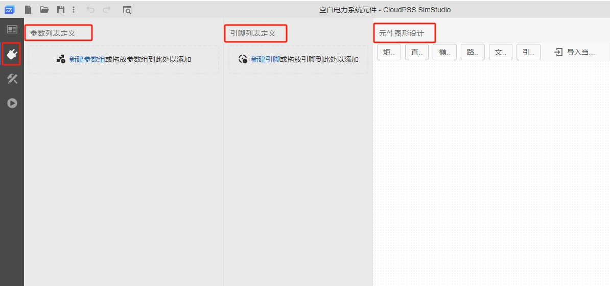

本节介绍自定义潮流元件的实现方法，并用 EMTLab 的官方元件为案例，详细介绍自定义潮流元件的构建过程。

## 功能定义
EMTLab 提供的自定义潮流元件功能。

## 功能说明
用户可通过元件实现中潮流实现功能，为拓扑实现的元件提供简化的潮流模型，或为 Octave 代码实现的电磁暂态元件提供相应的潮流模型。新建**空白电力系统元件**或在原元件的项目实现页面，点击**实现标签页**，选择**潮流**实现，点击**创建潮流实现**按钮，即可为相应元件创建对应的潮流模型。

元件的潮流实现分为两部分，**潮流模型定义**和**潮流输出定义**，前者将元件映射到潮流计算过程中的各类阻抗和负荷模型，后者则用于生成元件的潮流回写数据，将需要的潮流结果写回元件参数，用于暂态仿真初始化等功能。

### 元件基础配置
潮流元件**接口标签页**的参数列表、引脚列表和元件图形等基础配置可参考 [模块封装](../../simstudio/basic/moduleEncapsulation/index.md) 帮助文档，本节不在赘述。

### 潮流模型定义
**创建潮流实现**后，在潮流实现页面左侧可对潮流模型定义进行编辑。点击**新建潮流模型**创建新的空白潮流模型定义，也可以使用拖放和复制粘贴功能复用已有的模型定义。

该部分定义此元件潮流模型的类型，以及潮流数据的来源。
#### 母线
#### PV 节点 / PQ 节点 / 平衡节点
#### 静态负荷
#### 对地导纳
#### 短路线
#### 传输线
#### 两绕组变压器

### 潮流输出定义
该部分定义潮流结果的返回值相关处理。
#### 表达式书写
#### 节点类模型返回值变量

#### 支路类模型返回值变量

## 案例
import Tabs from '@theme/Tabs';
import TabItem from '@theme/TabItem';

<Tabs>
<TabItem value="case1" label="静态负载">

</TabItem>
<TabItem value="case2" label="三相传输线">

</TabItem>
<TabItem value="case3" label="三相三绕组变压器">

</TabItem>
<TabItem value="case4" label="同步发电机">

</TabItem>
</Tabs>

## 常见问题 Q&A
如何处理自定义直流系统的潮流？
: