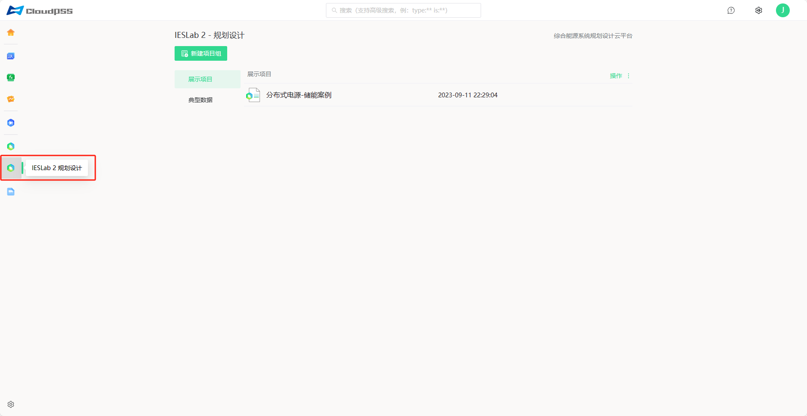
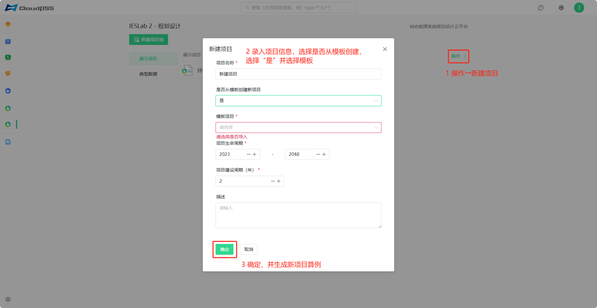

本节主要介绍IESLab 规划设计平台个人中心新建项目组和项目方法。

## 功能定义

在IESLab 规划设计平台个人中心的新建项目组和项目。

## 功能说明

用户成功登录后，在 CloudPSS 个人中心点击 `IESLab 规划设计` 的图标后，页面跳转至 `IESLab 规划设计平台`，该界面包含新建项目、项目管理等。

平台算例管理采用**项目组**和**项目**的模式，参考了 PMI 中项目 Project与项目集 Program。项目组类似文件夹，项目则类似文件，一个项目组下可以有多个项目。

## 新建项目组

点击`新建项目组`，输入项目组名称及描述，`是否从已有项目组导入`若选择`是`，将会拷贝已有项目组的所有项目算例；若选择`否`，将创建一个空白项目组。

## 从模板创建新项目

点击项目组右侧的`操作`，选择`新建项目`。

在弹出的`新建项目`对话框中，输入项目名称及描述，`是否从模板创建新项目`若选择`是`，可选择一个模板算例并拷贝生成算例；若选择`否`，将创建一个空白项目。

平台内置模板算例包括：含风光储交直流配网仿真优化展示算例、楼宇型综合能源仿真优化展示算例、三联供综合能源仿真优化展示算例、分布式供能综合能源系统、集中式供能综合能源系统，用户可在模板算例的基础上快速创建修改算例。

