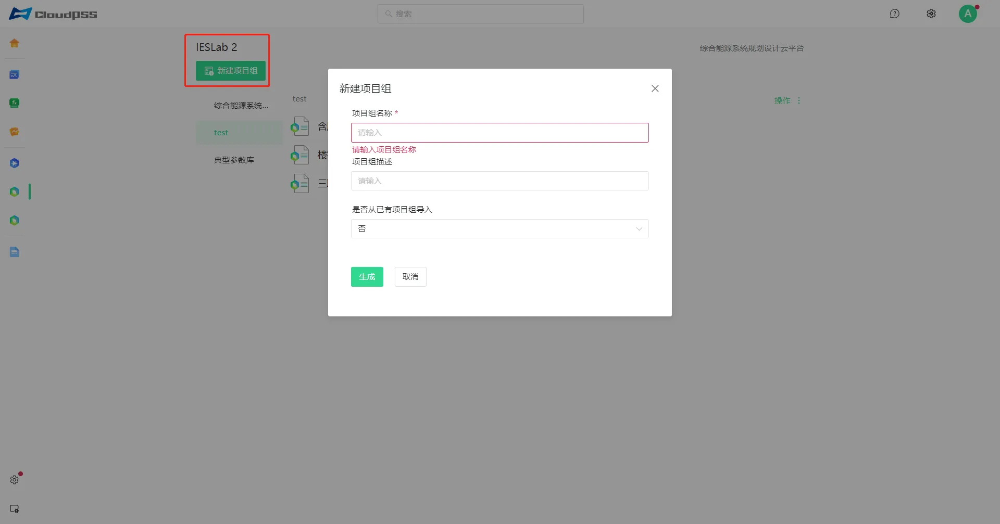
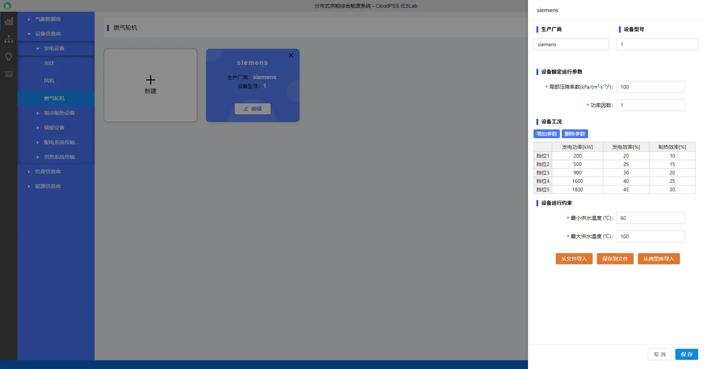
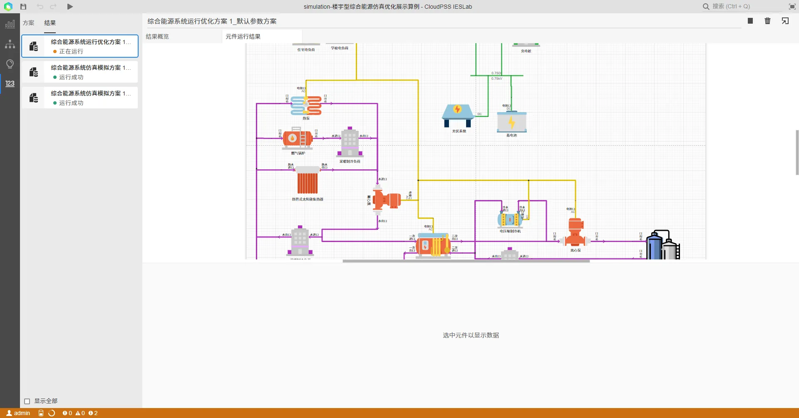

## 平台介绍

综合能源系统建模仿真平台主要面向**区域电能、热能、太阳能、风能、电池与储能**等多种能源相耦合的综合能源系统，通过建模仿真技术分析系统运行特性。平台由**数据管理**和**建模仿真**模块构成，**数据管理模块**可以对多种类型的基础数据进行录入和管理，**建模仿真模块**用于系统拓扑结构的搭建以及仿真计算结果的展示。

平台支持包括交直流电力系统、供暖制冷水热力系统在内的多能源系统耦合网络的建模仿真计算。与传统的综合能源系统仿真工具不同，平台集成了**20**余种常见的综合能源系统设备模型，允许用户灵活搭建任意能量梯级利用形式的综合能源系统，拓扑结构不受约束，同时支持并网系统、孤网系统的仿真计算。主要应用场景有：
1. 传统能源发电、新能源(风光集中式/分布式)、储能等多种能源形式构成的综合电网系统
2. 热电联产、热力锅炉、制冷制热等构成的综合热力系统

平台旨在为用户在综合能源系统的建模仿真、能量管理、运行优化等方面提供帮助，未来将陆续加入更多的功能满足用户的多样化需求。

> **仿真步骤：**
> 1.	注册登录 CloudPSS 平台，进入 CloudPSS IESLab 建模仿真平台
> 2.	建立项目，可从本地或模板导入
> 3.	数据管理模块：录入编辑项目基础参数
> 4.	拓扑编辑模块：搭建拓扑，设置仿真参数
> 5.	开始计算：仿真模拟或运行优化
> 6.	查看、导出及分析计算结果

## 建立项目

1. 新建项目或项目组，输入项目或项目组信息，其中项目组是多个项目的集合，平台向用户提供了从模板创建以及从现有项目创建的功能，方便用户快速搭建模型；

平台内置了模板项目，选择从模板创建新项目时，直接导入模板项目。另外，用户可以编辑修改项目名称，在描述里添加编辑修改项目信息。平台内置模板项目包括：含风光储交直流配网仿真优化展示项目、楼宇型综合能源仿真优化展示项目、三联供综合能源仿真优化展示项目、分布式供能综合能源系统、集中式供能综合能源系统，用户可在模板项目的基础上快速创建修改项目。

为方便项目移植拷贝，平台支持将项目导出到本地和从本地文件导入功能：点击项目的点号可以将项目导出为本地文件，点击项目组右侧的“操作”或点号可以将本地文件导入到平台。由于项目文件中的多年气象数据较多，导入导出时加载较慢，请耐心等待。

2. 打开已有项目：选中项目点击所在行，或点击“文件夹”按钮打开；通过“更多选型”按钮打开、编辑或删除。
   

## 数据管理模块

在**数据管理模块**输入仿真参数，输入参数信息后平台在**建模仿真模块**中将自动关联

### 功能简介

数据管理模块提供了友好的可视化界面，方便用户进行各类数据的录入、管理和浏览，内置**数据典型库**，包含常见厂家的多种型号设备、全国各地近几年的气象数据、**13种典型电冷热8760负荷**等

**数据管理模块**提供了友好的可视化界面，方便用户进行各类数据的录入、编辑和浏览，该模块主要由**气象数据库**、**设备信息库**、**负荷信息库**、**能源信息库**四个部分组成。

工作区上方的便捷工具主要有：切换卡片/列表展示模式，新建项目、筛选项目、搜索项目、从文件导入、批量从文件导入等。在“卡片”展示模式下，工作区有“新建”卡片可以便捷新建项目，卡片右上方的“×”可以删除卡片，选中对应卡片或点击“编辑”按钮可以打开编辑区，编辑区可以便捷设备信息，其主要快捷功能有：**从文件导入**、**保存到文件**和**从典型库导入**，平台内置常见常见的多种型号设备，方便用户录入设备。点击空白处会弹出“保存、不保存、返回”提示框

### 气象数据

**气象数据库**内置中国大陆区域近几年的**8760小时**数据，如**环境温度**、**太阳辐射强度**、**风速**等气象数据，主要用于**新能源如光伏风电**的计算，计算前需载入气象数据。地点模块内置地图插件，在后台服务器联网时可以对地图进行拖曳平移缩放等，支持搜索项目地点所在城市切换地图。通过输入项目GPS经纬度坐标、地图选点定位等方式选择项目地点，点击“载入气象数据”按钮载入气象数据。因数据量大，等待一段时间后载入气象数据成功后回自动进入“气象数据”模块展示。

*气象数据库：*

通过“气象数据”模块左上方的工具栏可以气象数据导出为 excel 文件，并支持**用户上传气象数据**，参考导出文件的格式。右侧的下拉框可以便捷选择日期。打开“编辑”按钮后，气象数据表格为可编辑状态，用户编辑后平台回自动校验用户编辑的数据合法性，数据格式不对时会提示“验证错误，请检查格式!”，关闭“编辑”按钮后，平台会自动更新并提示“更新数据成功”。

气象数据模块下方为图表展示区，用户选择数据类目查看曲线及保存图片等。

### 设备数据

**设备数据库**中，设备信息库中，用户可以将设备参数录入到设备数据库中进行管理，用户录入设备数据后，拓扑编辑模块可以选择对应设备并自动关联该设备所对应的参数。

>平台设备模型均为稳态模型，支持建立多挡位的变工况设备模型，以更好地模拟设备启停及复杂运行工况。平台设备主要分为发电设备、制冷制热设备、储能设备、配电系统传输设备和供热系统传输设备5类。
>
> 1.	发电设备有风机、光伏、燃气轮机
> 2.	制冷制热设备有燃气锅炉、热泵、热管式太阳能集热器、电压缩制冷机、吸收式制冷机
> 3.	储能设备有储热水罐和蓄电池
> 4.	配电系统传输设备有变压器、模块化多电平换流器MMC、传输线
> 5.	供热系统传输设备有离心泵与管道

### 负荷数据

**负荷信息库**中有电负荷和采暖制冷负荷数据。平台提供了**典型负荷**、**分月详细模型**和**自定义负荷**三种不同的录入形式，其中典型负荷按照设计规范进行负荷设计，内置住宅、学校、医院、办公、酒店、仓储、商场、小型工业、大型工业、影剧院、赛事馆、博物馆、超市共**13种典型8760h**负荷数据，并支持用户查看不同月份不同日期的负荷曲线。分月详细模型中，用户需录入各月份各时段的负荷；自定义负荷模型中，用户需按照平台给定的格式上传负荷曲线文件，平台会自动校验文件中数据格式问题。当用户上传的负荷曲线中时间与仿真时间不一致时，平台采用了**插值算法**计算仿真时间电对应的负荷。

*负荷参数填写：*

### 能源信息

**能源信息库**中，用户可建立**燃料**、**电**、**冷**、**热**等能源的价格等信息，用于计算系统**经济性及环保性**指标。拓扑编辑模块可以选择对应价格模型，用户绑定该能源信息后平台将自动关联并纳入环保性和经济性的计算中，计算完成后对项目方案进行经济性评价。

燃料：主要包含煤炭天然气等，分月的燃料波动价格用于计算燃料购置费，污染物排放系数则用于计算CO2等污染物排放量。

冷热价格模型分为按热量计价和按面积计价。

电价模型平台提供了分月**常数电价**、**分时电价**、**阶梯电价**和**分时阶梯电价**。在综合能源项目中，运营商一般通过向电网购电，通过建设高效的综合能源系统，向用户提供能源并获取盈利。平台绑定用电/冷/热计价模型用于计算项目收入。电网及用燃料的设备的计价模型则用于计算项目支出。

## **建模仿真模块**

****建模仿真模块**用于系统拓扑结构的搭建、计算参数设置以及计算结果的展示。用户在此可以根据需要灵活搭建综合能源系统的拓扑结构、图纸和元件格式的调整、选择设备元件并设置设备仿真策略。**

### 工作台简介

> 1) **模型**  
> 模型标签内放置了仿真拓扑构建中所需要的典型综合能源系统元件，主要包括电源设备、制冷制热设备、储能设备、电力传输设备、热力传输设备和负荷。
为更好地管理项目拓扑，模型新增工具：超链接、分割线和 Markdown 文本。超链接于指向平台系统内部的链接，如项目和元件链接等，一般应使用相对路径。如：ieslab/ies/diagram?simu_id=XXX，点击该超链接即可跳转到相应的项目。Markdown文本内容的编写支持MarkDown语法，Markdown 是一种轻量级标记语言，支持文字格式调整，图片、图表、数学公式等的输入。在进行参数编写时，输出结果将实时渲染至工作台的显示框中。
> 2) **拓扑编辑窗口**  
> 拓扑编辑窗口是进行仿真拓扑构建的编辑区域。用户可将模型库中的元件拖拽至拓扑编辑窗口内，进行元件连线及配置，并组织成完整的仿真拓扑。
鼠标右键可以选择剪切、复制、粘贴、创建副本、删除、全选、撤销、重做、顺时针旋转、逆时针旋转、导出为 SVG 图片、更新元件、元件表操作，或者通过快捷键实现上述操作。
> 为方便搭建项目，平台支持跨网页复制。可以将单个或多个元件复制到不同的项目中（即，不同的网页），实现单个或多个元件构成的复杂参数和拓扑的复制使用。
> 3) **快捷工具**  
> 拓扑编辑模块左上角的快捷工具主要有保存、撤销、恢复和元件表。其中，元件表提供了当前项目中，拓扑编辑窗口内所有的元件的信息列表，包括元件名称、参数以及引脚信息。元件表可用于批量化管理元件信息，例如复制粘贴元件参数、统一修改元件参数等操作。
> 4) **校验信息**  
> 平台支持实时对项目拓扑的连接关系等进行合法性校验，并在校验信息处提供错误、警告和信息，点击信息平台会自动跳转到该错误源。
> 5) **图纸**  
> 当仿真拓扑图过大时，可以使用图纸功能来对拓扑图进行分区划分及管理，不同的图纸间可通过引脚标号进行连接。一个项目内不同图纸上的拓扑，本质上为同一级别。
> 6) **参数栏**  
> 参数栏用于对元件特性进行配置。一个典型的参数栏由参数和引脚两部分组成，参数部分可有多个分组，每个分组下可有多个参数。
> 7) **格式栏**  
> 格式栏用于对元件或页面进行格式配置。支持配置拓扑编辑窗口的网格、视图、尺寸等显示特性，支持配置元件的排列、样式、字体等显示特性。
> 8) **搜索**  
> 搜索框支持对元件、参数、文字、图纸、引脚名称等内容的智能搜索。

### 搭建拓扑

拓扑结构是真实物理系统的模型：进入**建模仿真模块**，在左侧模型库内选择模型拖至工作区，将各个元件连接起来搭建项目的模型，平台用不同颜色标识了交直流流和水流连接线，方便用户正确识别不同子系统的连接关系。

**拓扑注意事项**

>1. 每个元件的连接点/端口/引脚都有属性（直流、交流、流体），不同属性的引脚不能直接相连
>2. 电力系统中，每一个电压等级至少需要一条母线。一般来说，外部电源（理想大电源，slack bus）需要先与母线相连，传输线和变压器两侧都要连接母线。

### 边界条件

在对综合能源系统进行仿真模拟时，需要**指定系统的运行策略**才能对系统运行状态进行准确的模拟和分析。仿真策略主要包括：元件型号选择，设备的运行模式和出力曲线，以及经济性参数模型等。

用户可通过右侧参数面板对元件参数和仿真控制参数进行编辑，主要有基础参数和仿真参数：1.输入元件名称，输入基础参数并绑定选择数据管理模块内已有的模型参数；2.在仿真参数组处输入仿真参数。

**参数设置注意事项**

> 1. 电力相关元件，首先需要指定元件类型：交流/直流
> 2. 基础参数的设备配置台数，对于电力系统的设备元件，相对于连在同一个母线上，均为PQ节点；对于热力系统的设备元件，视为设备元件并联。储水罐元件无配置台数。
> 3. 设备运行模式：对于冷热源设备，主要有指定功率运行模式和温度运行模式。对于温度运行模式，设备功率由进出口温度与流量计算得到。对于功率运行模式，温度则由功率与流量计算得到，由于热力系统求解时需要有温度参考点，项目至少设置一个温度运行模式，或在项目中加入储水罐，储水罐的水温做为温度参考点进行计算。
> 4. 对于风机、光伏等发电设备，用户若已经计算功率出力曲线，可以修改为“指定出力曲线”模式，上传预测的功率曲线即可。
> 5. 在仿真时，用户需录入设备的运行策略，对于电力相关设备元件，需要录入对应时刻的出力，通过添加曲线功能录入，对于缺省时刻的数值，平台采用插值和外推算法填充。

### 仿真模拟

仿真模拟模块有方案和结果两个标签页面。

1）**方案页面**

仿真模拟参数设置：时间设置：开始时间与结束时间，用户需点击时间，通过弹出的时间插件选择输入时间；对于仿真计算，支持8760h计算，时间步长为30min-240min；点击开始后，平台会自动校验和项目设置。

2）**仿真结果**

平台对用户的每一次仿真结果都进行存储，用户可通过切换左侧的仿真结果标签进行结果查看，结果标签可进行导出以及删除操作。
结果概览由报错信息、仿真信息和结果统计概览三部分组成。当仿真出现不收敛等错误情况时，报错信息将会给出相应的提示；结果统计概览会将仿真结果进行分析，统计供电冷热量、电冷热负荷及收入支出等。

元件运行结果页面支持用户选择元件并查看相应的结果数据曲线。数据结果图形支持缩放、平移、重命名坐标轴名称、重命名标题名称、数据下载、图像下载等操作。

### 运行优化

**注意：运行优化模块仅限于服务器版本，公网暂未开放**

运行优化模块主要用于日前或日内优化，与仿真模拟模块的页面布局基本一致。

1）**方案页面**

运行优化参数设置：时间设置：开始时间与结束时间，用户需点击时间，通过弹出的时间插件选择输入时间；对于运行优化，其计算时间尺度不超过1天，计算时间步长可选择0.5和、1h和2h；优化目标可选择：经济性和环保性最优等目标，迭代步数上线可选择100-2000的整数。

2）**优化结果**

平台对用户的每一次仿真结果都进行存储，用户可通过切换左侧的仿真结果标签进行结果查看，结果标签可进行导出以及删除操作。
结果概览由报错信息、仿真计算信息等组成。当仿真出现不收敛等错误情况时，报错信息将会给出相应的提示。

元件运行结果页面支持用户选择元件并查看相应的结果数据曲线。数据结果图形支持缩放、平移、重命名坐标轴名称、重命名标题名称、数据下载、图像下载等操作。

