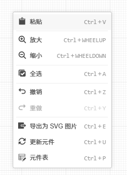
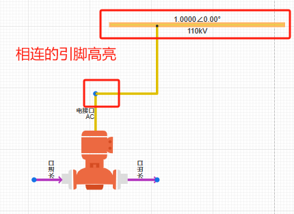
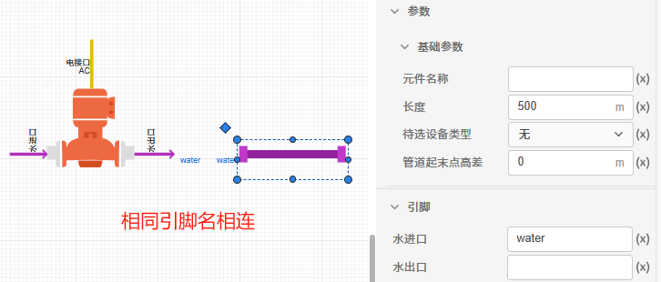

## 功能定义

用户可将模型库中的元件拖拽至拓扑编辑窗口内，进行元件连线及配置，并组织成完整的仿真拓扑。

## 功能说明

### 常见编辑操作

打开算例项目，选中图纸中的元件点击鼠标右键后可以选择如下的基础编辑操作，也可通过快捷键实现。

不选中元件，在图纸空白处点击鼠标右键后可以选择如下的基础编辑操作，也可通过快捷键实现。

#### 剪切

剪切图纸中的选中的元件，支持选中多个元件进行剪切。

#### 复制

复制图纸中的选中的元件，支持选中多个元件进行复制。

#### 创建副本

创建图纸中的选中的元件，支持选中多个元件创建副本。

#### 删除

删除图纸中的选中的元件，支持选中多个元件进行删除。

#### 顺/逆时针旋转

顺/逆时针旋转选中的元件 90°，支持选中多个元件进行旋转。也可以长按元件左上方的菱形图案对元件进行旋转。

#### 撤销/重做

撤回/返回上一步操作。

#### 导出为 SVG 图片

导出图纸中选中的元件的 SVG 图片，可以生成这些元件图标组成的矢量图，支持选中多个元件导出。

#### 打开模块

对于权限是**作为子模块公开**或**可读**的元件，可以选择打开模块，打开该模块的项目链接，查看内部细节。

#### 粘贴

点击图纸空白处，粘贴剪切/复制的元件，支持同平台项目间跨网页复制/粘贴。跨网页复制/粘贴可以将单个或多个元件粘贴到到不同的算例中（即，不同的网页），实现单个或多个元件构成的复杂参数和拓扑的复制使用。

#### 放大/缩小

放大或缩小图纸的视图比例。也可以按住`ctrl`键，利用鼠标滚轮来缩放视图。同时也可以用按住`ctrl`键+鼠标右键，拖动鼠标来平移视图。

#### 全选

全选图纸元件。

#### 更新元件

更新项目元件的内部细节。

#### 元件表

弹出元件表对话框。

#### 创建为子模块

选中多个元件点击鼠标右键后选择创建为子模块，可以将这个元件另存为一个单独的模型项目。

### 元件连接

拓扑编辑过程中元件间的连接方法有两种。

1. 直接使用连接线连接元件
   
   将鼠标光标移至元件引脚处，若该引脚出现蓝色圆形阴影，说明该引脚可用。此时单击该引脚，按住鼠标左键并移动光标至需要被连线的引脚处，当该引脚处出现橙色边框，松开鼠标左键即完成两个元件的连线。

   
   
   选中连线后，将鼠标悬停在连线上，连线的两端会出现连个箭头，中间会出现一个圆角矩形，鼠标左键常按箭头可以任意拖放箭头位置，调整连线的首末端。

   鼠标左键常按圆角矩形可以平移线段位置。

   

2. 使用引脚参数连接元件
   
   若出现元件较多、连线不便的情况，可以通过**设置引脚**的方式对两个及以上的引脚进行连接。单击需要连接的元件，在现参数栏的引脚处填写相同的字符，即可实现连接，如下图所示。

   

:::warning

1. 电气引脚与信号引脚不能互相连接。
1. 信号输入引脚不能并联，信号输出引脚不能并联。也即信号输出引脚需连接至另一信号输入引脚。
1. 引脚连接需满足维数要求。例如`三相交流电压源`的正端为三维电气引脚，不能直接与单相电阻的一维引脚连接，此时可加入`分线器`进行电气引脚拆分。同理，多维的信号引脚加入`多路信号合并`或`多路信号分离`元件进行拆分/聚合。

:::