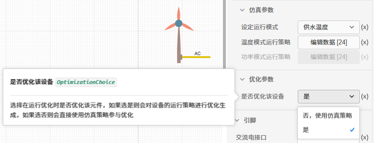

## 元件定义

> **该元件指燃气轮机的设备设施，燃气发电机组是适应世界环保要求和市场新环境而开发的新型发电机组，一些发电机组还可与余热回收装置一起作为热电联供机组。燃气轮机的工作过程是：压气机(即压缩机)连续地从大气中吸入空气并将其压缩；压缩后的空气进入燃烧室，与喷入的燃料混合后燃烧，成为高温燃气，随即流入燃气透平中膨胀作功，推动透平叶轮带着压气机叶轮一起旋转；加热后的高温燃气的作功能力显著提高，因而燃气透平在带动压气机的同时，尚有余功作为燃气轮机的输出机械功。燃气轮机由静止起动时，需用起动机带着旋转，待加速到能独立运行后，起动机才脱开。燃气轮机的工质来自大气，最后又排至大气，是开式循环；此外，还有工质被封闭循环使用的闭式循环。**

在平台中，燃气轮机机组实现热电联供，即CHP（Combined Heating and Power），是指以天然气为主要燃料带动燃气轮机、微燃机或内燃机发电机等燃气发电设备运行，产生的电力供应用户的电力需求，系统发电后排出的余热通过余热回收利用设备(余热锅炉或者余热直燃机等)向用户供热。通过这种方式大大提高整个系统的一次能源利用率，实现了能源的梯级利用。还可以提供并网电力作能源互补，整个系统的经济收益及效率均相应增加。其数学模型如下：

$$ P =F\eta_e $$  
$$ \eta_q + \eta_p+\eta_l = 1 $$  
 式中：F 是燃料提供的总功率(kW),P 是发电机的额定功率(kW),$\eta_p$代表发电效率,$\eta_l$代表燃气轮机的损失系数。

$$ Q =F\eta_h= m(h_{out}-h_{in}) $$  
式中：Q是制热功率(kW)，$\eta_h$代表制热效率，m为流体质量流量（kg/s），$h_{in}$为流体进口比焓(kJ/kg)，$h_{out}$为流体出口比焓(kJ/kg)。

## 元件说明

燃气轮机元件参数标签页包括**属性**、**参数**、**引脚**三类参数，下面对每类参数进行详细说明。

### 属性

CloudPSS 提供了一套统一的元件属性功能，关于元件属性参数的配置，详见[元件属性配置](/docs/docs/software/xstudio/simstudio/basic/moduleEncapsulation/index.md)页面。

### 参数

#### 基础参数

| 参数名 | 键值 (key) | 单位 | 备注 | 类型 | 描述 |
| :--- | :--- | :--- | :--: | :--- | :--- |
| 元件名称 | **CompName** |  | 元件名称 | 文本 | 元件名称 |
| 元件类型 | **CompType** |  | 选择元件类型 | 选择 | 选择**交流元件**时输出交流电；选择**直流元件**时输出直流电。 |
| 设备配置台数 | **DeivceNumber** | 台 | 设备配置台数 | 自然数 | 设备配置台数 |
| 待选设备类型 | **DeviceSelection** |  | 从设备库中选择设备类型 | 选择 | **选择数据管理模块录入的设备型号**，将燃气轮机元件的厂家、产品型号、额定运行参数自动绑定为对应设备在数据管理模块中录入的参数。|
| 上网计价模型 | **SalePriceModel** |  | 上网计价模型 | 选择 | 综合能源系统的新能源等将电出售给外部电源的上网价格模型，计入项目收入 |
| 燃料价格模型 | **FuelPriceModel** |  | 燃料价格模型 | 选择 | 用于计算燃料耗量、燃料购置费用（计入项目支出）以及其污染物排放量 |

#### 仿真参数

在仿真参数中编辑设备的仿真边界条件，主要包含**运行方式**和**运行策略曲线**。

| 参数名 | 键值 (key)  | 单位 | 备注 | 类型 | 描述 |
| :--- | :--- | :--- | :--: | :--- | :--- |
| 出力模式 | **SettingParaType** |  | 选择运行模式 | 选择 | 在输入仿真运行策略前需要指定设备运行模式。有**温度**和**功率**两种模式。若选择**温度**模式，则设备出力根据系统计算得到。若选择**功率**模式，设备出力为用户指定功率。|
| 温度模式运行策略 | **OutletTemp** |  | 配置设备在不同时刻的运行温度 | 表格 | 仅当**出力模式**项为温度模式时生效，在表格中录入**各个时间段对应的出口温度**。 **开始时间**对应每个仿真时刻，**供水温度**为设备出口温度。|
| 功率模式运行策略 | **PowerGenerating** |  | 配置设备在不同时刻的功率 | 表格 | 仅当**出力模式**项为功率模式时生效，在表格中录入**各个时间段对应的设备运行策略**。 **开始时间**对应每个仿真时刻，**设备启停运行策略**为设备运行挡位和运行台数的组合，注意设备运行总台数不能超过设备配置台数。|

#### 优化参数

在优化参数中编辑设备的优化条件。

| 参数名 | 键值 (key)  | 单位 | 备注 | 类型 | 描述 |
| :--- | :--- | :--- | :--: | :--- | :--- |
| 是否优化该设备 | **OptimizationChoice** |  | 是否对燃气轮机元件的运行方式进行优化 | 选择 | 选择在运行优化时是否优化该元件，如果选是则会对设备的运行策略进行优化生成，如果选否则会直接使用仿真策略参与优化|

### 引脚

燃气轮机的输出有**电接口**和**水出口口**引脚，输入为**水进口**，用于将燃气轮机元件与其他电设备连接，支持**线连接**和**信号名**的连接方式。

引脚的**名称、键值、维度、定义描述**的详细说明如下表所示。

| 引脚名 | 键值 (key)  | 维度 | 描述 |
| :--- | :--: | :--- | :--- |
| 电接口 | **DC/AC** | 1×1 | 可以在引脚处输入相同的字符使得燃气轮机与其他电元件相连，当基础参数**元件类型**项是**直流元件**时，键值为**DC**；**元件类型**项是**交流元件**时，键值为**AC**。|
| 水进口 | **InletWater** | 1×1 | 可以在引脚处输入相同的字符使得设备与其他电元件相连|
| 水出口 | **OutletWater** | 1×1 | 可以在引脚处输入相同的字符使得设备与其他电元件相连|

## 常见问题Q&A

元件模型是否准确？

:   燃气轮机组模型较为简单，平台主要关注燃料与电、热之间的转换关系，并未关注发电、压缩、燃烧、透平等电热过程。对于机组启停等复杂过程，可以通过变工况模型来近似仿真。

燃气轮机的交直流元件有什么区别？

:   选择交流时输出交流电，选择直流时输出直流电
    在能量流计算过程中均为 PQ 节点。

    注意，交流元件和直流元件不能直接相连。

燃气轮机元件在建模仿真平台使用时需要配置哪些元件参数？数据管理模块需要配置哪些数据？

:   在对燃气轮机元件进行仿真模拟前，务必录入编辑元件的**基础参数**和**仿真参数**；

    在数据管理模块需要配置**燃气轮机**的**额定运行参数**。并在基础参数中绑定数据管理模块的燃气轮机。

燃气轮机元件的运行方式有哪几种配置方式？

:   共有 3 种，其中仿真 2 种，运行优化 1 种模式。

:   

:   1. **仿真：供水温度模式**

        用户已知燃气轮机机组的热水出口温度时，**运行模式**设置为**供水温度**，同时**优化参数**选择“否，使用仿真策略”。  
        此时，燃气轮机机组的供热功率由进出口温度、流量等参数计算得到，发电功率根据电热效率计算，类似于**背压式**热电联产机组，即“以热定电”模式，为北方供热电厂的主流运行模式。
        
:   2. **仿真：发电功率模式**

        用户已知燃气轮机机组的发电功率时，**运行模式**设置为**发电功率**，同时**优化参数**选择“否，使用仿真策略”。  
        此时，燃气轮机机组的供热功率根据电热效率计算，进出口温度根据热功率和流量等参数计算得到，类似于**抽气式**热电联产机组，即“以电定热”模式，适用于有发电需求，同时负荷变化幅度较大，变化频繁的区域性热电厂。 

:   3. **运行优化**

        此时燃气轮机元件的出力由系统优化计算得到，但是**不读取仿真参数**，需要将**优化参数**的**是否优化该设备**项设置为**是**即可。

温度和功率策略的开始时刻必须和仿真时刻一致吗？

:   **建议保持一致**。若启停策略和出力曲线的开始时刻与仿真时刻不一致，平台会**自动采用插值和外推算法填充**。    特别注意：对于启停策略和出力曲线，在仿真时刻之外的时间段策略，为**前平推和后平推**，即，策略之前的数值始终为策略的第一个值，策略之后的数值始终为策略里最后一个值。