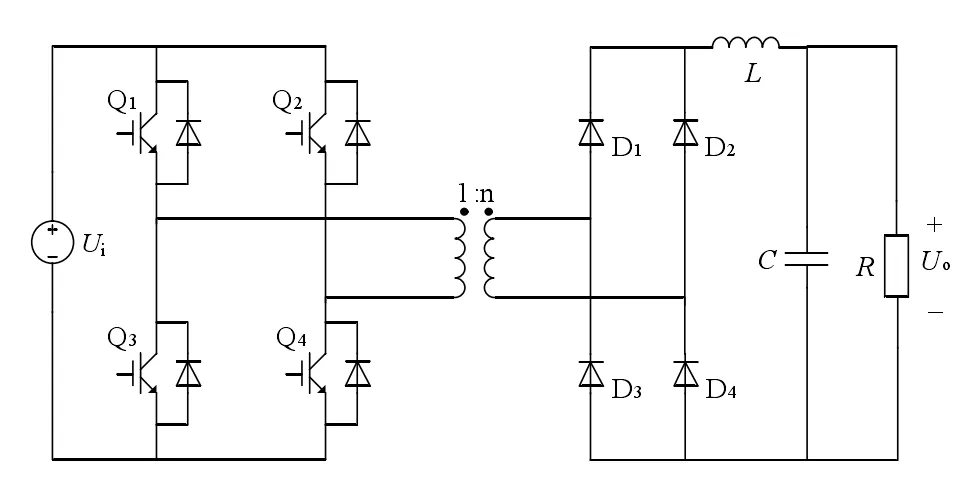

## 元件定义

**该元件指直流变压器的设备设施，电压等级的多级化是研究直流配电网的基础。直流变换器在直流配电网的多级化上起着至关重要的作用，一般采用的电压调制方式是通过控制占空比来调节输出电压大小，其中双有源全桥变换器除了占空比调制外，保持占空比一定，通过改变移相比也可以调节电压大小，也具有广泛的应用。平台的直流变压器采用的是双有源全桥变换器。**

 **全桥变换器的结构如下所示：**

 

**其稳态等效模型如下：**

$$
M{（D）} = 2nD
$$
$$
R_{E} = 2n^{2}DR_{T1} + {（{D + 0.5}）}R_{T2} + {（{2D + 1}）}R_{D} + R_{L}
$$
式中：MD为占空比；$R_E$为直流变压器等效电阻；D为占空比，n为隔离变压器变比，$R_{T1}$为隔离变压器1次侧漏电阻，$R_{T2}$为隔离变压器2次侧漏电阻，$R_D$为二极管导通电阻，$R_L$为隔离变压器2次侧励磁电阻。

## 元件说明

光伏系统元件参数标签页包括**属性**、**参数**、**引脚**三类参数，下面对每类参数进行详细说明。

### 属性

CloudPSS 提供了一套统一的元件属性功能，关于元件属性参数的配置，详见[元件属性配置](/docs/docs/software/xstudio/simstudio/basic/moduleEncapsulation/index.md)页面。

### 引脚
直流电接口，可以在引脚处填写相同的字符使得两个元件相连。

### 参数

#### 基础参数

| 参数名 | 键值 (key) | 单位 | 备注 | 类型 | 描述 |
| :--- | :--- | :--- | :--: | :--- | :--- |
| Name | **Name** |  | 元件名称 | 文本 | 元件名称 |
| 元件类型 | **CompType** |  | 选择元件类型 | 选择 | 选择**交流元件**时为交流电，选择**直流元件**时为直流电|
| Voltage Angle | **Voltage Angle** | deg | Voltage Angle | 实数 | 初始相角 |
| Voltage Magnitude | **Voltage Magnitude** | p.u. | Voltage Magnitude | 实数 | 初始电压 |
| Base Voltage | **Base Voltage** | Kv | Base Voltage | 实数 | 基准电压 |

#### 设备参数

| 参数名 | 键值 (key) | 单位 | 备注 | 类型 | 描述 |
| :--- | :--- | :--- | :--: | :--- | :--- |
| Name | **Name** |  | 元件名称 | 文本 | 元件名称 |
| 元件类型 | **CompType** |  | 选择元件类型 | 选择 | 选择**交流元件**时为交流电，选择**直流元件**时为直流电|
| Voltage Angle | **Voltage Angle** | deg | Voltage Angle | 实数 | 初始相角 |
| Voltage Magnitude | **Voltage Magnitude** | p.u. | Voltage Magnitude | 实数 | 初始电压 |
| Base Voltage | **Base Voltage** | Kv | Base Voltage | 实数 | 基准电压 |

### 引脚

元件有**电接口**引脚，用于与其他电设备连接，支持**线连接**和**信号名**的连接方式。

引脚的**名称、键值、维度、定义描述**的详细说明如下表所示。

| 引脚名 | 键值 (key)  | 维度 | 描述 |
| :--- | :--: | :--- | :--- |
| 电接口 | **Pin DC/AC** | 1×1 | 可以在引脚处输入相同的字符使得元件与其他电元件相连，当基础参数**元件类型**项是**直流元件**时，键值为**Pin DC**；**元件类型**项是**交流元件**时，键值为**Pin AC**。|
