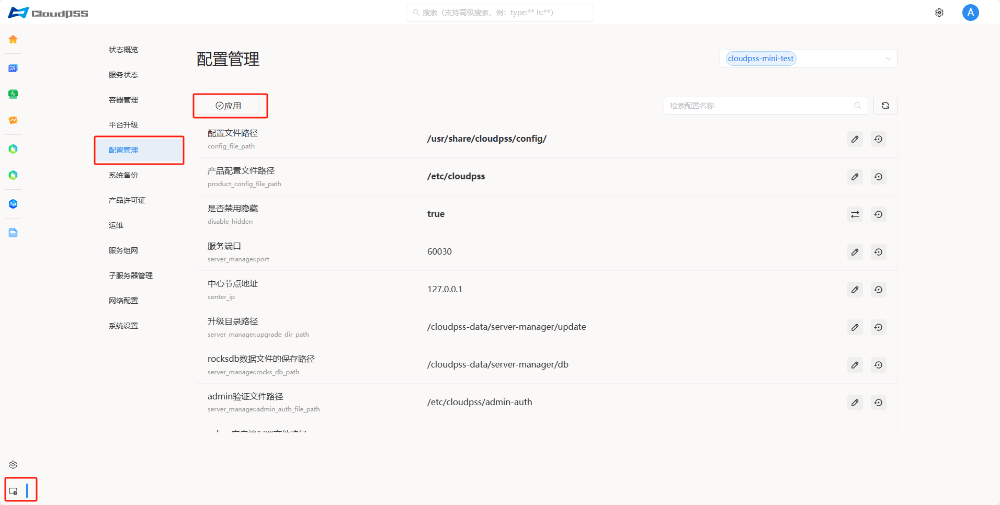

**配置管理**模块提供一个集中的界面，允许用户能够轻松地管理和配置 **CloudPSS** 各个软件及其服务。所有服务的配置项和设置通过配置定义文件描述，并通过直观的图形界面进行配置和管理。



## 界面使用指南

### 修改配置项

以服务端口配置项为例：


点击**修改**图标按钮，配置项进入编辑状态，输入修改后的值，点击**应用**按钮，修改的配置即可生效。如果想要恢复原始的配置，点击**还原**图标按钮，即可恢复默认值。

:::tip
注意，隐藏的配置项不会出现在前端页面中，除非 disable_hidden(是否禁用隐藏) 配置项是 `false` 的状态。
:::

### 检索配置项

可以通过搜索来过滤配置项。


## cli工具使用指南

:::tip
注意，以下内容仅限具有运维权限以上的人员使用。
:::

**Server Manager 配置管理**在服务器上允许以命令行的形式进行配置管理，一共有以下几个命令：

+ **cloudpss-config list**：  输出当前存储的配置值，未设置的值显示为 null

+ **cloudpss-config get [key]**： 输出计算后的配置输入值

+ **cloudpss-config set [key] = [value]**： 设置配置值

+ **cloudpss-config unset [key]**：  取消设置，恢复默认值

+ **cloudpss-config configure [filename]**：  应用配置文件

+ **cloudpss-config help [command]**： 显示命令帮助

### 查看配置项

进入服务器设备的 **shell** 界面，以 **disable_hidden** 为例，输入命令如下：

```shell
cloudpss-config get disable_hidden
```

### 修改配置项

进入服务器设备的 **shell** 界面，以 **disable_hidden** 为例，输入命令如下：

```shell
cloudpss-config set disable_hidden = true
```

### 恢复配置项

进入服务器设备的 **shell** 界面，以 **disable_hidden** 为例，输入命令如下：

```shell
cloudpss-config unset disable_hidden
```


