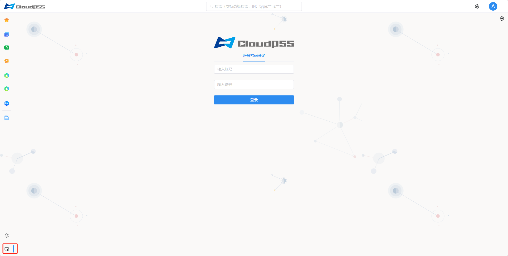

## 访问指南

1. 进入 **CloudPSS** 的网页个人中心，点击页面左下角的服务管理图标。

2. 或者输入服务器地址：在浏览器的地址栏中输入当前服务器的 IP 地址，例如 `http://10.101.10.45`，在地址栏加上端口号 `8080`，即 `http://10.101.10.45:8080`　访问 **Server Manager**。

3. 输入账号、密码登录系统

> 为保证最佳显示效果，建议使用 **Chrome** 浏览器。

