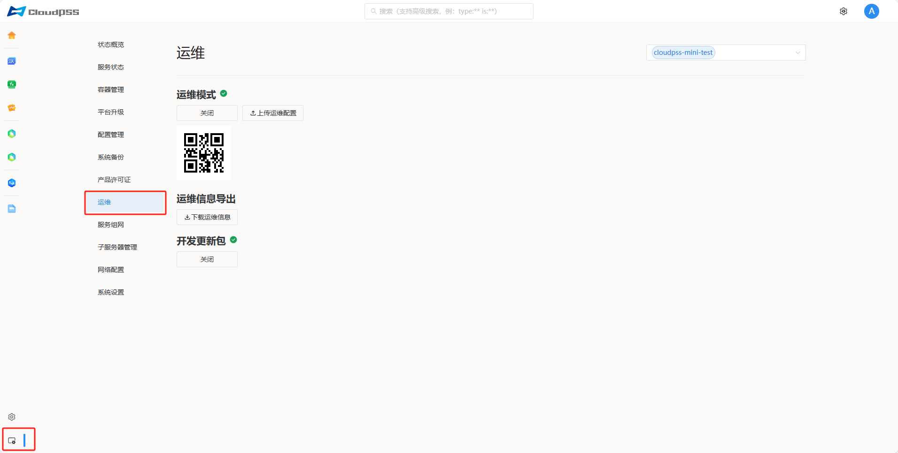

**运维**页面允许用户开启系统运维模式，运维模式开启后获得一个运维二维码，将这个二维码截图发给 **CloudPSS** 的工程师，他们就可以通过互联网连接机器进行远程维护。

> 如果运维模式无法打开，或者打开后没有二维码显示。请检查设备有没有互联网连接；如果网络连接状态正常，再检查设备的运维配置是否已经过期。

## 导出运维信息

点击**下载运维信息**按钮，导出当前服务器的设备信息压缩包，格式为 **zip**。

