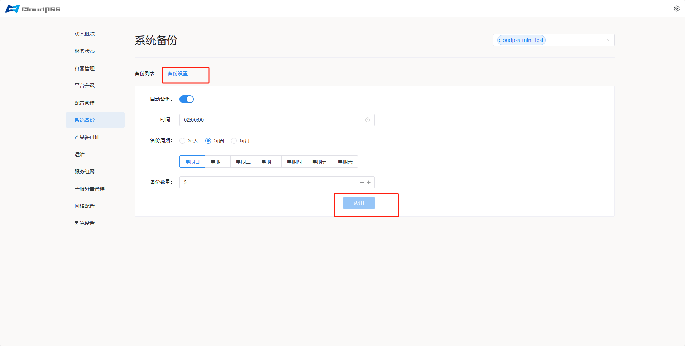

---
title: 系统备份
sidebar_position: 67

tags: 
- server manager

--- 

**系统备份**页面允许用户对 **CloudPSS** 全部服务进行备份管理，支持手动备份（**下载**、**删除**、**锁定**、**还原**系统备份）和自动定时备份。

## 备份设置

点击**系统备份**页面的**备份设置** tab，进入**备份设置**页面。页面显示内容如下：

+ **自动备份**：开关

+ **时间**：时间选择框（24h制）

+ **备份周期**：每天、每周、每月

+ **备份数量**：

配置完成后，点击**应用**按钮。 