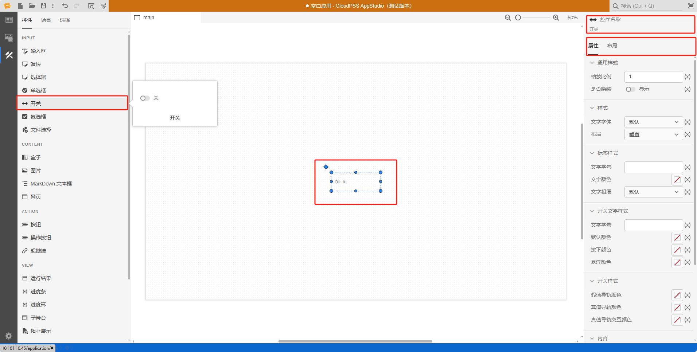

本节主要介绍 **AppStudio** 控件库里的开关控件。

## 属性

**CloudPSS** 提供了一套统一的控件属性参数

### 通用样式

import CommonStyle from '../../grid/_common-style.md'

<CommonStyle />

### 样式

| 参数名 | 键值 (key) | 单位 | 备注 | 类型 | 描述 |
| :--- | :--- | :--- | :--: | :--- | :--- |
| 文字字体 | `style/font-family` |  | 选择文字字体 | 选择 | 标签文字字体样式，字体类型包括：默认、宋体、黑体、楷体、微软雅黑、Georgia、Palatino Linotype、Times New Roman、Arial、Arial Black、Verdana、Courier New、Trebuchet MS |
| 布局 | `layout` |  | 选择控件布局 | 选择 | 垂直或者水平布局，默认为垂直 |

### 标签样式

| 参数名 | 键值 (key) | 单位 | 备注 | 类型 | 描述 |
| :--- | :--- | :--- | :--: | :--- | :--- |
| 文字字号 | `style/--spectrum-global-dimension-font-size-100` |  | 输入文字字号 | 常量 | 输入文字字号 |
| 文字颜色 | `style/--spectrum-alias-label-text-color` |  | 选择文字颜色 | 颜色选择器 | 点击文字颜色，弹出颜色选择器自定义颜色 |
| 文字粗细 | `style/--spectrum-alias-body-text-font-weight` |  | 选择文字粗细 | 选择 | 选择标签文字粗细，默认、100、200、300、400、500、600、700、800、900、1000 |

### 开关文字样式

| 参数名 | 键值 (key) | 单位 | 备注 | 类型 | 描述 |
| :--- | :--- | :--- | :--: | :--- | :--- |
| 文字字号 | `style/--spectrum-switch-m-text-size` |  | 输入文字字号 | 常量 | 输入文字字号 |
| 默认颜色 | `style/--spectrum-switch-m-text-color` |  | 开关默认颜色 | 颜色选择器 | 点击默认颜色，弹出颜色选择器自定义开关默认颜色 |
| 按下颜色 | `style/--spectrum-switch-m-text-color-down` |  | 开关按下颜色 | 颜色选择器 | 点击按下颜色，弹出颜色选择器自定义开关按下颜色 |
| 悬浮颜色 | `style/--spectrum-switch-m-text-color-hover` |  | 开关悬浮颜色 | 颜色选择器 | 点击悬浮颜色，弹出颜色选择器自定义开关悬浮颜色 |

### 开关样式

| 参数名 | 键值 (key) | 单位 | 备注 | 类型 | 描述 |
| :--- | :--- | :--- | :--: | :--- | :--- |
| 假值导轨颜色 | `style/--spectrum-switch-m-track-color` |  | 假值导轨颜色 | 颜色选择器 | 点击悬浮颜色，弹出颜色选择器自定义假值导轨颜色 |
| 真值导轨颜色 | `style/--spectrum-switch-m-emphasized-track-color-selected` |  | 真值导轨颜色 | 颜色选择器 | 点击悬浮颜色，弹出颜色选择器自定义真值导轨颜色 |
| 假值导轨交互颜色 | `style/--spectrum-switch-m-emphasized-track-color-selected-hover` |  | 假值导轨交互颜色 | 颜色选择器 | 点击悬浮颜色，弹出颜色选择器自定义假值导轨交互颜色 |

### 内容

| 参数名 | 键值 (key) | 单位 | 备注 | 类型 | 描述 |
| :--- | :--- | :--- | :--: | :--- | :--- |
| 标签 | `label` |  | 内容标签 | 常量 | 开关控件文字标签 |
| 禁用 | `disabled` |  | 禁用开关 | 开关 | 禁用选择**开**或者**关**，开启后控件禁止点击和交互，默认为**关** |
| 真值标签 | `trueText` |  | 真值标签 | 常量 | 真值标签 |
| 假值标签 | `falseText` |  | 假值标签 | 常量 | 假值标签 |
| 值 | `value` |  | 开关控件值 | 开关 | 开关控件默认值，默认为**关** |

### 事件

| 参数名 | 键值 (key) | 单位 | 备注 | 类型 | 描述 |
| :--- | :--- | :--- | :--: | :--- | :--- |
| 更改 | `@change` |  | 输入结束时触发事件 | 函数 | 采用更新方式触发，失去焦点后控件的值才会更新 |

## 案例介绍

### 颜色选择器类型

import ColorPicker from '../../grid/_color-picker.md'

<ColorPicker />

## 常见问题

### (x) 与 f(x) 的区别

import Fx from '../../grid/_fx.md'

<Fx />

###  事件触发机制

import Event from '../../grid/_event.md'

<Event />