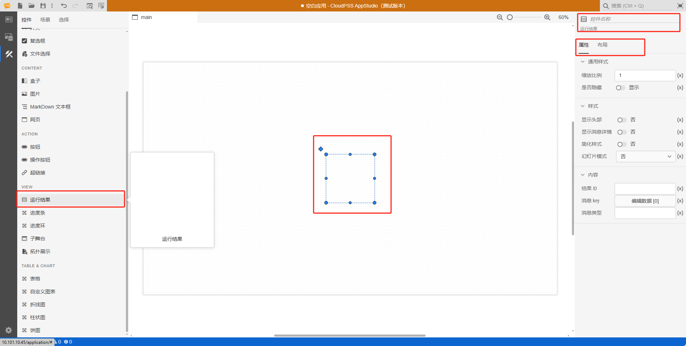

本节主要介绍 AppStudio 控件库里的运行结果控件。

## 属性

**CloudPSS** 提供了一套统一的控件属性参数

### 通用样式

| 参数名 | 键值 (key) | 单位 | 备注 | 类型 | 描述 |
| :--- | :--- | :--- | :--: | :--- | :--- |
| 缩放比例 | `$scale` |  | 输入控件缩放比例 | 常量 | 输入缩放比例数值，控件按照比例放大或者缩小，默认为 1 倍大小 |
| 是否隐藏 | `hidden` |  | 选择是否隐藏控件 | 选择 | 选择**隐藏**或者**显示**，**隐藏**当前控件，或者**显示**当前控件，默认为**显示**状态 |

### 样式

| 参数名 | 键值 (key) | 单位 | 备注 | 类型 | 描述 |
| :--- | :--- | :--- | :--: | :--- | :--- |
| 显示头部 | `showHeader` |  | 是否显示头部 | 开关 | 是否显示头部，默认为否 |
| 显示消息详情 | `showMessageDetails` |  | 是否显示消息详情 | 开关 | 是否显示消息详情，默认为否 |
| 简化样式 | `simpleStyle` |  | 是否简化样式 | 开关 | 是否简化样式，包括不显示消息边框、背景等装饰性样式，默认为否 |

### 内容

| 参数名 | 键值 (key) | 单位 | 备注 | 类型 | 描述 |
| :--- | :--- | :--- | :--: | :--- | :--- |
| 结果 ID | `key` |  | 输入查看的结果 ID | 常量 | 查看的结果 ID  |
| 消息 key | `messageKey` |  | 查看的消息 ID | 表格 | 查看的消息 ID，省略可以显示所有消息，默认显示所有消息  |
| 消息类型 | `messageType` |  | 输入查看的消息类型 | 常量 | 查看的消息类型，省略可以显示所有消息，默认显示所有消息  |
