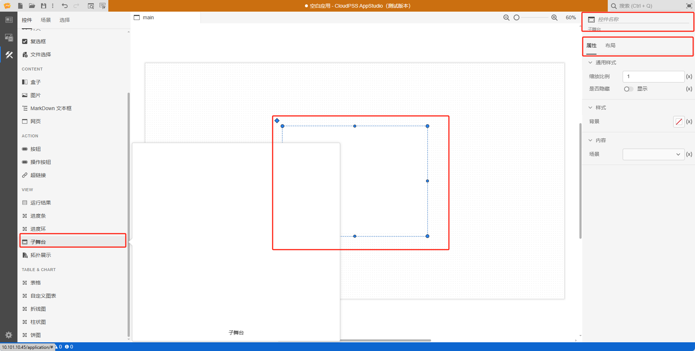

本节主要介绍 AppStudio 控件库里的子舞台控件。

## 属性

**CloudPSS** 提供了一套统一的控件属性参数

### 通用样式

import CommonStyle from '../../grid/_common-style.md'

<CommonStyle />

### 样式

| 参数名 | 键值 (key) | 单位 | 备注 | 类型 | 描述 |
| :--- | :--- | :--- | :--: | :--- | :--- |
| 背景 | `background` |  | 显示背景 | 颜色选择器 | 点击背景颜色，弹出颜色选择器自定义背景颜色，同时允许用户上传图片自定义背景 |

### 内容

| 参数名 | 键值 (key) | 单位 | 备注 | 类型 | 描述 |
| :--- | :--- | :--- | :--: | :--- | :--- |
| 场景 | `key` |   | 选择场景 | 选择 | 选择场景，默认为 `main`，场景详情参见[场景标签页](../../../../../xstudio/appstudio/workbench/function/sence/sence-sub/index.md) |

## 案例介绍

### 颜色选择器类型

import ColorPicker from '../../grid/_color-picker.md'

<ColorPicker />

## 常见问题

### (x) 与 f(x) 的区别

import Fx from '../../grid/_expression.md'

<Fx />

###  事件触发机制

import Event from '../../grid/_event.md'

<Event />
