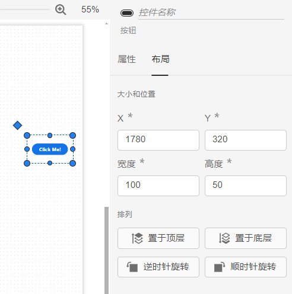

### 功能定义

格式栏主要负责对场景中控件的格式进行设置。

## 功能说明

### 控件格式

选中场景中的控件点击鼠标右键后右侧的属性配置区内会出现控件布局栏。

#### 大小和位置

用户可通过 `X` 和 `Y` 来修改控件在cj中的位置，`X` 和 `Y` 是控件左上角顶点的坐标。场景左上角顶点的坐标为 `X = 0`、`Y = 0`。

通过**宽度**和**高度**修改控件的大小。

:::info
- 不建议用户直接通过大小来修改控件尺寸，而是用属性栏>通用样式>缩放比例来修改控件的大小。
:::

#### 排列

当不同控件重叠在一起时，排列功能可以设置它们的重叠先后顺序，选择置于顶层或置于底层。排列功能还可以设置控件的旋转角度，可以点击顺时针旋转、逆时针旋转。

当框选多个控件时，排列功能可以设置它们的对齐方式和分布方式，如左对齐、水平居中、右对齐、顶端对齐、居中对齐、底端对齐、横向等距分布或纵向等距分布等。

