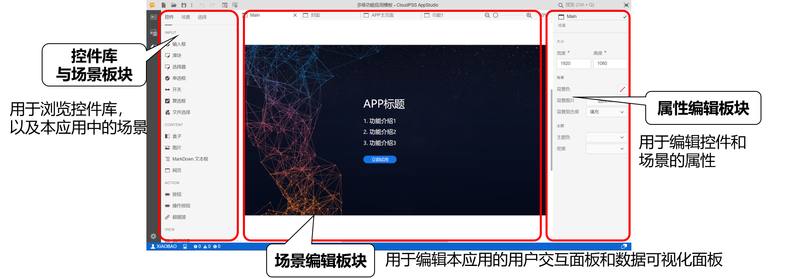
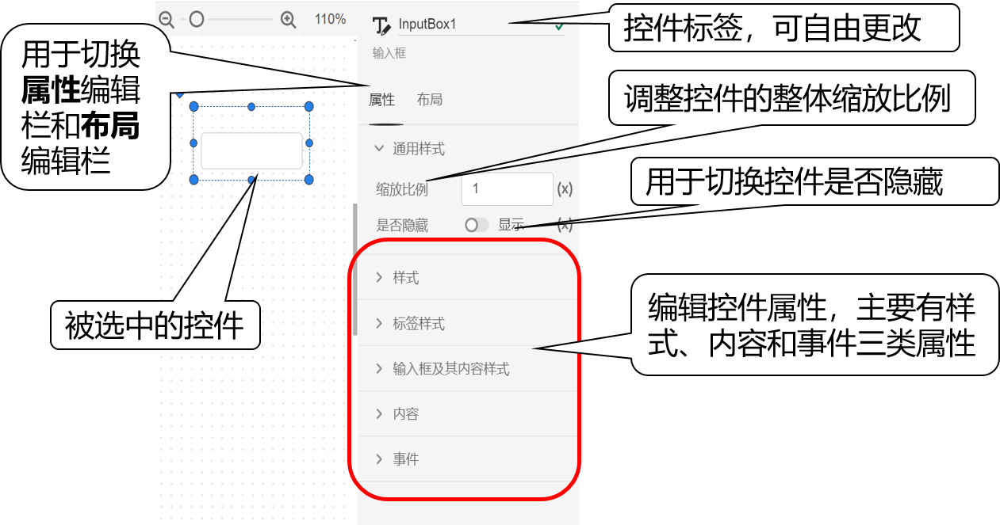

本节介绍功能区第三个实现标签页的使用方法。

## 页面功能

场景标签页用于搭建**用户交互面板和数据可视化面板**，该标签页包含控件场景板块、场景编辑板块和属性编辑板块。

## 功能说明

### 控件

控件标签中可以浏览控件库中的控件，这些控件被置于不同的标签下，可直接拖拽进场景编辑板块。

AppStudio 内置了应用构建中所需要的典型可视化控件，包括INPUT（输入类控件）、CONTENT(内容类控件)、ACTION(操作类控件)、VIEW(视图类控件)在内的 4 种类型、19 种控件。

### 场景

场景标签中可以浏览应用中的场景和添加新的场景。

当用户需要构建一个含多个子页面的复杂应用时，考虑到美观和便捷性，可利用场景功能将子页面放置到不同的场景中，类似于 SimStudio 的图纸功能。

每个子页面是一个独立的场景，通过配置控件属性实现场景间的切换和嵌套。选中场景后可以在标签页右侧的属性编辑板块编辑**场景属性**，详见[场景帮助](./sence-sub/index.md)。

### 选择

选中某个场景后，选择标签中会显示该场景内部所有的控件，按照图层从上到下排列，最上面的控件在最上层，点击某个控件后，会在场景编辑板块内自动选中该控件，方便用户找到快速找到想要操作的控件，右键点击可以快速删除控件。

### 场景编辑

场景编辑板块是构建用户交互面板和数据可视化面板的编辑区域。用户可将控件库中控件拖拽至场景编辑窗口内，进行控件属性配置。详见[场景编辑帮助](./edit/index.md)。

### 属性标签

场景标签页右侧为属性编辑板块，在选中某一控件后，最上方为控件标签，可以更改控件名称。下方是控件的属性标签和布局标签，分别用于配置控件的参数和布局。对于属性标签，由通用样式、样式、标签样式、内容样式、内容、事件等部分组成，如图中展示的是输入框控件。

:::warning
- 参与交互的控件必须命名。
- 同一场景下不同控件的标签名不能重复。
:::

关于每个控件的属性介绍详见该控件的帮助文档[ AppStudio控件帮助](../../../stuff/index.md)。

### 布局标签

局标签支持配置控件的大小位置、排列层级等显示特性。布局标签的具体使用方法详见[布局标签帮助](./font/index.md)。

### 预览

在搭建好场景并配置好控件属性后，点击工具栏的预览按钮从编辑模式进入预览模式，在预览模式中用户可以对所构建的应用界面、数据绑定关系和数据可视化效果进行调试。详见[应用预览帮助](../../../basic/pre/index.md)。

### 发布

在搭建好场景并配置好控件属性后，当功能区切换到场景标签页时，工具栏会出现发布工具，点击发布按钮，会将项目发布为一个Web端的应用，用户点击右下角的发布成功提示栏或在浏览器地址栏中粘贴复制好的链接，即可打开应用。详见[应用发布帮助](../../../basic/publish/index.md)。