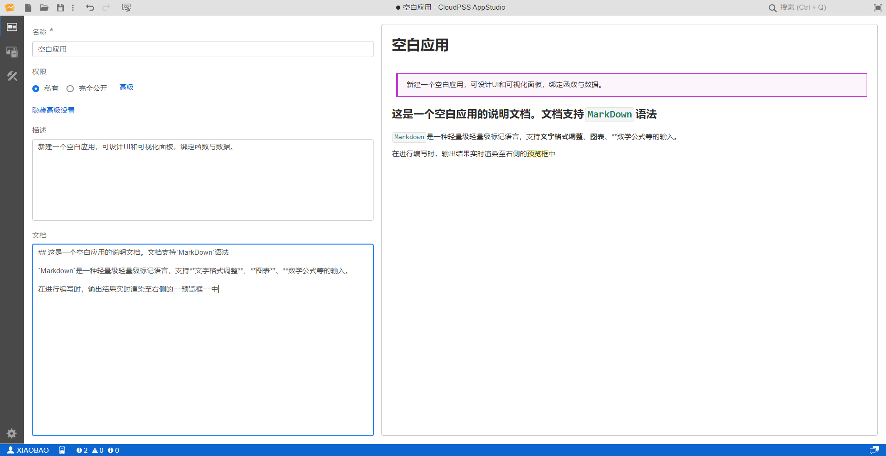

AppStudio 工作台的功能区可以切换展示总览、资源、场景三个标签页，每个标签页具有不同的页面功能。本节首先介绍第一个总览标签页的功能。

## 页面功能

总览标签页实现对当前应用项目信息的配置，包括配置项目基本信息(名称、权限)、描述以及文档。

### 名称

显示应用项目的名称，可任意修改，可与其它项目重名。

### 权限

权限设置包括**私有**和**完全公开**。

当权限选择私有时，该应用项目仅保存在个人项目中，仅用户自己可见；

当权限选择完全公开时，所有用户可见，还可以查看应用内部的场景细节。

除了上述权限外，还可以点击**高级**为应用设置更多权限，详见[高级权限配置](../../../center/index.md)。

### 隐藏高级设置 

点击后会隐藏权限，仅可设置应用项目名称，项目权限为默认的私有。

### 描述

为该应用项目添加描述性文字，该文字将会显示在个人中心的项目列表中，便于用户进行简要注释。

### 文档

可为应用项目添加说明性文档，该文档可在个人中心的项目列表中打开查看。

### 预览

在描述和文档部分编辑时，输出结果将实时渲染至右侧的预览框中。

描述及文档内容的编写支持`MarkDown`语法，`Markdown`是一种轻量级标记语言，支持文字格式调整，图片、图表、数学公式等的输入。

`MarkDown`语法的介绍详见[MarkDown 语法介绍功能帮助](https://markdown.com.cn/)。

## 案例

import Tabs from '@theme/Tabs';
import TabItem from '@theme/TabItem';

<Tabs>
<TabItem value="js" label="应用项目信息配置">

</TabItem>
</Tabs>

