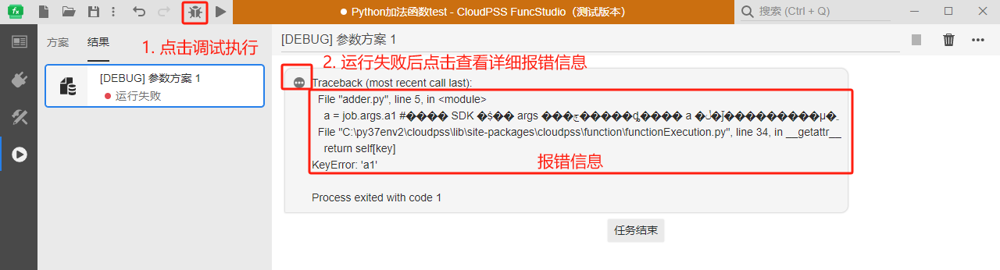
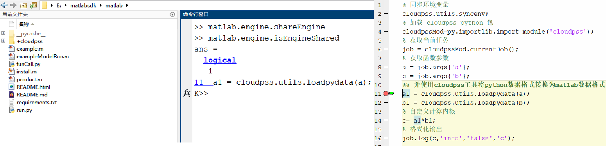

本节首先介绍 FuncStudio 函数的本地调试功能，然后通过 2 个案例介绍本地调试功能的使用方法。

## 功能定义

由于接入 FuncStudio 的函数内核可能包含利用 FuncStudio SDK 获取当前参数方案的代码，如果直接在终端运行函数内核会报无法获取输入参数的错误。

因此，FuncStudio 提供了函数的本地调试功能，帮助用户在 FuncStudio 执行器里面对函数进行调试，本地调试相当于对函数内核进行 Debug，只有本地调试通过的函数才能集成到 CloudPSS 云服务框架下供自己或其他用户远程调用。

本地调试的优点在于会把函数所有的执行信息都输出，包括**结果、提示、警告和报错**，帮助用户快速定位到错误，从而及时调整程序。本地调试功能只在 FuncStudio 本地执行器里提供，网页版不支持。

## 功能说明

### 使用前提

使用函数本地调试功能的前提如下：

- 确保在接口标签页内定义好函数的输入参数；

- 确保在实现标签页内指定好内核的命令行执行语句和工作目录。

### 调试方法

满足上述前提后，点击运行标签页的**调试执行**功能，对函数内核启动本地调试，如果显示**运行失败**，可以点击 `···` 号查看详细的**报错信息**，根据报错信息修改函数内核。

如果 FuncStudio 结果栏中的报错信息出现中文乱码，影响查看，可以**打开日志文件夹**的`.err`文件查看完整的报错信息。

import Tabs from '@theme/Tabs';
import TabItem from '@theme/TabItem';

### 调试技巧

<Tabs>
<TabItem value="py" label="Python 内核的本地调试技巧">

由于 FuncStudio 是在终端执行 Python 内核文件，因此无法直接在 Python IDE 里面添加断点对内核逐步调试。可以采用**每部分程序单独调试**的方法，具体如下：

#### 1.调通自己编写的算法程序

为了提高调试效率，建议用户先手动赋值参数方案，利用 Python IDE 的逐步调试功能将自己自己编写的算法程序调通。

:::warning

Python IDE 里面的调试环境必须和 FuncStudio 中指定的 Python 环境一致。

:::

#### 2.调通参数方案获取代码

将当前函数任务实例的 JSON 结构体 print 到 FuncStudio 结果页面中，确保参数键和 JSON 结构体中的参数键一致；

将获取的参数方案类型 print 到 FuncStudio 结果页面中，确保参数类型正确，如果不正确，则需要做参数类型转换。

#### 3.调通格式化输出代码

确保 log、plot、table 等格式化输出方法的调用格式正确；

对于 plot 方法，如果在 FuncStudio 中没有显示图形的话，检查 traces 参数的数据格式是否正确。

</TabItem>
<TabItem value="Matlab" label="Matlab 内核的调试流程">

对于 Matlab 内核，在当前启动的 Matlab 中输入 matlab.engine.shareEngine 共享实例后，即可在 Matlab 工作台中逐步调试内核。

</TabItem>
</Tabs>

## 案例

<Tabs>
<TabItem value="py" label="Python 内核的本地调试">

</TabItem>
<TabItem value="Matlab" label="Matlab 内核的本地调试">

</TabItem>
</Tabs>

## 常见问题

调试执行通过，但是 FuncStudio 结果栏中没有任何输出结果该如何排查错误？

:  检查 log、plot、table 等格式化输出方法的调用格式是否正确。对于 plot 方法，如果在 FuncStudio 中没有显示图形的话，检查 traces 参数的数据格式是否正确。
