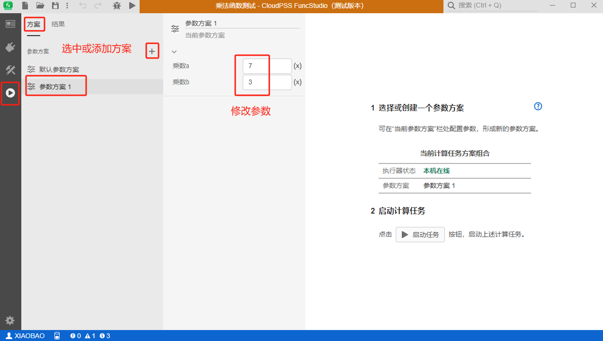
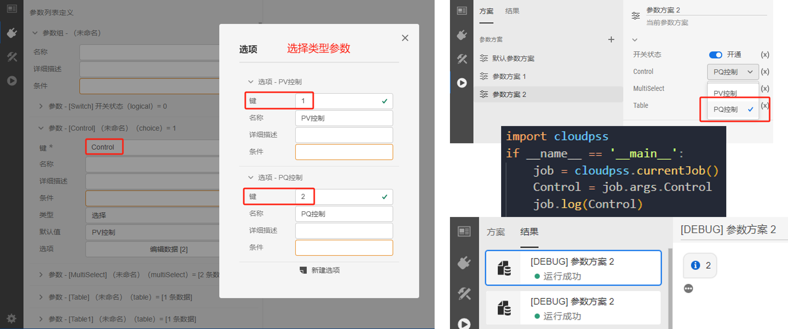

本节介绍 FuncStudio 函数输入参数定义及引用的功能。

## 功能定义

用于配置函数的外部接口，即定义函数的输入参数，并且可以通过在 FuncStudio 运行标签页中配置参数方案来更改算法内核的输入。

## 功能说明

### 配置参数列表

首先，需要在 FuncStudio 接口标签页的参数列表内定义函数的输入参数。

参数列表可实现对参数组、参数的配置。参数组为参数的分组，添加参数前必须为其新建一个分组。

XStudio 提供了统一的参数列表配置方法，支持实数、整数、文本、布尔、选择、多选、表格以及虚拟引脚 9 种类型参数的定义。

每种类型参数的定义详见[参数列表定义](../../../simstudio/basic/moduleEncapsulation/parameter-list/index.md)。

### 配置参数方案

配置好的参数列表后，运行标签页方案下的**默认参数方案**里面会将定义的参数列表显示出来，用户可以选择或添加参数方案，通过修改当前方案下的参数值，**更改内核的输入**。



:::warning
用户修改参数列表后（包括类型和默认值），已有的参数方案不会更新，得手动修改；只有添加新的参数方案才会更新。
:::

### 在内核中引用参数方案的值

配置好的参数列表后，可在计算内核中利用 FuncStudio SDK 通过参数键名来引用当前方案下参数的值。

**不同语言内核引用参数的格式不一样：**

import Tabs from '@theme/Tabs';
import TabItem from '@theme/TabItem';

<Tabs>
<TabItem value="python" label="本地 Python 内核">

通过`args.键`的方式获取。

```py showLineNumbers
import cloudpss  #导入安装好的CloudPSS-SDK
if __name__ == '__main__': 
    job = cloudpss.currentJob() #获取函数在当前参数方案下的计算任务实例
    a = job.args.a #利用 SDK 提供的 args 方法获取键为 a 的参数在当前方案下的值
    b = job.args.b #获取键为 b 在当前参数方案下的值
```

</TabItem>
<TabItem value="matlab" label="本地 Matlab 内核">

通过`args.{'键'}`的方式获取。

```matlab showLineNumbers
cloudpss.utils.syncenv; %同步环境变量
cloudpssMod = py.importlib.import_module('cloudpss'); %加载 CloudPSS-SDK
job = cloudpssMod.currentJob(); %获取函数在当前参数方案下的计算任务实例
a = job.args{'a'}; %利用 SDK 提供的 args 方法获取键为 a 的参数在当前方案下的值
b = job.args{'b'}; %获取键为 b 在当前参数方案下的值
```

</TabItem>
<TabItem value="js" label="云端 JavaScripts 内核">

通过`args.键`的方式获取。

```JavaScript showLineNumbers
export default async function* (args,signal,env) {
    yield "hello, "+args.name+"!" // #利用 SDK 提供的 args 方法获取键为 name 的参数在当前方案下的值
    yield "Good bye, "+args.name+"!"
}  
```
</TabItem>
</Tabs>


**不同类型参数值的获取方式不一样：**

<Tabs>

<TabItem value="bool" label="布尔/选择/多选">

对于实数、整数、文本等选项类型的参数，直接通过键名获取的是每个**选项的键**。

如下图所示，一个布尔类型的参数通过`args.Switch`获取的是选项的键，`1 或者 0`。


如下图所示，一个选择类型的参数通过`args.Control`获取的是选项的键，`1 或者 2`。



如下图所示，一个多选类型的参数通过`args.MultiSelect`获取的是选项的键，比如，多选“选项1”、“选项2”、“选项3”
获取的值就是`['1','2','3']`。


</TabItem>
<TabItem value="table" label="表格">

对于表格这种可能有多个值的参数，直接通过键引用的是整个表格的数据，表格中第 a 行 第 b 列的数据通过`[a-1]['b-1']`的方式获取。

如下图所示，不同语言内核引用表格元素的格式不一样：


<!-- 分割线 -->
<Tabs>
<TabItem value="python" label="本地 Python 内核">

通过`args.键[a-1]['b-1']`的方式获取表格中第 a 行 第 b 列的数据。

```py showLineNumbers
import cloudpss  #导入安装好的CloudPSS-SDK
if __name__ == '__main__': 
    job = cloudpss.currentJob() #获取函数在当前参数方案下的计算任务实例
    num = job.args.Table[0]['0'] #获取表格第 1 行第 1 列的数据
    text = job.args.Table[1]['1'] #获取表格第 2 行第 2 列的数据
```


</TabItem>
<TabItem value="matlab" label="本地 Matlab 内核">

通过`args.{'键'}(a){'0'}`的方式获取。

```matlab showLineNumbers
cloudpss.utils.syncenv; %同步环境变量
cloudpssMod = py.importlib.import_module('cloudpss'); %加载 CloudPSS-SDK
job = cloudpssMod.currentJob(); %获取函数在当前参数方案下的计算任务实例
a = job.args{'a'}; %利用 SDK 提供的 args 方法获取键为 a 的参数在当前方案下的值
b = job.args{'b'}; %获取键为 b 在当前参数方案下的值
```

</TabItem>
<TabItem value="js" label="云端 JavaScripts 内核">

通过`args.键[a-1]['b-1']`的方式获取。

```JavaScript showLineNumbers
export default async function* (args,signal,env) {
    yield "hello, "+args.name+"!" // #利用 SDK 提供的 args 方法获取键为 name 的参数在当前方案下的值
    yield "Good bye, "+args.name+"!"
}  
```
</TabItem>
</Tabs>

<!-- 分割线 -->

</TabItem>
<TabItem value="normal" label="实数/整数/文本">

对于实数、整数、文本等普通类型的参数，直接通过参数键获取的是参数的值，比如：1.242；3，'文本'。

</TabItem>
</Tabs>


## 常见问题

对于 Matlab 内核中数组/矩阵/等类型输入参数该如何配置？

:   - 首先，在参数列表中将数组/矩阵/等类型输入参数均定义为字符串类型；

    - 然后，在参数方案中该参数的值内输入数组/矩阵，例如`[1,2,3,4,5,6]`；

    - 最后，在 Matlab 内核中通过`args{'键'}`获取数组或矩阵字符串`[1,2,3,4,5,6]`，进一步可在 Matlab 里用使用 eval 方法。例如：`a = eval('[1,2,3,4,5,6]')` 转换成数组/矩阵/。


表格数据导入 csv 文件失败，该如何解决？

:   首先得保证 csv 文件格式和表格格式一致，然后需要在 csv 文件中添加首行作为每一列的编号。

    