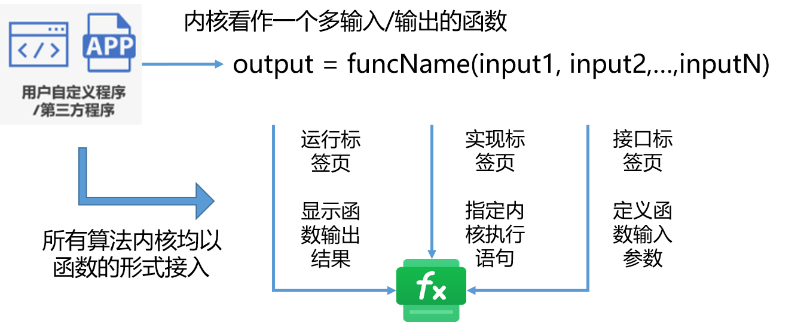

FuncStudio 函数工坊的核心功能是在 CloudPSS 云服务框架中集成**第三方计算内核**和**用户自定义算法内核**，扩展CloudPSS 平台的功能边界，方便用户构建各类数字孪生计算后台。

FuncStudio 采用了“**函数化**”的设计思路，来将用户自定义内核或第三方内核以函数的形式快捷、灵活地接入 CloudPSS，为复杂数字孪生应用的构建提供了调试部署、业务管理及计算调度的功能。

所谓的“函数化”是指任何第三方计算内核和用户自定义算法内核都能以一个具有**多输入/输出量的函数**集成到 FuncStudio中，**每一个内核就是一个独立的函数项目**。

用户只需在本地计算机中安装 FuncStudio 执行器，**建立函数项目**、**定义其输入和输出参数格式**，**指定好内核的命令行执行语句**，即可将内核接入 FuncStudio。

