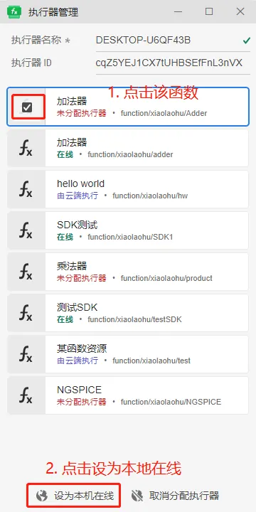

本节主要介绍**Matlab**内核接入**FuncStudio**的实现过程，以一个简单**乘法器内核**为例。

### 创建函数

首先登录到 CloudPSS 的主页，点击 FuncStudio 图标进入 FuncStudio 的个人中心，点击**新建空白项目**，即创建一个空白项目，并进入FuncStudio 工作台。


### 配置函数参数

进入 FuncStudio 工作台后，在当前**接口**标签页配置函数的外部接口，即定义乘法函数的参数。点击**新建参数组**，在参数编辑栏内，添加名称为**乘法参数组**的参数组；接着点击**新建参数**，在该参数组内添加对应**乘数 a**、**乘数 b**的参数，如下图所示。


可以配置这两个参数的键、名称、类型、默认值等等。

这样即可将一个乘法器计算内核的外部参数通过接口标签页成功录入到了FuncStudio。

### 设置参数

点击左侧的**总览**按钮，进入**总览**标签页，配置函数的基本信息(名称、类型、权限信息以及标签)、编写函数的描述以及详细的说明文档。


### 实现函数

在完成函数的参数配置后，紧接着需要实现函数的算法内核，即如何编写函数的算法内核、函数算法内核如何获取配置好的外部接口参数以及如何格式化输出函数的计算结果。

#### 选择实现方式

点击左侧的**实现**按钮，进入**实现**标签页，点击工具栏中的**更改实现类型**按钮，此处我们选择**本地：自定义命令**，进入本地页面，直接使用本地计算程序作为函数的算法内核。


#### 配置Matlab环境

详见[Python环境配置](../../../envir/matlab/index.md)。

#### 编写本地Matlab代码

安装好 SDK 后，在本地编写一个 product.m 的 Matlab 文件来作为乘法器函数的算法内核，具体代码如下所示：

````Matlab
% 同步环境变量
cloudpss.utils.syncenv;
% 加载 cloudpss python 包
cloudpssMod = py.importlib.import_module('cloudpss');
job = cloudpssMod.currentJob();% 获取当前任务
a = job.args{'a'};% 获取函数参数
b = job.args{'b'};% 获取函数参数

% 并使用cloudpss工具将python数据格式转换为matlab数据格式
a1 = cloudpss.utils.loadpydata(a);
b1 = cloudpss.utils.loadpydata(b);
a2 = str2double(a1);% 数据类型转换
b2 = str2double(b1);% 数据类型转换

% 自定义计算内核
c= a2*b2;

% 格式化输出
job.log(c,'info','false','c')
````

以上两个准备工作完成后，在**本地：自定义命令**实现页面的命令窗口内输入执行 product.m 文件的命令，在工作目录内指定 product.m 文件所在的本地目录。

:::tip

在实现标签页的命令窗口内输入的执行语句格式固定为：

**‘指定的执行算法内核的虚拟 python 环境’ + 空格 + run.py + 空格 + “Matlab脚本/函数名称”**

即用指定的python环境执行matlab sdk 中的 run.py文件，用run.py文件启动Matlab来执行内核脚本。

以执行上述乘法函数的计算内核为例，先指定python环境 加 run.py，最后加上product这个需要执行的Matlab脚本名称

工作目录就是我们存放product.m文件的位置，也就是matlab sdk 所在的位置。

这样就将本地的Matlab计算内核以一个乘法函数的形式接入到了FuncStudio。


:::

### 保存函数

在运行函数之前需要保存函数，点击工具栏的「保存」按钮，输入唯一资源 ID 和函数名称将该函数保存到个人中心。如下图所示：


### 配置执行器

在启动任务之前需要对函数的执行器进行配置。首先打开在 FuncStudio 个人中心下载安装好的执行器，右击系统状态栏中 FuncStudio 执行器的小图标，选择菜单中的「执行器管理」打开执行器管理界面。


对于刚保存的在本地执行的函数当前状态为'未分配执行器'，需要手动选中后设置为**设为本机在线**来分配执行器。



### 配置Matlab实例

在配置好FuncStudio函数之后，还需要配置一个可以执行m文件的Matlab实例，这样做的好处在于：

能够使用当前启动的Matlab实例运行由FuncStudio 执行器下发的任务，来消除每次下发任务后需要重新启动Matlab的耗时，并具备断点调试功能。

具体的，打开Matlab ，在命令窗口内运行** matlab.engine.shareEngine **命令，就可以将当前打开的 Matlab 配置为执行脚本文件的实例。

接着可以通过运行 **matlab.engine.isEngineShared** 命令，来查看当前Matlab实例是否已经共享，

最后，将打开的Matlab的工作目录切换到product.m文件所在目录。

需要注意的是，在运行 matlab.engine.shareEngine 后，即使我们关闭了当前的matlab实例，也可以在FuncStudio执行器内调用这个matlab实例执行计算内核，

关闭matlab后会增加一段启动matlab的时间，因此实际操作中不建议关闭matlab


### 运行函数

在配置好执行器后，点击左侧的**运行**按钮，进入**运行**标签页，对于同一个项目，CloudPSS FuncStudio 支持配置不同的参数运行方案，便于用户快速对比不同参数条件下的函数执行结果。

选择一个配置好参数方案，点击工具栏的**启动任务**快捷按钮，在该参数方案下执行函数，得到相应的输出结果。

