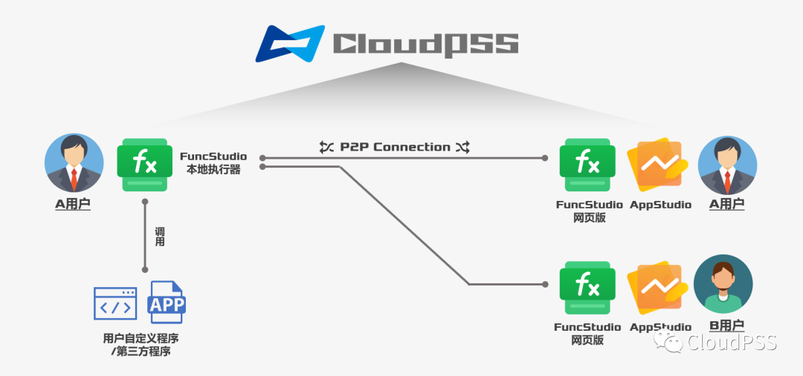

## FuncStudio 函数工坊——灵活接入能源电力系统数字孪生计算内核

FuncStudio 采用了**函数化**的设计思路，将用户自定义内核或第三方内核以函数的形式快捷、灵活地接入 CloudPSS，为复杂数字孪生应用的构建提供了调试部署、业务管理及计算调度的功能。

## FuncStudio 执行器

FuncStudio 支持用户将自定义或第三方计算内核以函数的形式接入，用户只需在本地计算机中安装**FuncStudio执行器**，**建立函数**、**定义其输入和输出参数格式**，**指定好用户自定义内核的命令行执行语句**，即可将自定义内核接入 FuncStudio 执行器。FuncStudio 也提供了跨平台、跨设备的支持，方便部署云边融合业务。当**执行器联网在线时**，用户可使用任意一台终端登录 CloudPSS，在网页版 FuncStudio 中**远程调用该计算内核**并**查看计算结果**。

下面这个图就很详细的说明了FuncStudio 平台的功能和工作模式 

例如，用户A在自己的本地计算机内安装了FuncStudio的执行器，

并且已经将自己的计算内核以函数化的方式接入了FuncStudio执行器，

如果该函数权限是公开的，那么只要他的本地执行器是联网在线，

用户A或者其他用户B都可以通过网页版FuncStudio或AppStudio来远程利用用户A的执行器，启动这个函数的算法内核，

然后将执行结果反馈到用户A和B的网页版XStudio中，从而实现计算内核的远程共享。
