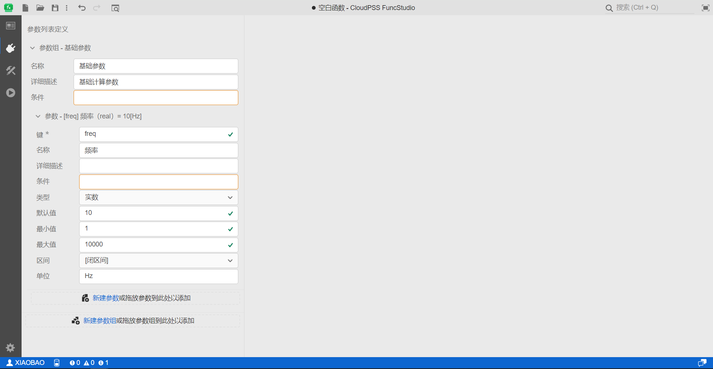
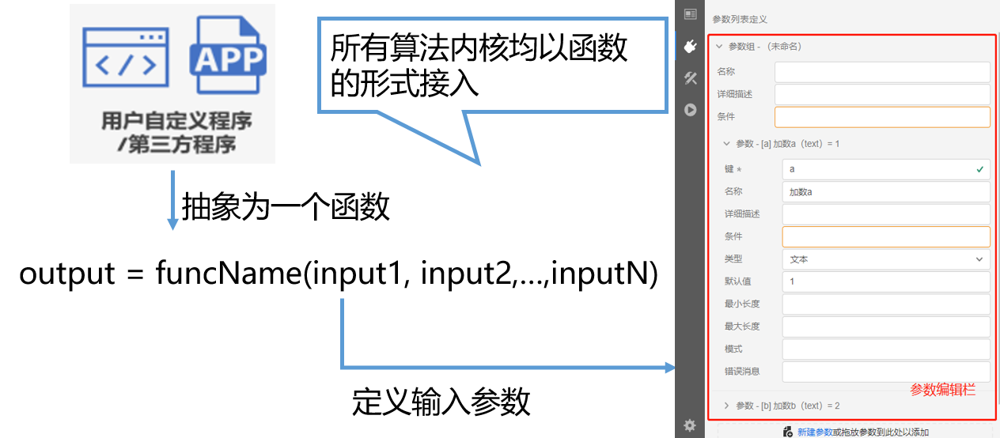

本节首先介绍功能区第二个接口标签页的功能，然后通过 1 个案例说明接口标签页的使用方法。

## 页面功能

接口标签页用于配置函数的外部接口，即定义函数的输出参数，并在多参数方案运行时使用。

## 功能说明

### 参数列表定义 

参数列表定义用于实现当前函数项目输出参数的定义。提供**新建参数组**和**新建参数**的功能。一个函数项目可以包含多个参数组，每个参数组下可以包含多个参数。

为统一 XStudio 三个平台的使用体验，FuncStudio 和 SimStudio 平台均采用统一的参数和变量体系，同样支持实数、整数、文本、布尔、选择、多选、表格以及虚拟引脚9种类型参数的定义，支持常量和表达式形式的参数输入，可轻松兼容不同输入输出格式。

提供了参数的键、名称、详细描述、条件、类型、默认值等配置选项。配置好的参数，可在内核中**通过特定的接口进行引用**。

详见[函数输入参数定义配置帮助](../../../basic/interface/index.md)。

### 参数预览

在进行接口标签页的配置过程中，可通过**右击图标绘制窗口选择预览选项**或点击预览快捷按钮，实现对参数列表的预览。用户可通过预览功能及时查看参数配置以及各部分联动是否正常。

## 案例

import Tabs from '@theme/Tabs';
import TabItem from '@theme/TabItem';

<Tabs>
<TabItem value="js" label="函数输入参数定义">

</TabItem>
</Tabs>

## 常见问题

为什么要设计接口标签页呢？

:   为什么要设计接口标签页呢？

    因为任何第三方计算内核和用户自定义算法内核都能以一个具有多输入/输出量的函数集成到 FuncStudio 中，也就是下图这种格式，
 
    因此，首先需要整理出内核所有的输入参数，把这些参数的详细信息全部录入 FuncStudio。具体如何录入呢，就需要用到接口标签页。

    