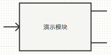

本文档介绍元件/模块的图标设计，主要步骤包括[元件图标绘制](#元件图标绘制)、[在图标中添加引脚并绑定](#在图标中添加引脚并绑定)两个部分。

## 图标绘制工作区

在[元件/模块封装](../index.md)的过程中，打开[接口标签页](../../../workbench/function/interface/index.md)，右侧则为图标绘制工作区，包含```图标组件库```、```图标绘制区```、```显示设置与属性编辑区```，如下图所示。


用户可以从```图标组件库```中点击或拖拽需要添加的组件，添加到```图标绘制区```中。可供添加的组件包括[矩形](./drawing/index.md#矩形)、[直线](./drawing/index.md#直线)、[椭圆](./drawing/index.md#椭圆)、[路径](./drawing/index.md#路径)、[文本](./drawing/index.md#文本)、[引脚](./drawing/index.md#引脚)共六种，可在[子页面](./drawing/index.md)中查看各类型的图标组件用法。

当用户点击```图标绘制区```的空白处，右侧将显示```显示设置区```，用户可以调整当前视图设置，包括[图形选项](#图形选项)和[窗格](#窗格)设置；当用户选中```图标绘制区```中的某个图标组件，右侧将显示该组件的```属性编辑区```，详见[元件图标绘制](./drawing/index.md)中对应的内容。

## 元件图标绘制

本节详细介绍各个图标组件的使用方法，详见[子页面](./drawing/index.md)。

阅读本节后，将能自行绘制任意需要的元件/模块图标。

## 在图标中添加引脚并绑定

本节介绍在图标中绑定[引脚列表](../pins-list/index.md)中的引脚。

在完成元件图标绘制操作后，用户可以从```图标组件库```中拖拽```引脚```组件到```图标绘制区```，将引脚组件自带的**蓝色圆点**对准需要摆放引脚的位置。

用户也可以在右侧的```属性编辑区```中，手动设置引脚的位置（```X```和```Y```参数）。注意，此时属性编辑区中引脚的**宽度**和**长度**参数均为无效参数，无需调整。引脚的属性编辑区如下图所示。


在引脚的属性编辑区最下方，存在一个名为```引脚```的单选栏，用户需要在这里选中该```引脚图标组件```需要绑定的[引脚列表](../pins-list/index.md)中的引脚。

对于每个引脚列表中,[“可见”配置项](../pins-list/index.md#引脚定义)设置为**开**的引脚，需要依次在图标绘制区中添加并绑定这些引脚的图标。

通过以上的教程，用户已经能完成基础的元件图标实现。

## 高级功能

本节介绍图标绘制的高级功能，包括[导入当前图形](#导入当前图形)、[图形选项](#图形选项)和[窗格](#窗格)三个方面。

### 导入当前图形

```导入当前图形```功能的主要应用场景是：
- 部分CloudPSS旧版本的元件图标和当前的新版本图标不兼容，利用这些元件另存得到的元件中，图标绘制工作区中出现```导入当前图形```的按钮。
- 对于原本为[```普通项目```或```简单项目```](../../../workbench/function/summary/index.md#模型类型)的模型，在[总览标签页](../../../workbench/function/summary/index.md)中修改为```元件```类型后，图标绘制工作区中出现```导入当前图形```的按钮。

```导入当前图形```按钮如下图所示：


**在```导入当前图形```按钮出现时，为了避免图标无法正常保存等问题，请先点击该按钮，生成默认的元件图标，再开始图形的绘制。**

生成默认的图标后，```导入当前图形```按钮将会消失，默认的图标可以按需求自行删除。

### 图形选项

点击```图标绘制区```的空白处，右侧```显示设置区```将会出现```图形选项```的配置栏。目前，Simstudio的该配置栏中仅有```缩放时允许用户调整长宽比```配置项。

当取消勾选该配置项时，用户调用模块时无法改变长宽比，如下图所示。



当勾选该配置项时，用户将能在调用模块时自由更改长宽比，如下图所示。


注意，如果勾选该配置项，允许用户自由更改长宽比，可能导致**连线无法对齐**等问题，详见[Simstudio元件图标设计规范](./regulations/index.md)相关内容。

### 窗格

## 如何绘制一个规范的元件图标？

跳转图标设计规范页面

