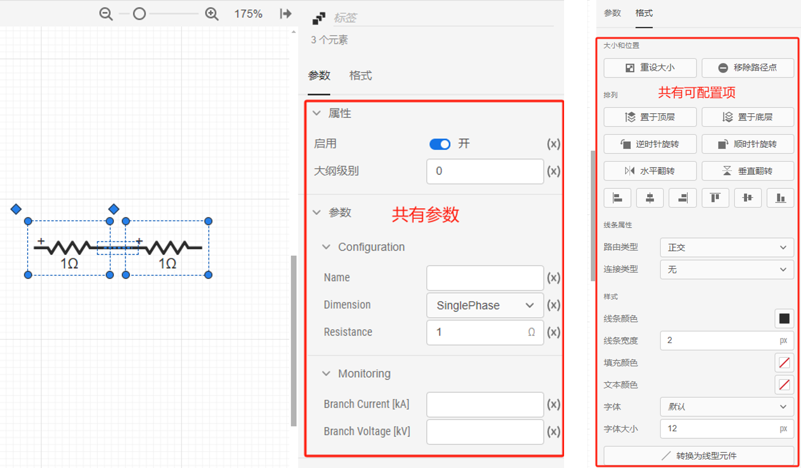

本节介绍 **SimStudio 工作台** - **实现标签页** 的布局、实现种类，并重点介绍拓扑编辑功能。

## 页面功能

CloudPSS SimStudio **实现标签页**用于构建、修改、管理当前模型项目的内部实现细节，是 SimStudio 最重要的功能页。

SimStudio 作为 CloudPSS 多个仿真软件的建模工作台，内嵌了潮流计算、电磁暂态仿真、综合能源系统仿真模拟等多类模型和仿真内核。为兼容不同类型模型的编辑和管理功能，CloudPSS SimStudio 提供了**拓扑实现**、**代码实现**、**外部导入实现**等多种模型实现方法。

根据 CloudPSS SimStudio 所提供的仿真功能不同，**实现标签页**具备不同的建模界面。

### 拓扑实现界面（默认界面）

SimStudio 默认提供基于拓扑图的可视化建模方案。用户采用类似 Simulink、PSCAD 等仿真软件的建模方法，通过拖拽、连接等操作快速构建直观的模型图。CloudPSS 的仿真软件 EMTLab、IESLab 和 DSLab 均默认采用拓扑实现方式。

拓扑实现界面由**资源栏**、**拓扑编辑区**、**属性栏**组成。用户可在拓扑实现界面进行元件拖放、拓扑连接、元件参数配置、以及页面格式/元件格式调整等功能。

### 代码实现界面

在 EMTLab SimStudio 工作台中，**模型类型**选择为**元件**时，SimStudio 提供基于 Python、Octave 语言的代码实现方式。用户可直接基于上述语言在**实现标签页**直接编写模型计算代码。

:::warning 功能可能受限
**代码实现**仅在 EMTLab 电磁暂态仿真时可用。功能帮助参见：
+ EMTLab - 电磁暂态仿真 - [自定义Octave元件](../../../../../emtlab/emtp-calc/self-config/octave/index.md)
+ EMTLab - 电磁暂态仿真 - [自定义Python元件](../../../../../emtlab/emtp-calc/self-config/python/index.md) 
:::

### 外部导入实现界面

在 EMTLab SimStudio 工作台中，**模型类型**选择为**元件**时，SimStudio 提供提供外部导入实现方式。用户可直接上传在外部平台已经编译好的二进制模型。

:::warning 功能可能受限
**外部导入实现**仅在EMTLab电磁暂态仿真中可用。功能帮助参见：
+ EMTLab - 电磁暂态仿真 - [自定义S-function元件](../../../../../emtlab/emtp-calc/self-config/s-function/index.md)
+ EMTLab - 电磁暂态仿真 - [自定义C/C++元件](../../../../../emtlab/emtp-calc/self-config/sdk/index.md)（CloudPSS 原生实现）（暂未开放）
:::

<!--  -->

### 其他特殊实现界面

#### 潮流实现界面

在 EMTLab SimStudio 工作台中，**模型类型**选择为**元件**时，还可为模型添加潮流实现，用以兼容潮流计算功能。功能帮助参见：
+ EMTLab - 潮流计算 - [自定义潮流元件](../../../../../emtlab/power-flow-calc/self-config/index.md)

<!--  -->

#### 内置实现界面

用于兼容 CloudPSS 官方模型的实现方式。该功能暂不对外开放。

### 多实现选择栏

在 EMTLab SimStudio 工作台中，**模型类型**选择为**元件**时，**实现标签页**的左边会显示**多实现选择栏**。此时，SimStudio 模型可支持多种实现同时存在。

EMTLab SimStudio 工作台中的**多实现选择栏**主要包括**拓扑**、**电磁暂态**和**潮流**三类。
+ **拓扑**：支持拓扑实现；
+ **电磁暂态**：支持内置实现、2种代码实现（自定义Python元件、自定义Octave元件）和2种外部导入实现（自定义S-function元件、CloudPSS原生实现）；
+ **潮流**：支持潮流实现。

上述三类实现可同时存在，但**每类实现仅能存在一个**。

#### 添加/删除实现

+ **添加实现**：鼠标左键点击**多实现选择栏**上待添加的实现类别，若当前类别的实现为空时，在右侧点击 **创建 XX 实现**，即可添加一类实现。
+ **删除实现**：鼠标右键点击**多实现选择栏**上待删除的实现类别，在弹出菜单中选择 **删除**，即可删除当前选择的实现。

#### 多实现优先级

多实现有两种形式，即**针对不同仿真内核的多实现**和**针对相同仿真内核的多实现**。例如：
+ **针对不同仿真内核的多实现**：构建一个风电机组元件，该模型既可以用**拓扑实现**搭建出其电磁暂态仿真模型，也可通过**潮流实现**配置该元件参与潮流计算的模型。当两种实现同时存在时，所构建的元件既可支持电磁暂态仿真，也可支持潮流计算。
+ **针对相同仿真内核的多实现**：构建一个风电机组的控制器模块/元件，该模型既可用**拓扑实现**搭建出控制器的流程图，也可通过**代码实现**直接编写控制器计算代码。

针对相同仿真内核的多实现存在时，实际计算**仅选择优先级最高**的实现参与计算。具体优先级如下：
+ **代码实现** > **拓扑实现**

正元确认一下此处的说明是否正确。

## 拓扑实现

拓扑实现界面由**资源栏**、**拓扑编辑区**、**属性栏**组成。**资源栏**包括**模型**和**图纸**两个标签。

### 模型

模型标签栏以分组的形式显示当前项目**订阅**的全部模型库分组。CloudPSS 的不同仿真功能订阅的模型库分组不同：
+ 原始 SimStudio 工作台：默认订阅 **CloudPSS 电磁暂态仿真元件库**的全部元件，模型库帮助文档参见 [EMTLab 元件库](../../../../../emtlab/components/index.md)
+ IESLab 中的 SimStudio 工作台：默认订阅 **CloudPSS 综合能源系统元件库**的全部元件。模型库帮助文档参见 [IESLab 元件库](../../../../../ieslab/sim/7_comp/index.md)

点击模型标签栏最下方的**添加更多**可以为本项目订阅更多的模型。更多模型订阅的功能说明参见模块调用 > [模型订阅](../../../basic/callModule/index.md#模块导入)帮助。

<!--  -->

### 图纸

图纸标签栏以列表的形式显示当前项目包含的全部图纸。

当单张仿真拓扑图过大时，考虑到美观和使用便捷性，可将规模较大的模型拓扑拆分为不同分区，分别放置于不同图纸中。

一个项目内不同图纸上的拓扑，本质上为同一**大纲级别**。选中一个图纸后可以在右侧的属性栏编辑当前项目的**全局变量**和**图纸选项**。

图纸的详细帮助参见[图纸](./canvas/index.md)帮助页。

<!--  -->

### 地理信息

开发中功能。

### 拓扑编辑区

拓扑编辑区是构建模型拓扑图的主要编辑区域。用户可将模型库中的元件拖拽至拓扑编辑窗口内，进行元件连线及参数配置操作，从而构建完整的模型。

拓扑编辑区的详细帮助参见[拓扑编辑](./edit/index.md)帮助页。

### 属性栏

拓扑编辑区的右侧是属性栏。属性栏显示拓扑编辑区中**当前选中元素**的参数和格式配置选项。若当前未选中任何元素，则属性栏显示当前项目的**全局变量**和当前图纸的**图纸选项**。

根据选中元素的不同，属性栏显示不同可配置选项。
+ 选中**某一元件**，属性栏显示当前元件的基本信息和可配置选项，包括：
  + **元件标签**（`Label`）：位于属性栏最上方。可以自由更改，不同元件的标签名可以重复。
  + **元件名称**和**元件资源ID**（`RID`）：点击右侧的复制按钮，可复制当前元件的`RID`.
  + **元件帮助**按钮：点击可跳转该元件的帮助页，仅对 CloudPSS 官方提供元件有效。
  + **参数栏**：用于配置与模型有效性、参数、连接关系有关的选项。
  + **格式栏**：用于配置与图形显示有关的选项。**元件格式**配置的详细说明参见 [格式](./font/index.md) 帮助页。

+ 选中**连接线**，属性栏仅显示连线的**格式卡**。**连线格式**配置的详细说明参见 [格式](./font/index.md) 帮助页。

+ 批量框选**多个元素**，属性栏的**参数卡**显示所有**元件**的共有参数，**格式卡**显示所有**元素**的共有可配置项，可方便批量修改同类元件的参数。

#### 参数卡

元件参数卡支持配置元件**属性**、**参数**和**引脚**等功能特性，参数卡的详细使用说明参见 [参数](./para/index.md) 帮助页。

#### 格式卡

格式卡支持配置元件或连线的大小位置、排列、样式等显示特性。格式卡的详细使用说明参见 [格式](./font/index.md) 帮助页。

