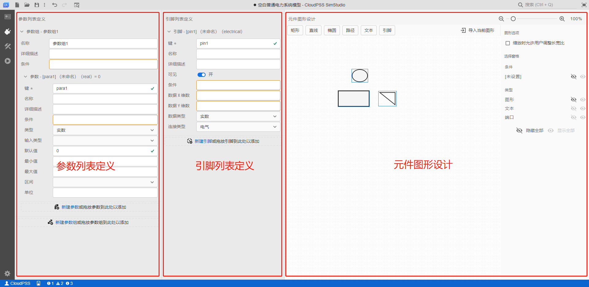

本文档介绍 **SimStudio 工作台** - **接口标签页** 的页面布局和功能概要。本页功能为进阶功能，在阅读前，请先熟悉 CloudPSS SimStudio 的 [参数、变量及引脚体系](../../../basic/parameterSystem/index.md)。 

## 页面功能

**接口标签页**用于定义当前模型的外部接口，包括：
+ 模型的全局参数；
+ 模型作为子模块、元件使用时的参数列表和引脚列表和元件图形。

**接口标签页**仅在当前模型类型为**普通模型**或**元件**时才会显示，且布局稍有区别。
+ 选择**普通模型**时，该页面仅提供模型接口参数的编辑功能；
+ 选择**元件**时，该页面同时提供模型接口参数、接口引脚和元件图形设计功能。

:::warning
此处要配两张图，分别是普通模型和元件的接口页截图和说明。
:::

完整的**接口标签页**包含**参数列表定义**、**引脚列表定义**和**元件图形设计**三个功能区域。

### 参数列表定义 

参数列表定义栏用于配置当前模型的全局参数或作为元件使用时的参数列表。

参数列表定义栏提供**新建参数组**和**新建参数**功能。一个模型可以包含多个参数组，每个参数组下可以包含多个参数。参数类型包括**实数**、**整数**、**文本**、**布尔**、**选择**、**多选**、**表格**以及**虚拟引脚**8种类型。用户可在此处定义参数组的名称、详细描述、条件，以及参数的键、名称、详细描述、条件、类型、默认值等配置选项。参数组或参数的显示与否可受条件表达式控制。

列表中参数的作用域为当前模型层级，即在当前打开项目的**实现**、**运行**标签页下的任意参数处都可引用。引用格式为：`$`加`key`（**参数键**）。例如：
+ 定义某参数“电阻”的`key`为`R`，引用时使用`$R`。

参数列表定义主要有两种用法：
+ **用法1**: 用于给普通模型项目添加全局参数，配合**参数方案配置**功能进行使用，用于多场景仿真等应用。具体操作方法参见 [参数方案配置](../../../basic/parameterCalculate/index.md) 帮助页。
+ **用法2**: 用于**模块封装**过程中的参数列表定义。具体使用方法参见 [定义元件/模块参数列表](../../../basic/moduleEncapsulation/parameter-list/index.md) 帮助页。

### 引脚列表定义

引脚列表定义栏用于配置当前模型作为元件使用时的引脚列表。该功能仅用于**模块封装**。

:::info 引脚
引脚是元件/模块与模型内部、模型外部的其它模块连接的接口。
特殊情况下，一个元件可以没有对外引脚。
:::

用户可在此处定义引脚名称、数据维数、数据类型、端口连接类型。引脚的显示与否可受条件表达式控制，以便根据不同的参数配置选项来显示不同的对外引脚。

具体使用方法参见 [定义元件/模块引脚列表](../../../basic/moduleEncapsulation/pins-list/index.md) 帮助页。

### 元件图形设计

元件图形设计区用于绘制当前模型作为元件使用时的图标。该功能仅用于**模块封装**。

图标绘制窗口提供了元件图标的绘图工具，支持图形、线、点、引脚、文字等元素的添加，以及线条/填充颜色的图形格式配置。各元素的显示与否可受条件表达式控制，以便根据不同的配置选项来显示不同的元件图标。

具体使用方法参见 [设计元件/模块图标](../../../basic/moduleEncapsulation/icon/index.md) 帮助页。

### 预览

在接口参数、引脚配置和图形设计过程中，可随时点击**工具栏** - **预览**按钮，或在**任意空白处右键**选择**预览**，可以及时预览生成的参数列表、引脚列表和元件图形。用户可在预览对话框中通过互动查看参数、引脚与图形各部分联动是否正常。

## 功能说明

接口标签页主要用于**参数方案配置**和**模块封装**两项功能，相关帮助参见：
+ [参数方案配置](../../../basic/parameterCalculate/index.md)
+ [模块封装](../../../basic/moduleEncapsulation/index.md)

## 案例

:::warning
本页不需要案例。
:::

import Tabs from '@theme/Tabs';
import TabItem from '@theme/TabItem';

<Tabs>
<TabItem value="js" label="案例1">

元件项目接口配置

</TabItem>
</Tabs>
