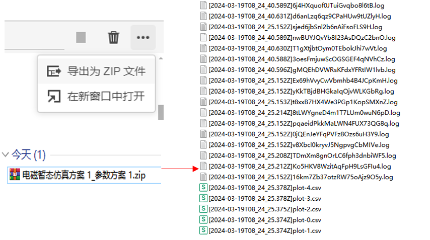

本文档介绍 **SimStudio 工作台** - **运行标签页** 的基础功能。

## 页面功能

**SimStudio 运行标签页**提供管理和存储参数方案/计算方案、配置仿真计算任务、查看仿真结果等功能。用户在完成建模工作后，用户可在该页面进行仿真任务相关的配置。

运行标签页包含**方案**与**结果**两个分页，分别管理仿真配置和结果数据。通过点击左边栏顶部的**方案**和**结果**标签实现切换。

SimStudio 作为 CloudPSS 多个仿真软件的建模工作台，内嵌了潮流计算、电磁暂态仿真、综合能源系统仿真模拟等多类仿真内核。因此，**SimStudio 运行标签页**也提供多种仿真方案的配置方法。

本文档仅介绍基础共性功能，针对不同计算方案的配置，参见：
+ 电磁暂态仿真 帮助页
+ 潮流计算 帮助页
+ 综合能源系统仿真模拟 帮助页

## 方案

**方案**分页包括**参数方案**及**计算方案**两项配置。根据所属软件平台的不同，**计算方案**按类型分为潮流计算、电磁暂态仿真、综合能源系统仿真模拟等多个分组。

运行一项计算任务前，需要预先配置好 1 套参数方案和 1 套计算方案。

 根据用户创建项目时使用的不同模板，SimStudio 会为每个项目默认至少添加 1 套参数方案和 1 套对应仿真类型的计算方案。例如：
 + 建立**空白电力系统模型**等电力系统模型时，默认添加 1 套**电磁暂态仿真**计算方案，特殊案例还会添加 1 套**潮流计算**计算方案。
 + 建立**空白综合能源系统模型**等综合能源系统模型时，默认添加 1 套**综合能源系统仿真模拟**计算方案。

 如下图所示。

### 参数方案

参数方案栏用于配置和管理多套模型参数。对于同一个项目，SimStudio 支持配置多套参数方案，方便多场景仿真、参数优化等任务中的参数配置和仿真结果管理。

#### 参数方案配置卡

在参数方案栏选择一个参数方案（如：默认参数方案），会切换显示当前参数方案下的**参数方案配置卡**。在**参数方案配置卡**处可配置当前参数方案下的模型全局参数/接口参数。模型的全局参数/接口参数可在**接口标签页**进行定义。定义方法参见 [参数方案配置](../../../basic/parameterSystem/index.md) 帮助页。

:::tip 空的默认参数方案
+ 针对不需要配置多场景参数的简单仿真任务，可不创建全局/接口参数列表，使用空白的默认参数方案即可，无需再配置参数方案。
:::

#### 重命名参数方案

在参数方案栏选择待重命名的参数方案，在当前参数方案下的**参数方案配置卡**顶端，可修改当前参数方案名称。

#### 新建参数方案

在参数方案栏，点击**参数方案**标签右侧的 **＋**，可添加新的参数方案。

#### 删除参数方案

在参数方案栏，右键选择待删除的参数方案，在弹出菜单中选择**删除**可删除选中的参数方案。

#### 创建副本

在参数方案栏，右键选择待复制的参数方案，在弹出菜单中选择**创建副本**可新建一个与之相同的参数方案。

#### 顺序调整

在参数方案栏，左键选中参数方案上下拖动，可调整参数方案列表顺序。

#### 案例

以**双端模块化多电平变流器模板**为例，该模型定义了**全局参数**列表，用户可添加不同的参数方案，配置不同的模块数进行多场景仿真。

:::tip 案例分享

点击可下载上述案例：[双端模块化多电平变流器模板](./model_CloudPSS_MMC_Benchmark.zip)。

您可将此项目上传至 SimStudio，结合案例实际学习如何使用参数方案。算例上传方法参见 [上传算例压缩包](../../../../../../account/app/simstuido/index.md#项目管理) 帮助页。

:::

### 计算方案

计算方案栏用于配置和管理多套仿真计算方案。对于同一个项目，SimStudio 支持配置多套仿真计算方案，方便使用一套模型完成不同类型的仿真分析工作。

SimStudio 内置了 CloudPSS 官方提供的潮流计算、电磁暂态仿真、综合能源系统仿真模拟等多种计算类型。用户可根据仿真涉及的应用方向，选择计算类型，添加并配置计算方案。

#### 计算方案配置卡

在计算方案栏选择一个计算方案（如：电磁暂态计算方案），会切换显示当前计算方案下的**计算方案配置卡**。在**计算方案配置卡**处可配置当前计算方案下仿真算法的运行参数，如仿真步长、开始/结束时间等。不同计算方案的配置方法，参见：
+ 电磁暂态仿真 帮助页
+ 潮流计算 帮助页
+ 综合能源系统仿真模拟 帮助页

#### 重命名计算方案

在计算方案栏选择待重命名的计算方案，在当前计算方案下的**计算方案配置卡**顶端，可修改当前计算方案名称。

#### 新建计算方案

在计算方案栏，在待新建的计算方案分组右侧点击 **＋**，可添加当前计算类型的新计算方案。

#### 删除计算方案

在计算方案栏，右键选择待删除的计算方案，在弹出菜单中选择**删除**可删除选中的计算方案。

#### 创建副本

在计算方案栏，右键选择待复制的计算方案，在弹出菜单中选择**创建副本**可新建一个与之相同的计算方案。

#### 顺序调整

在计算方案栏，左键选中计算方案上下拖动，可在当前计算类型分组内调整计算方案列表顺序。

### 启动任务 

配置好 1 套参数方案和 1 套计算方案后，点击**工具栏** - **启动任务**按钮，或点击右侧**使用帮助区**的**启动任务**按钮，即可启动当前**参数和计算方案下**的计算任务。切换不同的参数和计算方案，可启动不同的仿真计算任务。

计算任务启动后，页面会自动跳转至**运行标签页** - **结果**分页，并显示当前任务的计算结果。计算结果默认命名为`'所选计算方案名'_'所选参数方案名'`。

### 结束任务 

当计算任务开始运行后，在**结果**页面正在运行的计算右上角，点击**结束任务**按钮，可终止当前计算任务。

## 结果

**结果**分页提供管理、查看和分析 SimStudio 仿真计算任务结果的功能。点击**运行标签页**左边栏顶部的**结果**标签可切换至结果分页。

**结果**分页分为**结果管理栏**和**结果展示区**两个区域。

**结果管理栏**以列表的形式存储用户的每一次计算任务的结果，并显示每个任务的执行状态。用户可在**结果管理栏**选择不同计算任务，在右侧**结果展示区**浏览仿真结果。

不同仿真类型的计算任务产生的经计算结果格式也不同。当仿真出现不收敛等错误情况时，仿真信息会给出相应的提示。针对计算结果的格式和解读参见：
+ EMTLab - 电磁暂态仿真计算 - 量测及输出系统
+ EMTLab - 潮流计算及初始化 - 潮流结果写回及初始化
+ IESLab - 建模仿真平台 - 仿真模拟模块 - 结果页面
+ IESLab - 规划设计平台 - 典型场景生成模块 - 结果页面
+ IESlab - SimStudio IES - SimStudio IES 仿真计算 - 结果页面

### 重命名结果

在**结果管理栏**选择待重命名的计算结果，在**结果展示区**的顶端，可修改当前计算结果名称。

### 删除结果

在**结果管理栏**，右键选择待删除的计算结果，在弹出菜单中选择**删除**可删除选中的计算结果。也可选中待删除计算结果，点击**结果展示区**右上角的**删除**删除当前计算结果。

### 导出结果（cjob格式）

在**结果管理栏**，右键选择待导出的计算结果，在弹出菜单中选择**导出结果**，可将该仿真结果导出为**cjob**格式的文件。

### 导出结果（zip格式）

在**结果管理栏**，选中待导出的计算结果，点击**结果展示区**右上角的 **···**，选择**导出为zip文件**，可将该仿真结果导出为**zip**格式的文件。

### 导入结果

在**结果分页**，通过**工具栏**-**搜索框**搜索**导入结果**，点击**导入结果**选项，或通过快捷键**Ctrl+I**，可导入**cjob**格式的结果文件。导入后的结果会显示在**结果管理栏**。

### 显示全部

勾选**显示全部**后，会在**结果管理栏**加载用户在本地设备上执行过且未被删除的全部 XStudio 任务结果。

### 打开运行快照

在**结果管理栏**，右键选择待某一计算结果，在弹出菜单中选择**打开运行快照**，可以在新的窗口中打开对应结果的运行快照。

:::tip 学会使用运行快照
SimStudio 的模型具备快照机制。每运行一次仿真任务，SimStudio 会将当前任务的模型、参数方案、计算方案打包形成**快照**（**snapshot**）。用户可以非常方便地根据历史仿真结果，找到该结果对应的仿真模型拓扑、参数。该功能可帮助用户找回过去可运行成功、但当下不小心修改错误的项目。
:::

### 在新窗口中打开

在**结果管理栏**，选中某一计算结果，点击**结果展示区**右上角的 **···**，选择**在新窗口中打开**，可以在新的窗口中打开仿真结果。

### 数据结果图形操作 

部分结果曲线支持缩放、平移、重命名坐标轴名称、重命名标题名称、波形数据下载、波形图像下载、在`Chart Studio`中编辑等操作。可直接在结果消息的相应位置编辑。

## 常见问题

<!-- 为什么同一套模型能进行电磁暂态仿真却无法进行潮流计算？

:   要使用CloudPSS提供的潮流计算功能，首先需要搭建满足要求的算例。

    目前，潮流计算功能支持的设备元件包含静态负载、三相交流电压源、同步发电机、并联电容/电抗器、三相传输线、三相电阻、三相电感、三相电容、三相双绕组变压器和三相三绕组变压器，更多元件支持将在后续版本中逐步加入。潮流计算功能是围绕着三相交流母线进行的。
    
    因此，上述设备元件中，单电气端口的元件（静态负载、三相交流电压源、同步发电机、并联电容/电抗器）只有当其电气端口与母线直接相连时，才会被计入；对于多电气端口的元件，则其每一个电气端口都必须与母线直接相连。
    
    特别地，电流表可以串入电路中，在潮流计算过程中将被忽略。每条母线至多连接一个电源（三相交流电压源或同步发电机），其节点类型和相关参数在电源的 Power Flow Data 页面指定。未连接电源的母线将作为 PQ 节点参与计算。
    
    同一个算例中可以包含多个独立的网络，每个网络都必须包含且仅包含一个平衡节点。 -->