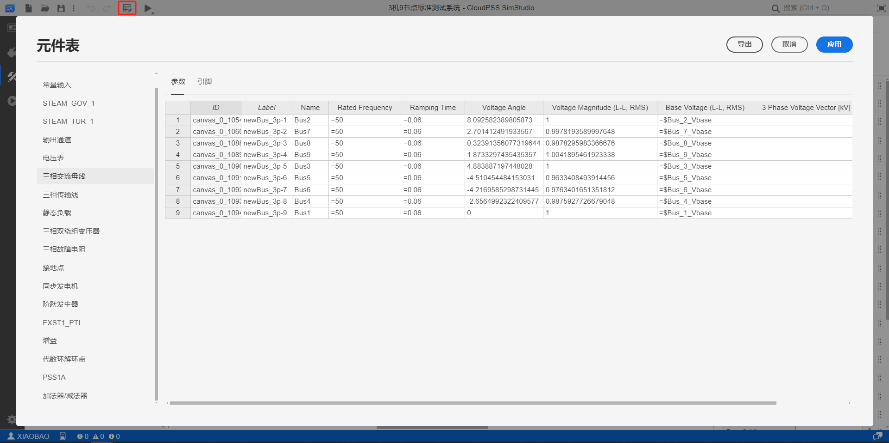
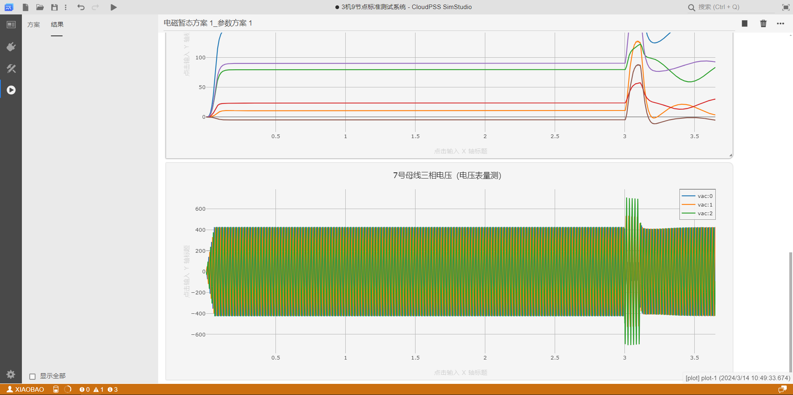

SimStudio 工作台分为四个个区域：上方的工具栏、左侧的标签栏、中间的功能区、以及下方的状态栏。其中标签栏用于切换功能区显示的标签页，包括总览、接口、实现、运行四个标签页，本节主要介绍工具栏的功能。

## 页面功能

工具栏包括 SimStudio 工作台的通用工具：新建、打开、保存、另存为、撤销、重做、搜索、全屏。以及不同标签页下的特殊工具：接口标签页下的**预览**、实现标签页下的**元件表**、运行标签页下的**启动任务**等。

## 功能说明

### 新建

点击工作栏左上侧**新建**按钮，会弹出新建窗口，用户可以选择已有项目模板，点击**新建**进行搭建，也可以点击窗口外任意空白处关闭该窗口。

新建项目窗口中有 CloudPSS SimStudio 平台预置的能够准确稳定运行的项目模板，包含空白项目模板、旋转电机及其控制系统、IEEE标准系统、电压源变流器及其控制系统、储能并网发电系统、光伏并网发电系统、高压直流输电系统、直流微电网系统、模块化多电平变流器及其控制系统、综合能源系统，为用户搭建仿真算例提供参考。

### 打开

点击工作栏左上侧**打开**按钮，会弹出打开窗口，用户可分别从**个人仿真**、**协作项目**、**仿真广场**以及**本地文件**打开所需的项目。

:::info

**个人仿真**是用户创建和保存在云空间的个人私有仿真项目。

**协作项目**是组织内合作的项目。

**仿真广场**中存储的是所有用户保存在云空间且选择公开的仿真项目。

**本地文件**是用户保存在本地设备的仿真项目文件，通过拖放文件或点击文件选择对话框选择文件，然后打开仿真项目。

:::

### 保存/另存为

点击工作栏左上侧**保存**按钮、或右边**更多**弹出的**另存为**按钮后，会弹出另存为窗口，选择保存为云空间的**个人项目**、**协作项目**、或者**本地文件**。选择保存在云空间中，须填入资源ID和名称，权限、描述选填，点击保存按钮即可实现项目文件的保存。

:::warning

项目权限选择**私有**，项目将会保存在个人仿真中，仅自己可见。

项目权限选择**完全公开**，项目会同步到仿真广场中，所有用户可见。

关于**高级权限**配置详见[高级权限配置]。

:::

### 撤销/重做

点击工作栏左上侧**撤销**按钮，撤回上一步操作。

点击工作栏左上侧**重做**按钮，返回上一步操作。

### 预览

当功能区切换到**实现标签页**时，工具栏会出现**预览**工具，点击预览按钮，实现对参数配置及模型封装情况的预览。

### 元件表

当功能区切换到**实现标签页**时，工具栏会出现**元件表**工具，点击按钮弹出元件表对话框，元件表用于批量查看、编辑、导出元件的参数及引脚。元件表操作与excel类似。

修改完成后点击右上角确认保存并退出元件表。详见[元件表](../../basic/componentTable/index.md)。

### 启动任务

**元件表**的右侧是**启动任务**工具，鼠标右键点击启动任务按钮，会弹出**结果标签页**下的参数方案和计算方案，方便用户在**实现标签页**下修改方案。

鼠标左键点击启动任务按钮，会跳转到**结果标签页**，根据当前的参数方案和计算方案启动仿真计算任务。

### 搜索

工作栏右上侧提供**搜索框**，可用于搜索命令、页面元素等。用户在搜索框内输入搜索内容，可以搜索出当前页面下与用户搜索内容有关的所有元素。例如在实现标签页下可以搜索于输入内容有关的**模型**和**拓扑图元素**。

关于**搜索**的详细用法参见[搜索功能]。

### 全屏

点击工作栏右上侧搜索栏旁边的**全屏**按钮，SimStudio 工作台将进入全屏模式，全屏模式下再次点击该按钮将退出全屏。

