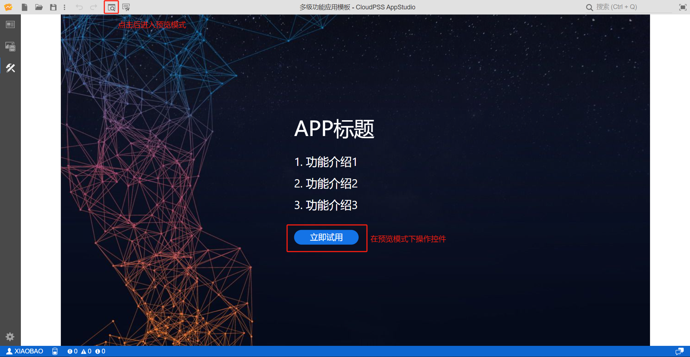

本节介绍 AppStudio 的应用预览功能。

## 功能定义

AppStudio 提供应用预览功能，在预览模式中用户可以对所构建的应用界面、数据绑定关系和数据可视化效果进行调试。

## 功能说明

### 应用预览

当功能区切换到场景标签页时，工具栏会出现预览工具，点击预览按钮，应用会从编辑模式进入预览模式。

在预览模式下，通过操作可交互控件，对应用的数据绑定关系和可视化效果进行调试。

## 常见问题

预览模式下存在无法操作可交互控件的问题 ，该如何解决？

:   - 排除状态栏的错误提示：进入预览模式前，必须将状态栏的所有错误全部消除，否则会导致预览模式下控件交互功能失效。
    - 排除控件属性栏错误提示：当表达式格式输入有误时，比如输入格式不正确或不存在的表达式，都会导致预览模式下控件功能失效，表达式的错误不会在状态栏提示，因此需要检查每个控件属性栏，消除错误。

预览模式下启动函数资源后没有结果返回，该如何结果？

:   用户可以按照以下步骤进行检查：

    - 检查添加在资源标签页内的函数资源是否在线，只有在线的函数才能被调用；

    - 排除状态栏的错误提示；

    - 确认控件属性的录入模式正确，表达式必须在 f(x) 模式下输入;

    - 排除控件属性栏错误提示，主要检查表达式中的控件名是否存在、检查表达式书写是否正确完整;

    - 排除隐藏错误，主要检查函数任务 ID 是否绑定正确、消息过滤是否填写正确。

