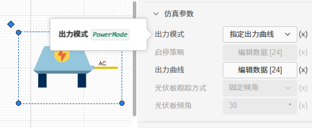

本节首先介绍光伏系统元件的参数配置，然后通过具体案例介绍该元件的使用方法和实现的效果，最后对常见问题进行回答。该元件用于 **IESLab 建模仿真平台**。

## 元件定义

### 元件功能

该元件用以建模光伏发电系统，能够根据**气象数据**、**IV 曲线**及**特性参数**模拟光伏发电系统在**实际工况下的 MPPT 输出功率**。

### 元件原理

太阳能电池组件是光伏系统元件的基础和核心，它的输出功率与 IV 曲线和光照强度、温度等气象参密切相关，输出功率为：

$$
P=P_{mppt}\eta
$$

式中：$P_{mppt}$为实际工况的 MPPT 输出功率，根据模型（工况气象参数、IV 曲线及特性参数）得到，$\eta$为综合折损效率。光伏发电系统在能量流计算中可看作**PQ 节点**。

1. **太阳能光伏电池理想数学模型**：

$$
I=I_{ph}-I_0\left\lbrack e^{\left(q\left(U+R_sI\right)/nkT\right)-1}\right\rbrack-\left(U+R_sI\right)/R_{sh}
$$

$$
T_{cell}=T_{air}+αS(1-η)/(U_c+U_ν ν_{wind} )
$$

式中，$I_{ph}$ 为光伏阵列电流； $I_0$ 为反向饱和电流；$q$ 为电子电荷，即 1.6× 10-19 C； $n$ 为二极管因子； $k$ 为玻耳兹曼常数，即 1.38× 10-23 J/K； $R_s$ 为串联电阻；$R_{sh}$ 为并联电阻， $T_{cell}$ 为组件温度，$T_{air}$ 为环境温度，$S$ 为光照强度W/m²，其余为常数。

在理想模型种，$I_{ph}$， $I_0$， $R_s$， $R_{sh}$ 4 个参数给定后，可以求解得到 I/V 曲线。

在给定的光照强度和温度条件下，求解其 I/V 曲线，通过 MPPT 控制得到最大功率点，一般认为 MPPT 点即为光伏板功率出力。

2. **实际工况（S，T）的工程简化模型**

由于参数 Iph、 I0、 Rs、 n很难确定，厂家很少提供，一般将理想方程进行工程简化。而实际的工作环境肯定与标准测试条件有所差异。光伏电池的输出特性和外界的环境影响因素有着十分紧密的联系，需要对模型所涉及到的 4 个性能参数依据环境因素对其的影响进行修正，从而实现对任意环境条件下光伏电池输出特性的模拟。

$$
\Delta I=S/S_{ref}
$$

$$
T_{cell} = T_{air}+KS
$$

$$
\Delta U=\left\lbrack1-c\left(T_{ref}\right)\right\rbrack In\left\lbrack e+b\left(S-S_{ref}\right)\right\rbrack
$$

在任意条件下（S，T），组件的MPPT峰值电压和峰值电流为：
$$
Ú_m=U_m\Delta U
$$

$$
Í_m=I_m\Delta I
$$

式中， a=0.00025 和 c=-0.0015为 温度补偿系数，b=0.000288 为光强补偿系数。标准太阳光照强度 $S_{ref}$ 为 1000 W/m2，标准电池温度 $T_{ref}$为 25 ℃；$T_{air}$为工况实际环境温度，单位为 ℃；电池温度系数 K=0.03，$S$为太阳光照强度，单位为 W/m2。

1. **光伏系统的效率与损失**

由于设备自身的不完美性、外界环境因素的影响以及线缆传输过程中的能量损失等多种因素，光伏系统存在多种损失，主要考虑的因素有逆变器的效率损失、变压器的效率损失，灰尘及雨雪遮挡损失、光伏组件串并联不匹配损失、交直流部分线路损失、其它杂项损失。

**失配损耗**：这主要是由于组串单独组件及不同组串间输出不匹配所导致的损耗。为了优化此损失，一些光伏系统采用组串逆变电器进行短路电流分档，以减小失配损耗。

**逆变电器损耗**：逆变电器相关损耗包含逆变电器自身损耗以及直流电转换交流电中MPPT追踪导致的损耗。逆变电器自身损耗主要包括效率损耗、过载损耗、功率阀值损耗、过电压损耗以及电压阀值损耗等。此外，逆变电器在将直流电转换成交流电的过程中，还会产生电力电子器件的热损失和辅助系统耗电损失。

**变压器相关损耗**：这主要包括逆变电器自身损耗及抵押转高压过程中的损耗。逆变器在晚上也会持续的消耗电能，需要考虑变压器的空载损耗。

**线缆损耗**：这主要是由于电压降导致的欧姆损耗，具体损耗需基于项目实际使用的线缆情况而定。线缆损耗主要包括AC及DC线缆损耗，AC线缆损耗指AC输出到变压器连接点间造成的损耗，DC线缆损耗指光伏阵列、汇流箱输出端至逆变器DC输入端造成的损耗。

**其他损耗**：光伏发电系统效率还可能受到灰尘及雨雪遮挡、斑点、组件衰减、温度影响等外界因素的损失。在项目前期，应注意系统的最优化设计，并在项目运行过程中采取一定措施来减少这些影响。

在光伏系统众多损失中，逆变器效率是最重要的。逆变器MPPT跟踪效率用效率常数代替。

太阳能光伏组件的 IV 曲线随着光照强度、温度和遮挡的不同在变化着，最大功率点也就在变化了，逆变器需要不断地寻找这个最大功率点，也就是最大功率点跟踪了，这样才能保证全天的电池板能量都能最大化地输出出来，不浪费太阳能资源。

**MPPT**，即 Maximum Power Point Tracking ，中文为“最大功率点跟踪”，它是指逆变器根据外界不同的环境温度、光照强度等特性来调节光伏阵列的输出功率，使得光伏阵列始终输出最大功率。
光伏阵列的最大功率点跟踪(MPPT)技术，常用的有以下几种：恒电压跟踪法(Constant Voltage Tracking， CVT)、干扰观察法(Perturbation And Observation method， P&O)、增量电导法(Incremental Conductance method， INC)、基于梯度变步长的电导增量法等。

系统效率：

$$
P=Ṕ_m\eta_{in}\eta_{dirt}\eta_{DCcable}\eta_{mismatch}\eta_{ACcable}\eta_{IAM}\eta_{trans}
$$
式中，$Ṕ_m$为理想功率，$\eta_{in}$为逆变器 inverter 的MPPT追踪控制效率，$\eta_{dirt}$为受污损遮挡影响后系统效率，$\eta_{DCcable}$为直流电缆效率，$\eta_{mismatch}$为光伏组件串并联不匹配影响后的系统效率，$\eta_{ACcable}$为交流电缆效率，$\eta_{IAM}$为太阳辐射入射（IAM）影响后的系统效率，$\eta_{trans}$为变压器效率。

推荐的系统效率参考值：
| 效率损失项目 | 	修正系数| 
| :--- | :--- |
| 直流电缆效率 |	99% | 
|	光伏组件串并联不匹配修正效率 |	99% |	
|	灰尘及雨雪遮挡修正效率 |		97% |	
|	交流线路效率 |		99% |	
|	逆变器MPPT的效率 |		97% |	
|	太阳辐射入射（IAM）修正效率 |		98% |	
|	变压器效率 |		99% |	

## 元件说明

光伏系统元件参数标签页包括**属性**、**参数**、**引脚**三类参数，下面对每类参数进行详细说明。

### 属性

CloudPSS 提供了一套统一的元件属性功能，关于元件属性参数的配置，详见[元件属性配置](/docs/docs/software/xstudio/simstudio/basic/moduleEncapsulation/index.md)页面。

### 参数

#### 基础参数

| 参数名 | 键值 (key) | 单位 | 备注 | 类型 | 描述 |
| :--- | :--- | :--- | :--: | :--- | :--- |
| 元件类型 | `CompType` |  | 选择元件类型 | 选择 | 选择**交流元件**时输出交流电，为**光伏交流系统**；选择**直流元件**时输出直流电，为**光伏直流系统**。 |
| 设备配置台数 | `DeivceNumber` | 台 | 设备配置台数 | 自然数 | 设备配置台数 |
| 待选设备类型 | `DeviceSelection` |  | 从设备库中选择设备类型 | 选择 | **选择数据管理模块录入的设备型号**，将光伏系统元件的厂家、产品型号、额定运行参数自动绑定为对应设备在数据管理模块中录入的参数。|
| 损失系数组 | `LossCoes` |  | 配置光伏系统各个环节的能量损失系数 | 表格 | 可配置的损失类型包括直流电缆损失、光伏组件串并联不匹配损失、灰尘及雨雪遮挡损失、交流线路损失、逆变器 MPPT 的效率损失、太阳辐射入射（IAM）损失、变压器损失等， 当仿真参数组的**出力模式**项为**指定出力曲线**时失效。|

#### 仿真参数

在仿真参数中编辑光伏系统的仿真边界条件，主要包含**运行方式**和**运行策略曲线**。

| 参数名 | 键值 (key)  | 单位 | 备注 | 类型 | 描述 |
| :--- | :--- | :--- | :--: | :--- | :--- |
| 出力模式 | `PowerMode` |  | 选择光伏系统的出力模式 | 选择 | 在输入仿真运行策略前需要指定设备运行模式。有**由气象数据计算**和**指定出力曲线**两种模式。若选择**由气象数据计算**，则光伏系统出力根据气象数据计算得到。若用户已经计算或得到了光伏系统的出力曲线，可以修改为**指定出力曲线模式**，在**出力曲线**参数中录入出力曲线即可。|
| 运行策略 | `Strategy` |  | 配置光伏系统在不同时刻的设备启停策略 | 表格 | 仅当**出力模式**项为气象数据计算时生效，在表格中录入**各个时间段对应的设备启停策略**。 **开始时刻**对应每个仿真时刻，**启停设备台数**不能超过**设备配置台数**。|
| 出力曲线 | `PowerCurve` |  | 自定义光伏系统的出力曲线 | 表格 | 仅当**出力模式**项为**指定出力曲线**时生效，在表格中录入**各个时间段对应的光伏系统的出力**。 **开始时刻**对应每个仿真时刻。|
| 光伏板跟踪方式 | `TrackingMethod` |  | 选择光伏板跟踪方式 | 选择 | 仅当**出力模式**项为**由气象数据计算**时生效。可选择**固定倾角**或**单轴跟踪（NS轴）**|
| 光伏板倾角 | `DigAngle` | ° | 配置光伏板倾角 | 实数（常量） | 仅当**出力模式**项为**由气象数据计算**且**光伏板跟踪方式**项为**固定倾角**时生效。调节范围 0-360° |

#### 优化参数

在优化参数中编辑光伏系统的优化条件。

| 参数名 | 键值 (key)  | 单位 | 备注 | 类型 | 描述 |
| :--- | :--- | :--- | :--: | :--- | :--- |
| 是否优化该设备 | `OptimizationChoice` |  | 是否对光伏系统元件的运行方式进行优化 | 选择 | 仅当仿真参数组的**出力模式**项为**由气象数据计算**时生效。选择**是**，则设备的运行策略由系统优化得到，不读取仿真参数中设置的运行模式和运行策略；选择**否**，则系统按照仿真参数的运行模式和运行策略运行。|

### 引脚

光伏系统只有一个**电接口**引脚，用于将光伏系统元件与其他电设备连接，支持**线连接**和**信号名**的连接方式。

引脚的**名称、键值、维度、定义描述**的详细说明如下表所示。

| 引脚名 | 键值 (key)  | 维度 | 描述 |
| :--- | :--: | :--- | :--- |
| 电接口 | `DC/AC` | 1×1 | 可以在引脚处输入相同的字符使得光伏系统与其他电元件相连，当基础参数**元件类型**项是**直流元件**时，键值为**DC**；**元件类型**项是**交流元件**时，键值为**AC**。|

## 案例

import Tabs from '@theme/Tabs';
import TabItem from '@theme/TabItem';

<Tabs>
<TabItem value="js" label="案例1">

以建模仿真平台**含风光储交直流配网仿真项目**为例。

- 首先在**数据管理模块**录入不同类型的光伏设备；

  

- 配置光伏设备的**额定运行参数**；

  

- 然后将**基础参数**的**待选设备类型**和数据管理模块中录入的光伏设备绑定；

  

- 最后将**仿真参数**的**出力模式**项配置为**由气象参数计算**；

  

- 并设定启停策略；

  

- 从仿真结果中可以看到该光伏系统元件的运行方式是由**气象参数**和**运行策略决定**的。

  

</TabItem>
<TabItem value="py" label="案例2">

对于某新能源项目，已有光伏系统出力的标准曲线，无需平台进行计算，此时使用指定出力曲线模式。

以建模仿真平台**含风光储交直流配网仿真项目**为例。

光伏系统的**仿真参数**的**出力模式**项配置为**指定出力曲线**；

  

- 并设定出力曲线，该曲线可以从 excel 表格中复制粘贴、手动编辑，也可以导入和导出 csv 文件。

  

- 从仿真结果中可以看到该光伏系统的出力曲线是由**用户指定的出力曲线**运行的。

  

</TabItem>
</Tabs>

## 常见问题

光伏元件是否准确？

:   光伏系统出力受多种因素影响，其中关键影响因素有气象条件和太阳能电池模型。

:   1. **气象参数**

        平台内置**中国大陆区域**近6年8760小时数据由 NASA 的**POWER**(https://power.larc.nasa.gov/) 和**MERRA2** (https://gmao.gsfc.nasa.gov/reanalysis/MERRA-2/) 等项目提供，NASA地球表面辐照从地球外层的辐照计算得到，受云层及空气质量影响较大，相比于 PVSyst 内置的**Meteonorm8**气象数据库，约有0—10%的偏差。  

:    2. **太阳能电池工程模型**

        以 NOCT 工况为例验证模型有效性: NOCT 是额定电池工作温度（ Normal Operating Cell Temperature， NOCT），是指当太阳能组件或电池处于开路状态，并在（电池表面光强强度=800W/，环境温度=20℃，风速=1m/s）时所达到的温度，正常组件的NOCT都在45℃左右（此时，k=0.03125）。  
        收集了晶科、隆基、晶澳等多个太阳能组件的参数，对比 NOCT 工况下的 MPPT 功率，太阳能电池工程模型的结果与厂家实测值的误差约 0-1%， 满足实际精度要求。

光伏系统能否进行排列优化？

:   暂不支持。

光伏系统的交直流元件有什么区别？

:   选择交流时输出交流电，为光伏交流系统，已经包含组串、支架跟踪、逆变、变压等主辅系统; 选择直流时输出直流电，为光伏直流系统，已经包含组串、支架跟踪等主辅系统，但不包含逆变设备。
    在能量流计算过程中均为 PQ 节点。

    注意，交流元件和直流元件不能直接相连。

光伏系统元件在建模仿真平台使用时需要配置哪些元件参数？数据管理模块需要配置哪些数据？

:   在对光伏系统元件进行仿真模拟前，务必录入编辑元件的**基础参数**和**仿真参数**；

    在数据管理模块需要配置**光伏设备**的**额定运行参数**。并在基础参数中绑定数据管理模块的光伏设备。

光伏系统元件的运行方式有哪几种配置方式？

:   共有 3 种

:   

:   1. **指定出力曲线**

        若用户已经有光伏系统的出力曲线，此时光伏系统元件的运行方式可完全由用户自己设定。  
        只需要将**仿真参数**的**出力模式**项设置为**指定出力曲线**，并在**出力曲线**项中录入**各个时间段对应的光伏系统出力**。此时基础参数无效，也无需优化，**优化参数被禁用**。
        
:   2. **出力由气象数据计算得到，运行方式不进行优化**

        此时光伏系统元件的运行方式由气象数据和启停策略计算得到。只需要将**仿真参数**的**出力模式**项设置为**由气象数据计算**，配置光伏板的跟踪方式、光伏板倾斜角等与气象有关的参数，并在**运行策略**项中录入**各个时间段对应的设备启停策**即可。 

:   3. **出力由气象数据计算得到，运行方式优化**

        此时光伏系统元件的出力由气象数据计算，但是**不读取仿真参数的设备启停策略**，设备启停策略由系统优化得到，主要应用于有弃风弃光的场景，调整设备启停以减小弃风弃光（默认光伏系统元件的跟踪系统不含固定角度，可调整角度以弃光）。需要将**优化参数**的**是否优化该设备**项设置为**是**即可。

启停策略和出力曲线的开始时刻必须和仿真时刻一致吗？

:   **建议保持一致**。若启停策略和出力曲线的开始时刻与仿真时刻不一致，平台会**自动采用插值和外推算法填充**。    特别注意：对于启停策略和出力曲线，在仿真时刻之外的时间段策略，为**前平推和后平推**，即，策略之前的数值始终为策略的第一个值，策略之后的数值始终为策略里最后一个值。
