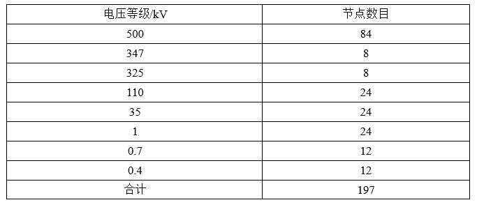
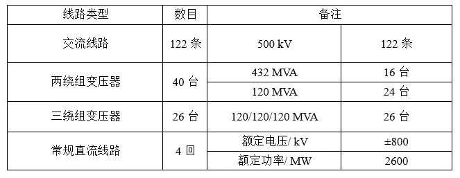
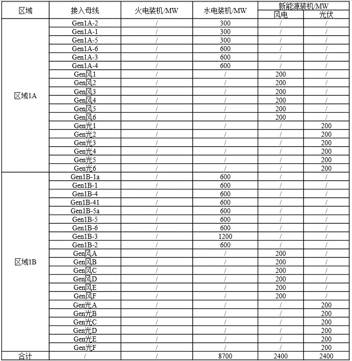
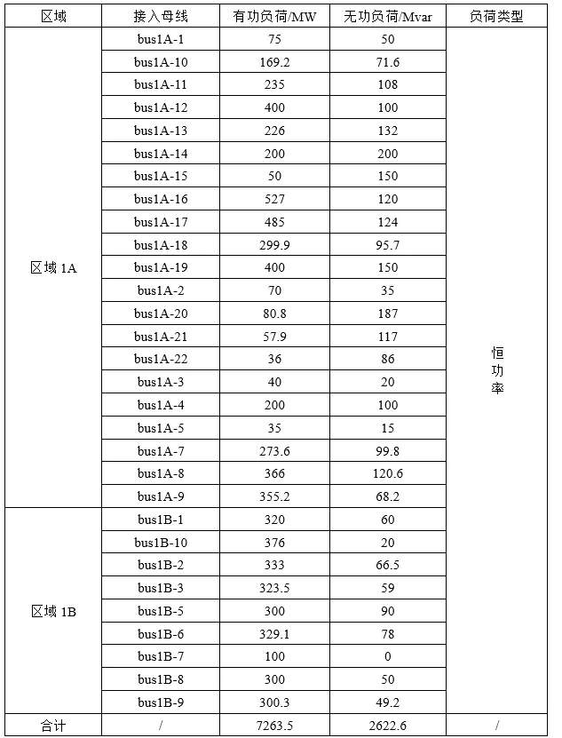

该算例对应中国电机工程学会 Github 发布算例中的 CSEE-TAS-173 算例。

## 场景描述
含新能源交直流混联送出系统，送受端区域电网交流联络通道三永N-2故障后，送受端区域电网功角失稳。

## 系统概况
根据某区域实际电网拓扑和数据，搭建如图所示的两区域交直流混联电网，所在分区分别为区域1A、1B（此处区域为BPA中的分区名称），输电网架共有197个节点（500kV主网架为85个节点）。

## 拓扑与线路概况
系统共有交流线路122条，变压器66台、直流4回，线路及变压器概况如下。

## 电源概况
水电机组总装机8700MW，其中区域1A装机2700MW，区域1B装机6000MW；风电、光伏2种新能源机组总装机4800MW，其中区域1A装机2400MW，区域1B装机2400MW；新能源机组装机占比接近36%。系统电源装机概况详见下表。

## 负荷概况
全网总负荷7263.5MW，其中区域1A负荷4581.6MW，区域1B负荷2681.9MW。系统负荷概况详见下表。

## 未启用机组
在中国电机工程学会已发布算例的运行方式下，拓扑图中部分机组未启用，未启用机组情况如下。

## 故障场景
区域1A和区域1B联络线（bus1A-21-bus1B-3）三永N-2后，区域1A机组相对区域1B机组功角失稳，BPA、PSASP 以及 CloudPSS 中仿真结果如下所示。

