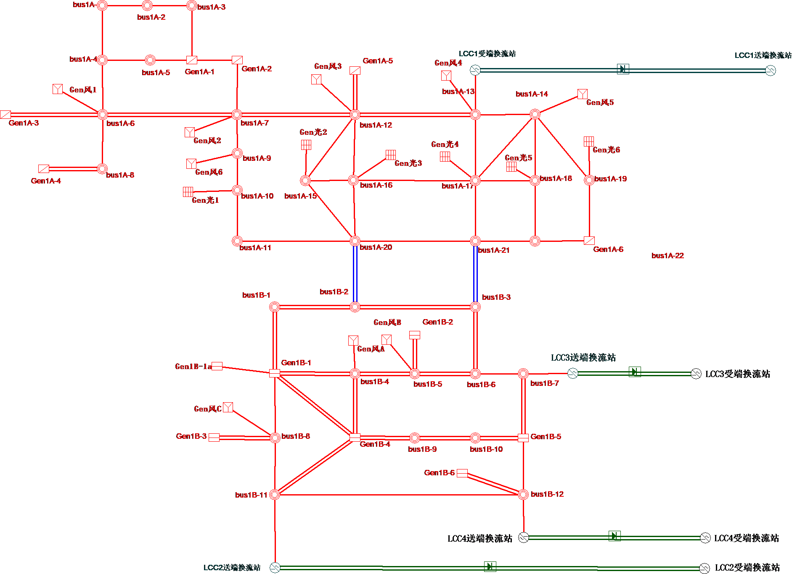
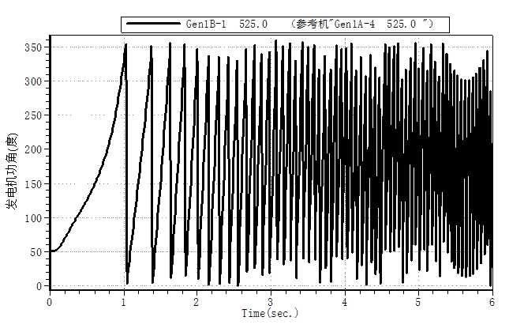
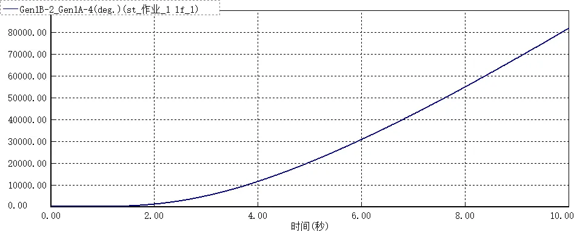
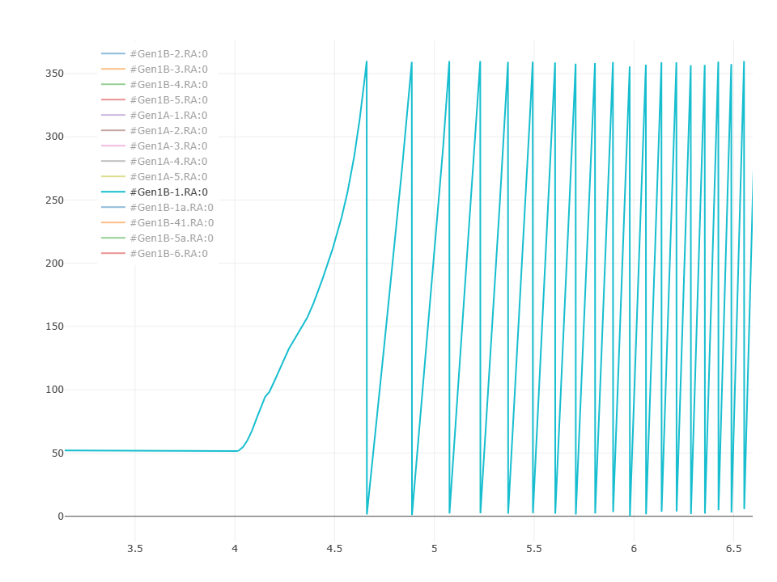

该算例对应中国电机工程学会 Github 发布算例中的 CSEE-TAS-173 算例。

## 场景描述
含新能源交直流混联送出系统，送受端区域电网交流联络通道三永N-2故障后，送受端区域电网功角失稳。

## 系统概况
根据某区域实际电网拓扑和数据，搭建如图所示的两区域交直流混联电网，所在分区分别为区域1A、1B（此处区域为BPA中的分区名称），输电网架共有197个节点（500kV主网架为85个节点）。

| 电压等级/kV | 节点数目 |
|------------|---------|
| 500        | 85      |
| 347        | 8       |
| 325        | 8       |
| 110        | 24      |
| 35         | 24      |
| 1          | 24      |
| 0.7        | 12      |
| 0.4        | 12      |
| 合计       | 197     |

## 拓扑与线路概况
系统共有交流线路122条，变压器66台、直流4回，线路及变压器概况如下。

| 线路类型     | 数目    |   >    |  备注 |
|-------------|---------|-----------|-----|
| 交流线路     | 122条  | 500 kV|122条 |
| 两绕组变压器 | 40台   | 432 MVA|16台 |
|       ^      |  ^       | 120 MVA|24台 |
| 三绕组变压器 | 26台   | 120/120/120 MVA|26台 |
| 常规直流线路 | 4回    | 额定电压/ kV|±800 |
|       ^      |  ^       | 额定功率/ MW|2600 |

## 电源概况
水电机组总装机8700MW，其中区域1A装机2700MW，区域1B装机6000MW；风电、光伏2种新能源机组总装机4800MW，其中区域1A装机2400MW，区域1B装机2400MW；新能源机组装机占比接近36%。系统电源装机概况详见下表。

| 区域   | 接入母线   | 火电装机/MW | 水电装机/MW | 风电装机/MW       | 光伏装机/MW |
|-------|-----------|-------------|-------------|---------------|----------------| 
| 区域1A | Gen1A-2   | /           | 300         | /             | /              |
|    ^   | Gen1A-1   | /           | 300         | /             | /              |  
|   ^   | Gen1A-5   | /           | 300         | /             | /              |
|   ^   | Gen1A-6   | /           | 600         | /             | /              |
|   ^   | Gen1A-3   | /           | 600         | /             | /              |
|   ^   | Gen1A-4   | /           | 600         | /             | /              |
|   ^   | Gen风1    | /           | /           | 200           | /              |
|   ^   | Gen风2    | /           | /           | 200           | /              |
|   ^   | Gen风3    | /           | /           | 200           | /              |
|   ^   | Gen风4    | /           | /           | 200           | /              |
|   ^   | Gen风5    | /           | /           | 200           | /              |
|   ^   | Gen风6    | /           | /           | 200           | /              |
|   ^   | Gen光1    | /           | /           | /             | 200            |
|   ^   | Gen光2    | /           | /           | /             | 200            |
|   ^   | Gen光3    | /           | /           | /             | 200            |
|   ^   | Gen光4    | /           | /           | /             | 200            |
|   ^   | Gen光5    | /           | /           | /             | 200            |
|   ^   | Gen光6    | /           | /           | /             | 200            |
| 区域1B | Gen1B-1a  | /           | 600         | /             | /              |
|   ^   | Gen1B-1   | /           | 600         | /             | /              |
|   ^   | Gen1B-4   | /           | 600         | /             | /              |
|   ^   | Gen1B-41  | /           | 600         | /             | /              |
|   ^   | Gen1B-5a  | /           | 600         | /             | /              |
|   ^   | Gen1B-5   | /           | 600         | /             | /              |
|   ^   | Gen1B-6   | /           | 600         | /             | /              |
|   ^   | Gen1B-3   | /           | 1200        | /             | /              |
|   ^   | Gen1B-2   | /           | 600         | /             | /              |
|   ^   | Gen风A    | /           | /           | 200           | /              |
|   ^   | Gen风B    | /           | /           | 200           | /              |
|   ^   | Gen风C    | /           | /           | 200           | /              |
|   ^   | Gen风D    | /           | /           | 200           | /              |
|   ^   | Gen风E    | /           | /           | 200           | /              |
|   ^   | Gen风F    | /           | /           | 200           | /              |
|   ^   | Gen光A    | /           | /           | /             | 200            |
|   ^   | Gen光B    | /           | /           | /             | 200            |
|   ^   | Gen光C    | /           | /           | /             | 200            |
|   ^   | Gen光D    | /           | /           | /             | 200            |
|   ^   | Gen光E    | /           | /           | /             | 200            |
|   ^   | Gen光F    | /           | /           | /             | 200            |
| 合计    | /         | /           | 8700        | 2400          | 2400           |

## 负荷概况
全网总负荷7263.5MW，其中区域1A负荷4581.6MW，区域1B负荷2681.9MW。系统负荷概况详见下表。

| 区域   | 接入母线   | 有功负荷/MW | 无功负荷/Mvar | 负荷类型 |
|-------|-----------|-------------|---------------|--------|
| 区域1A | bus1A-1   | 75          | 50            | 恒功率    |
|    ^   | bus1A-10  | 169.2       | 71.6          |   ^      |
|    ^   | bus1A-11  | 235         | 108           |   ^      |
|    ^   | bus1A-12  | 400         | 100           |   ^      |
|    ^   | bus1A-13  | 226         | 132           |   ^      |
|    ^   | bus1A-14  | 200         | 200           |   ^      |
|    ^   | bus1A-15  | 50          | 150           |   ^      |
|    ^   | bus1A-16  | 527         | 120           |   ^      |
|    ^   | bus1A-17  | 485         | 124           |   ^      |
|    ^   | bus1A-18  | 299.9       | 95.7          |   ^      |
|    ^   | bus1A-19  | 400         | 150           |   ^      |
|    ^   | bus1A-2   | 70          | 35            |   ^      |
|    ^   | bus1A-20  | 80.8        | 187           |   ^      |
|    ^   | bus1A-21  | 57.9        | 117           |   ^      |
|    ^   | bus1A-22  | 36          | 86            |   ^      |
|    ^   | bus1A-3   | 40          | 20            |   ^      |
|    ^   | bus1A-4   | 200         | 100           |   ^      |
|    ^   | bus1A-5   | 35          | 15            |   ^      |
|    ^   | bus1A-7   | 273.6       | 99.8          |   ^      |
|    ^   | bus1A-8   | 366         | 120.6         |   ^      |
|    ^   | bus1A-9   | 355.2       | 68.2          |   ^      |
| 区域1B | bus1B-1   | 320         | 60            |   ^      |
|    ^   | bus1B-10  | 376         | 20            |   ^      |
|    ^   | bus1B-2   | 333         | 66.5          |   ^      |
|    ^   | bus1B-3   | 323.5       | 59            |   ^      |
|    ^   | bus1B-5   | 300         | 90            |   ^      |
|    ^   | bus1B-6   | 329.1       | 78            |   ^      |
|    ^   | bus1B-7   | 100         | 0             |   ^      |
|    ^   | bus1B-8   | 300         | 50            |   ^      |
|    ^   | bus1B-9   | 300.3       | 49.2          |   ^      |
| 合计    | /         | 7263.5      | 2622.6        |          |

## 未启用机组
在中国电机工程学会已发布算例的运行方式下，拓扑图中部分机组未启用，未启用机组情况如下。

| 区域   | 未启用机组                                                                                     | 未启用负荷 |
|-------|------------------------------------------------------------------------------------------------|-----------|
| 区域1A | Gen1A-6、Gen光1、Gen光2、Gen光3、Gen光4、Gen光5、Gen光6、Gen风1、Gen风2、Gen风3、Gen风4、Gen风5、Gen风6 | -         |

## 故障场景
区域1A和区域1B联络线（bus1A-21-bus1B-3）三永N-2后，区域1A机组相对区域1B机组功角失稳，BPA、PSASP 以及 CloudPSS 中仿真结果如下所示。

