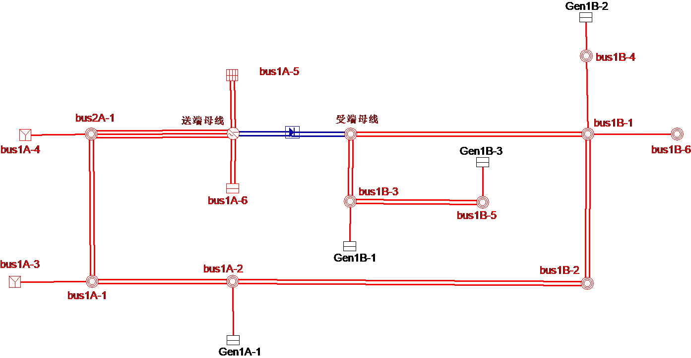
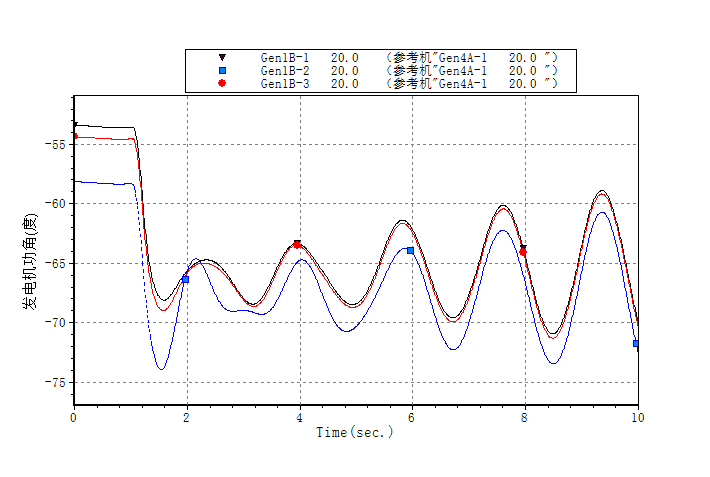
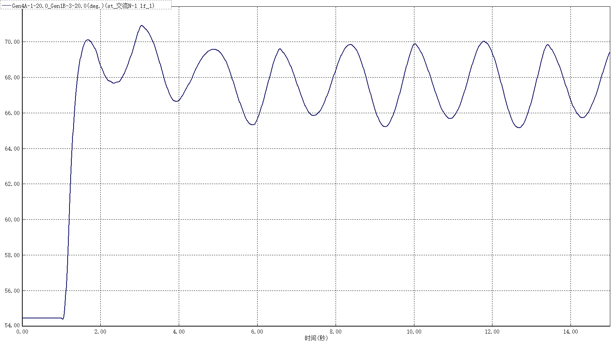
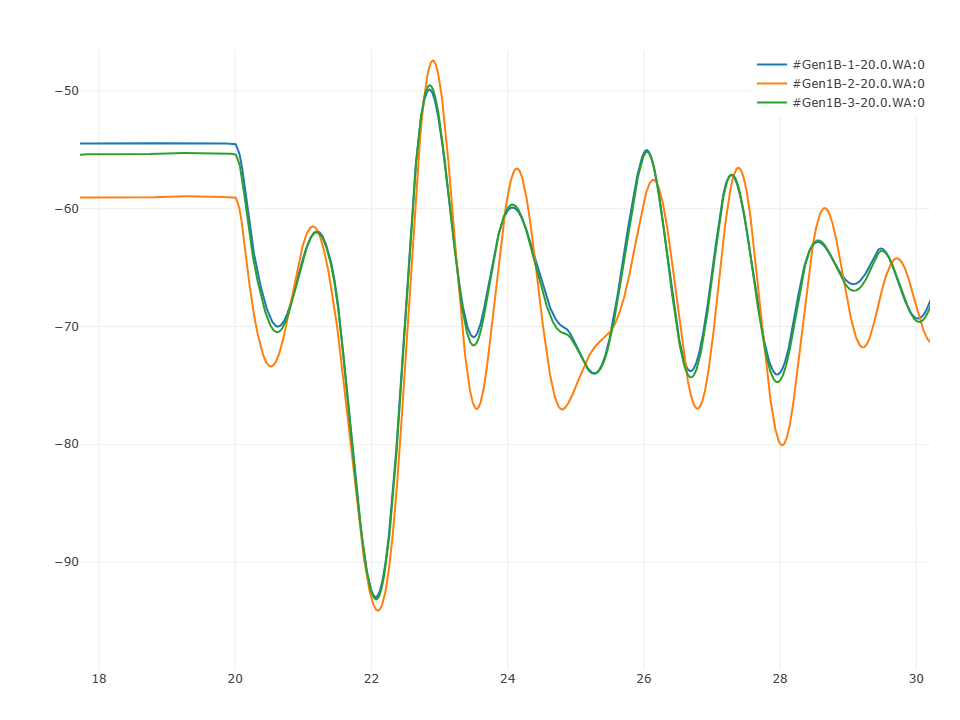

该算例对应中国电机工程学会 Github 发布算例中的 CSEE-DAS-49 算例。

## 场景描述
风火打捆经交直流并联送出系统，新能源、火电通过长链式交流通道送往受端电网，长链式交流通道三永N-1故障后导致系统动态功角失稳。

## 系统概况
根据某区域实际电网拓扑和数据，搭建如图所示的两区域交直流混联电网，所在分区分别为区域1A、1B（此处区域为BPA中的分区名称），输电网架共有53个节点（500kV主网架为16个节点），输电网架概况如表所示。系统内1条直流，直流送出功率为100万千瓦。

| 电压等级/kV | 节点数目 |
|------------|---------|
| 500        | 16      |
| 220        | 3       |
| 210        | 2       |
| 199        | 2       |
| 35         | 4       |
| 20         | 10      |
| 1          | 4       |
| 0.69       | 8       |
| 0.4        | 4       |
| 合计       | 53      |

## 拓扑与线路概况
系统共有交流线路26条，变压器30台、直流回路1回，线路及变压器概况如下。

| 线路类型     | 数目  |    >    |  备注 |
|-------------|-------|----------|-----------|
| 交流线路     | 26条  | 500kV|26条         |
| 两绕组变压器 | 26台  | 3000MVA|4台         |
|       ^     |    ^   | 780MVA|10台         |
|       ^     |    ^   | 360MVA|4台          |
|       ^     |    ^   | 300MVA|8台          |
| 三绕组变压器 | 4台   | 1000/1000/360 MVA|4台 |
| 直流线路     | 1回   | 额定电压/ kV |±500   |
|        ^     |   ^    | 额定功率/ MW |1000   |

## 电源概况
火电机组总装机6000MW，其中区域1A装机3600MW，区域1B装机1800 MW；风电、光伏2种新能源机组总装机4800MW，均位于区域1A；新能源机组装机占比接近45%。系统电源装机概况详见下表。

| 区域   | 接入母线   | 火电装机/MW | 水电装机/MW | 风电装机/MW       | 光伏装机/MW |
|-------|-----------|-------------|-------------|---------------|----------------| 
| 区域1A | Gen1A-1   | 600         | /           | /             | /              |
|   ^    | Gen1A-3   | 600         | /           | /             | /              |
|   ^    | Gen1A-4   | 600         | /           | /             | /              |
|   ^    | Gen4A-1   | 600         | /           | /             | /              |
|   ^    | Gen4A-2   | 600         | /           | /             | /              |
|   ^    | Gen4A-3   | 600         | /           | /             | /              |
|   ^    | Gen4A-4   | 600         | /           | /             | /              |
|   ^    | Gen光C-1  | /           | /           | /             | 400            |
|   ^    | Gen光C-2  | /           | /           | /             | 400            |
|   ^    | Gen光C-3  | /           | /           | /             | 400            |
|   ^    | Gen光C-4  | /           | /           | /             | 400            |
|   ^    | Gen风A-1  | /           | /           | 400           | /              |
|   ^    | Gen风A-2  | /           | /           | 400           | /              |
|   ^    | Gen风A-3  | /           | /           | 400           | /              |
|   ^    | Gen风A-4  | /           | /           | 400           | /              |
|   ^    | Gen风B-1  | /           | /           | 400           | /              |
|   ^    | Gen风B-2  | /           | /           | 400           | /              |
|   ^    | Gen风B-3  | /           | /           | 400           | /              |
|   ^    | Gen风B-4  | /           | /           | 400           | /              |
| 区域1B | Gen1B-1   | 600         | /           | /             | /              |
|   ^    | Gen1B-2   | 600         | /           | /             | /              |
|   ^    | Gen1B-3   | 600         | /           | /             | /              |
| 合计    | /         | 6000        | /           | 3200          | 1600           |

## 负荷概况
全网总负荷5383MW，其中区域1A负荷102.3MW，区域1B负荷5280.7MW。系统负荷概况详见下表。

| 区域   | 接入母线   | 有功负荷/MW | 无功负荷/Mvar | 负荷类型 |
|-------|-----------|-------------|---------------|--------|
| 区域1A | Gen4A-1   | 23.1        | 11.2          | 恒功率   |
|    ^   | Gen4A-2   | 26.4        | 12.8          |    ^     |
|    ^   | Gen4A-3   | 26.4        | 12.8          |    ^     |
|    ^   | Gen4A-4   | 26.4        | 12.8          |    ^     |
| 区域1B | bus1B-1   | 926         | 132           |    ^     |
|   ^   | bus1B-2   | 800         | 200           |     ^    |
|   ^   | bus1B-3   | 810.8       | 187           |     ^    |
|   ^   | bus1B-4   | 607.9       | 117           |     ^    |
|   ^   | bus1B-5   | 736         | 186           |     ^    |
|   ^   | bus1B-6   | 800         | 0             |     ^    |
|   ^   | bus1B-7   | 600         | 0             |     ^    |
| 合计    | /         | 5383        | 871.6         |          |

## 故障场景
bus1A-1~busA-2线路N-1故障，送端电网机组相对受端电网机组动态失稳。BPA、PSASP 以及 CloudPSS 中仿真结果如下所示。

 