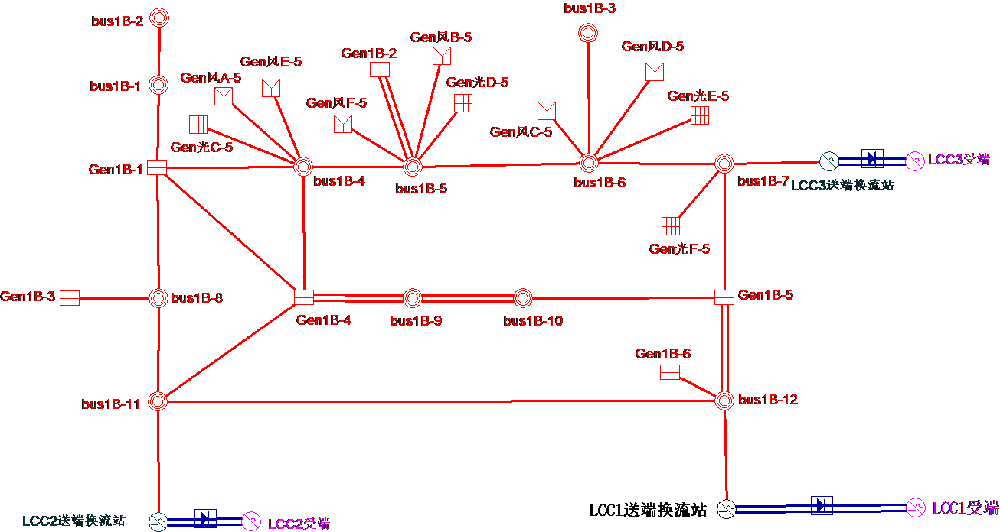
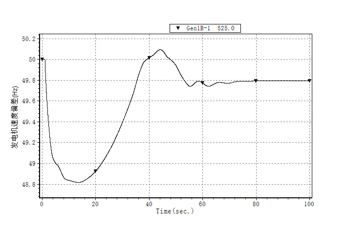
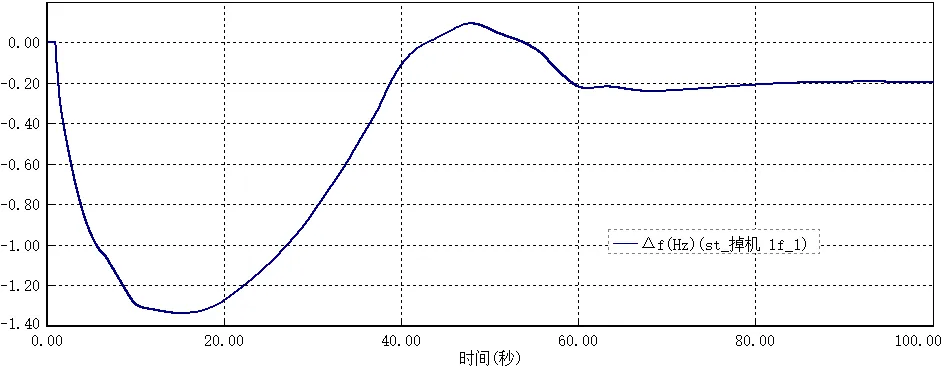
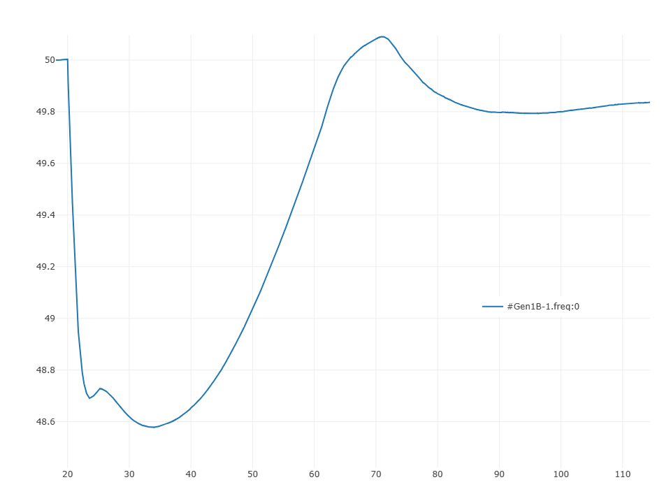

该算例对应中国电机工程学会 Github 发布算例中的 CSEE-LF-90 算例。

## 场景描述
新能源+常规电源经直流外送系统，发生掉机故障，功率缺额导致系统低频问题。

## 系统概况
根据某区域实际电网拓扑和数据，搭建如图所示的两区域交直流混联电网，所在区域编号为1B（此处区域为BPA中的分区名称）。输电网架共有102个节点（500kV主网架为42个节点），输电网架概况如表所示。系统内3条直流，LCC1直流送出功率80万千瓦，LCC2直流送出功率80万千瓦，LCC3直流送出功率80万千瓦。

| 电压等级/kV | 节点数目 |
|------------|---------|
| 500        | 42      |
| 347        | 6       |
| 325        | 6       |
| 110        | 12      |
| 35         | 12      |
| 1          | 12      |
| 0.7        | 6       |
| 0.4        | 6       |
| 合计       | 102     |

## 拓扑与线路概况
系统共有交流线路26条，变压器30台、直流回路1回，线路及变压器概况如下。

| 线路类型     | 数目  | >|备注                |
|-------------|-------|------|---------------|
| 交流线路     | 46条  | 500 kV|46条        |
| 两绕组变压器 | 24台  | 432MVA|12台         |
|      ^       |    ^   | 120 MVA|12台        |
| 三绕组变压器 | 12台  | 120 /120/120MVA|12台 |
| 直流线路     | 3回   | 额定电压/ kV |±800   |
|    ^         |   ^    | 额定功率/ MW| 2400   |

## 电源概况
水电机组总装机5350MW，均位于区域1B；风电、光伏2种新能源机组总装机2400MW，均位于区域1B；新能源机组装机占比接近31%。系统电源装机概况详见下表。

| 区域   | 接入母线   | 火电装机/MW | 水电装机/MW | 风电装机/MW       | 光伏装机/MW |
|-------|-----------|-------------|-------------|---------------|----------------| 
| 区域1B | Gen1B-1   | /           | 600         | /             | /              |
|    ^  | Gen1B-6   | /           | 600         | /             | /              |
|    ^  | Gen1B-5a  | /           | 600         | /             | /              |
|    ^  | Gen1B-5   | /           | 600         | /             | /              |
|    ^  | Gen1B-4   | /           | 600         | /             | /              |
|    ^  | Gen1B-3   | /           | 1150        | /             | /              |
|    ^  | Gen1B-2   | /           | 600         | /             | /              |
|    ^  | Gen1B-1a  | /           | 600         | /             | /              |
|    ^  | Gen风A-0  | /           | /           | 200           | /              |
|    ^  | Gen风F-0  | /           | /           | 200           | /              |
|    ^  | Gen风E-0  | /           | /           | 200           | /              |
|    ^  | Gen风D-0  | /           | /           | 200           | /              |
|    ^  | Gen风C-0  | /           | /           | 200           | /              |
|    ^  | Gen风B-0  | /           | /           | 200           | /              |
|    ^  | Gen光F-0  | /           | /           | /             | 200            |
|    ^  | Gen光E-0  | /           | /           | /             | 200            |
|    ^  | Gen光D-0  | /           | /           | /             | 200            |
|    ^  | Gen光C-0  | /           | /           | /             | 200            |
|    ^  | Gen光B-0  | /           | /           | /             | 200            |
|    ^  | Gen光A-0  | /           | /           | /             | 200            |
| 合计    | /         | /           | 5350        | 1200          | 1200           |

## 负荷概况
全网总负荷2601.9MW，均位于区域1B。系统负荷概况详见下表。

| 区域   | 接入母线   | 有功负荷/MW | 无功负荷/Mvar | 负荷类型 |
|-------|-----------|-------------|---------------|--------|
| 区域1B | bus1B-1   | 260         | 60            | 恒功率   |
|    ^   | bus1B-10  | 356         | 175           |    ^      |
|    ^   | bus1B-2   | 333         | 166.5         |    ^      |
|    ^   | bus1B-3   | 323.5       | 159           |    ^      |
|    ^   | bus1B-5   | 300         | 150           |    ^      |
|    ^   | bus1B-6   | 329.1       | 178           |    ^      |
|    ^   | bus1B-7   | 100         | 0             |    ^      |
|    ^   | bus1B-8   | 300         | 50            |    ^      |
|    ^   | bus1B-9   | 300.3       | 49.2          |    ^      |
| 合计    | /         | 2601.9      | 987.7         |          |

## 故障场景
系统发生掉机故障，损失功率35万千瓦。系统暂态频率最低低于49Hz，存在低频问题，CloudPSS算例中掉机故障发生于第20s。BPA、PSASP 以及 CloudPSS 中仿真结果如下所示。

