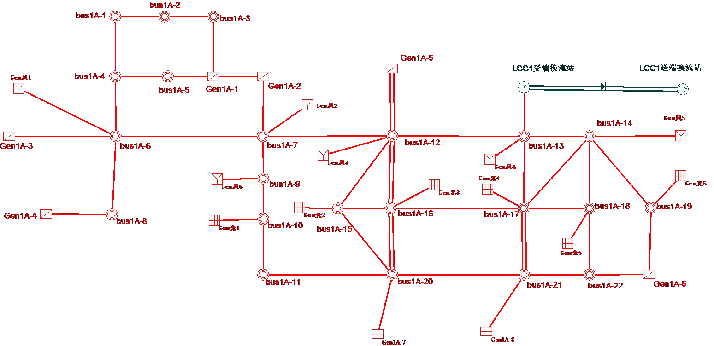
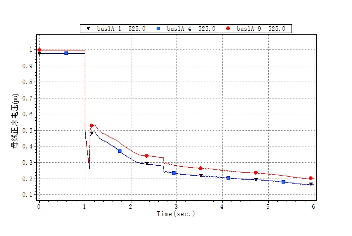
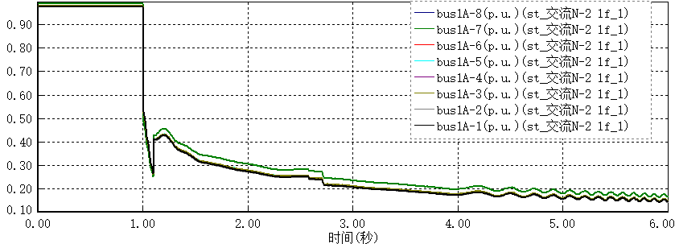
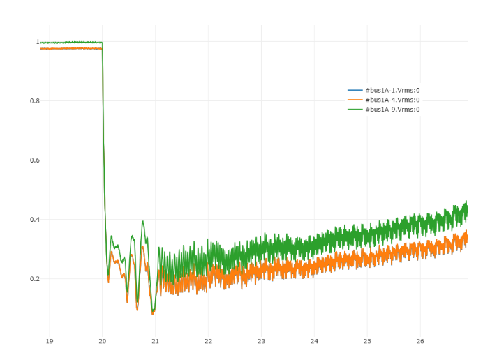

该算例对应中国电机工程学会 Github 发布算例中的 CSEE-VC-88 算例。

## 场景描述
含新能源的直流馈入系统，交流通道三永N-2，系统电压失稳。

## 系统概况
根据某区域实际电网拓扑和数据，搭建如图所示的两区域交直流混联电网，所在分区为区域1A（此处区域为BPA中的分区名称），输电网架共有100个节点（500kV主网架为48个节点），输电网架概况如表所示。系统内一回直流，直流受入功率为80万千瓦。

| 电压等级/kV | 节点数目 |
|------------|---------|
| 500        | 48      |
| 347        | 2       |
| 325        | 2       |
| 220        | 6       |
| 110        | 6       |
| 35         | 12      |
| 1          | 12      |
| 0.7        | 6       |
| 0.4        | 6       |
| 合计       | 100     |

## 拓扑与线路概况
系统共有交流线路61条，变压器28台、直流回路1回，线路及变压器概况如下。

| 线路类型     | 数目  | > |备注                      |
|-------------|-------|--------- |------------------|
| 交流线路     | 61条  | 500 kV |61条               |
| 两绕组变压器 | 16台  | 432 MVA |4台               |
|       ^      |  ^     | 236 MVA |6台               |
|          ^   |   ^    | 120 MVA |6台               |
| 三绕组变压器 | 12台  | 501/501/200 MVA |6台       |
|        ^     |  ^     | 120/120/120 MVA |6台       |
| 直流线路     | 1回   | 额定电压/ kV  |±800          |
|         ^    |    ^   | 额定功率/ MW | 800           |

## 电源概况
水电机组总装机5700MW，均位于区域1A；风电、光伏2种新能源机组总装机2400MW，均位于区域1A；新能源机组装机占比接近40%。系统电源装机概况详见下表。

| 区域   | 接入母线   | 火电装机/MW | 水电装机/MW | 风电装机/MW       | 光伏装机/MW |
|-------|-----------|-------------|-------------|---------------|----------------| 
| 区域1A | Gen1A-1   | /           | 300         | /             | /              |
|    ^   | Gen1A-2   | /           | 300         |       /       |       /         |
|    ^   | Gen1A-3   | /           |600          |       /     |      /         |
|    ^   | Gen1A-4   | /           | 600         |        /      |       /         |
|    ^   | Gen1A-5   | /           | 300         | /             | /              |
|    ^   | Gen1A-6   | /           | 600         | /             | /              |
|    ^   | Gen1A-7   | /           | 600         | /             | /              |
|    ^   | Gen1A-8   | /           | 600         | /             | /              |
|    ^   | Gen1A-17  | /           | 600         | /             | /              |
|    ^   | Gen1A-19  | /           | 600         | /             | /              |
|    ^   | Gen1A-10  | /           | 600         | /             | /              |
|    ^   | Gen风1    | /           | /           | 200           | /              |
|    ^   | Gen风2    | /           | /           | 200           | /              |
|    ^   | Gen风3    | /           | /           | 200           | /              |
|    ^   | Gen风4    | /           | /           | 200           | /              |
|    ^   | Gen风5    | /           | /           | 200           | /              |
|    ^   | Gen风6    | /           | /           | 200           | /              |
|    ^   | Gen光1    | /           | /           | /             | 200            |
|    ^   | Gen光2    | /           | /           | /             | 200            |
|    ^   | Gen光3    | /           | /           | /             | 200            |
|    ^   | Gen光4    | /           | /           | /             | 200            |
|    ^   | Gen光5    | /           | /           | /             | 200            |
|    ^   | Gen光6    | /           | /           | /             | 200            |
| 合计    | /         | /           | 5700        | 1200          | 1200           |

## 负荷概况
全网总负荷6451.6MW，均位于区域1A。系统负荷概况详见下表。

| 区域   | 接入母线   | 有功负荷/MW | 无功负荷/Mvar | 负荷类型 |
|-------|-----------|-------------|---------------|--------|
| 区域1A | bus1A-1   | 75          | 50            | 恒功率   |
|   ^   | bus1A-10  | 169.2       | 71.6          |     ^    |
|   ^   | bus1A-11  | 235         | 108           |     ^    |
|   ^   | bus1A-12  | 400         | 100           |     ^    |
|   ^   | bus1A-13  | 526         | 132           |     ^    |
|   ^   | bus1A-14  | 500         | 200           |     ^    |
|   ^   | bus1A-15  | 350         | 150           |     ^    |
|   ^   | bus1A-16  | 527         | 120           |     ^    |
|   ^   | bus1A-17  | 355         | 124           |     ^    |
|   ^   | bus1A-18  | 299.9       | 95.7          |     ^    |
|   ^   | bus1A-19  | 400         | 150           |     ^    |
|   ^   | bus1A-2   | 70          | 35            |     ^    |
|   ^   | bus1A-20  | 380.8       | 187           |     ^    |
|   ^   | bus1A-21  | 357.9       | 117           |     ^    |
|   ^   | bus1A-22  | 336         | 186           |     ^    |
|   ^   | bus1A-3   | 40          | 20            |     ^    |
|   ^   | bus1A-4   | 200         | 100           |     ^    |
|   ^   | bus1A-5   | 35          | 15            |     ^    |
|   ^   | bus1A-7   | 473.6       | 99.8          |     ^    |
|   ^   | bus1A-8   | 366         | 120.6         |     ^    |
|   ^   | bus1A-9   | 355.2       | 68.2          |     ^    |
| 合计    | /         | 6451.6      | 2249.9        |          |

## 未启用机组
在中国电机工程学会已发布算例的运行方式下，拓扑图中部分机组未启用，未启用机组情况如下。

| 区域   | 未启用机组                               | 未启用负荷 |
|-------|-----------------------------------------|----------|
| 区域1A | Gen1A-1、Gen1A-2、Gen1A-3、Gen1A-4     | -        |

## 故障场景
交流线路bus1A-17~bus1A-21发生三永N-2故障后，系统电压崩溃。BPA、PSASP 以及 CloudPSS 中仿真结果如下所示。

