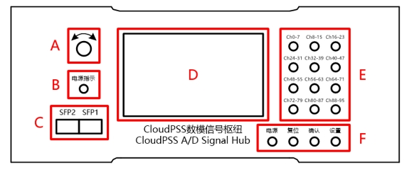
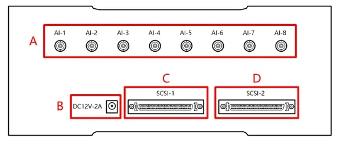
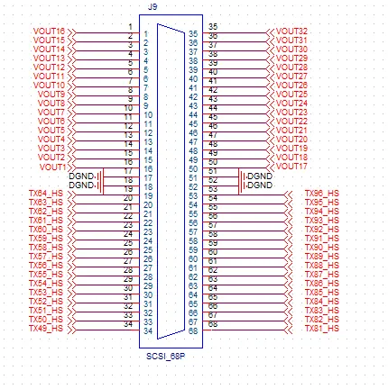

### 前面板接口

  

- A：功能旋钮   

- B：电源指示灯，开机后常量  
- C：SFP 光口，插入光模块，实现与计算服务器的通信  
- D：交互屏幕，显示系统状态、发送帧、超时帧、发送间隔、通道个数、数字量输入/输出方向等  
- E：数字键盘，可输入数字等设置值，也可快速切换对应通道的数字量输入/输出方向
- F：功能按键。**电源**短按开机，长按关机；**复位**短按清零超时帧，长按复位所有设置；**确认**下发选中的设置指令；**设置**切换状态和设置页面

### 后面板接口

  

- A：模拟量输入接口，8路模拟量输入，BNC接口，量程±5V  

- B：电源输入口，12V，2A  
- C：SCSI 接口 1，包含 64 路数字量输入/输出，数字量高电平 +5V
- D：SCSI 接口 2，包含 32 路模拟量输出，量程 ±10V；32 路数字量输入/输出，高电平 +5V  

#### SCSI 接口引脚定义

  

- Pin 1-2 ：+5V  
  
- Pin 33-34：GND
- Pin 3-32，35-68：共 64 路数字量输入/输出  

数字量通道对应的 Channel ID 见 [使用说明](../40-user-instructions/index.md) 中的软件模块。  

  

- Pin 17-18：GND
  
- Pin 51-52：GND
- Pin 1-16，35-50：共 32 路模拟量输出  
- Pin 19-34，53-68：共 32 路数字量输入/输出  

数字量通道对应的 Channel ID 见 [使用说明](../40-user-instructions/index.md) 中的软件模块。