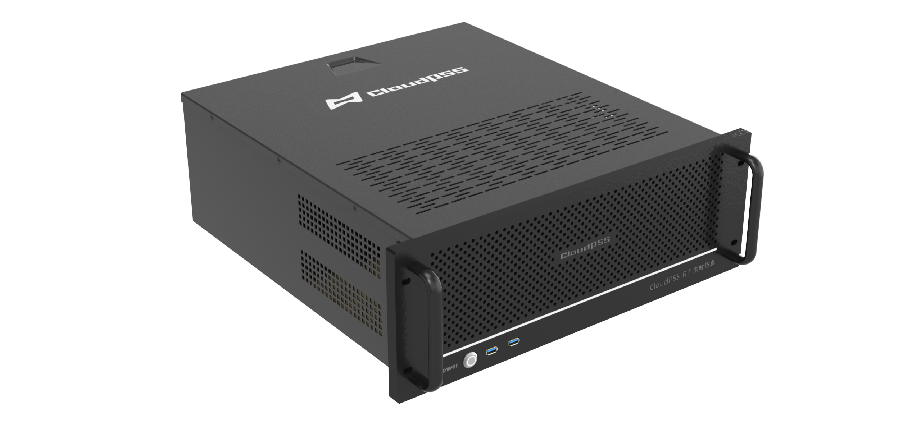

 

CloudPSS Pro (RT) 是搭载 CloudPSS 电力系统电磁暂态云仿真平台的高性能软硬件一体仿真机，相较于 CloudPSS Mini (RT)，它拥有更强大的计算性能、更大的仿真规模。 

CloudPSS (RT) 采用完全自主知识产权、国际领先的电磁暂态仿真技术，提供集离线仿真加速、大/小步长实时仿真、硬件在环、功率在环在内的一体化仿真功能。单台仿真器不仅可支持数千节点系统的实时仿真，也可对含数十万电气节点、百万控制节点的新型电力系统进行高效仿真加速。此外，仿真软件支持多种处理器架构，提供软硬件全国产化配置方案，供应链安全，无断供风险，是实时仿真器 RTDS、RTLAB、HYPERSIM 的“国产化替代最佳方案”。

import DocCardList from '@theme/DocCardList';

<DocCardList />

