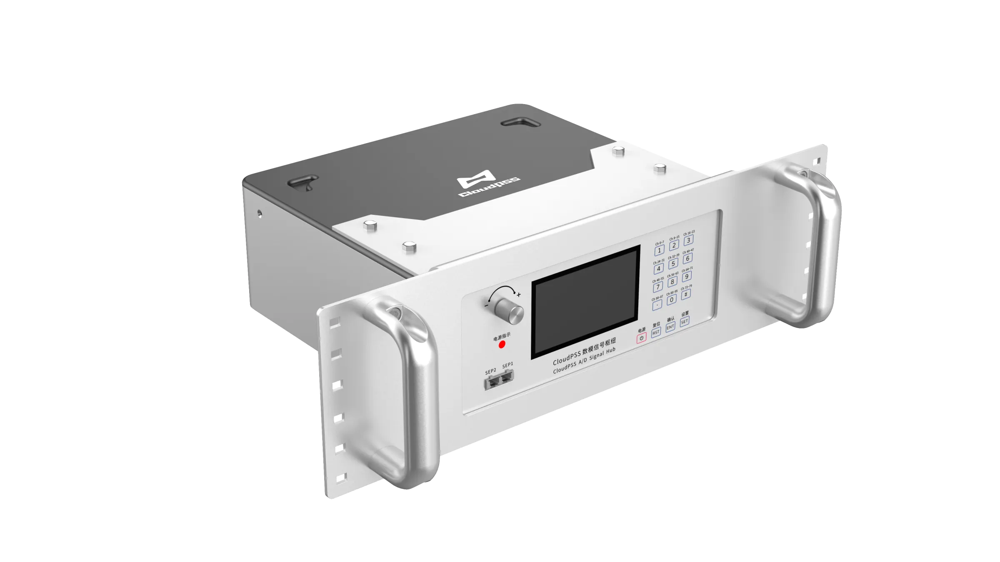

  
  
CloudPSS I/O 信号枢纽（CloudPSS I/O Signal Hub）是一款机柜式多功能数模 I/O 信号处理设备，具备高速率数模转换功能，可作为 CloudPSS-RT 实时仿真器的模拟量、数字量输入/输出的扩展接口，实现 CloudPSS 仿真模型与外部控制器、信号发生器或示波器的实时信号交互。

CloudPSS I/O Signal Hub 可应用于外部信号实时输入、仿真波形实时输出、控制器硬件在环等多种场景，与 CloudPSS-RT 实时仿真器配合使用可满足用户的快速原型控制、硬件在环系统测试等多种需求。 

- 具备 2 个 SFP 光口，通过光纤和定制通信协议与 CloudPSS-RT 通信，兼具稳定性与高效性。 

- 单机支持 8 路模拟量输入，32 路模拟量输出和 96 路数字量输入/输出，支持多机扩展，满足绝大部分硬件在环测试需求。  

- 拥有屏幕及按钮式交互面板，可实时监控运行状态、设置和下发功能指令。  

import DocCardList from '@theme/DocCardList';

<DocCardList />