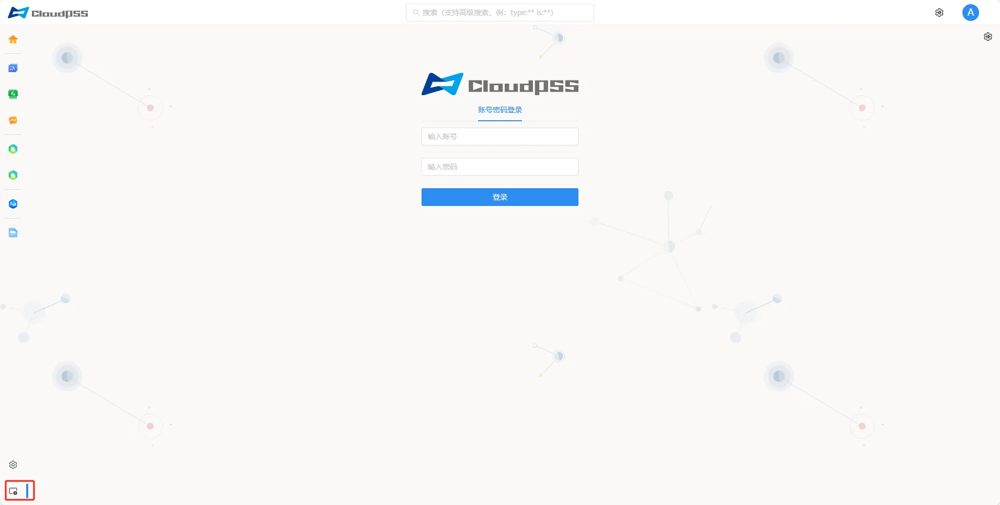

有以下几种方式均可以访问 **CloudPSS Server Manager** 服务。 

- 进入 **CloudPSS** 个人中心，然后选择页面左下角的**系统管理**图标。

- 直接在浏览器地址栏输入服务器的 IP 地址加上 `/admin`，例如 `http://10.101.10.45/admin`，即可进入 **Server Manager**，未登录状态下页面会自动重定向到 `http://10.101.10.45:8080/admin/login`，然后输入系统管理员账号和密码登录系统。 

- 在浏览器地址栏输入服务器的 IP 地址，例如 `http://10.101.10.45`，并在地址后面加上端口号 `8080`，未登录状态下页面会自动重定向到 `http://10.101.10.45:8080/admin/login`，然后输入系统管理员账号和密码登录系统。

:::tip 登录提示
用户可自行修改系统管理员密码。参见 [用户管理](../../../software/50-user-center/50-system-administrator-settings/10-user-management/index.md) 或者 [重置密码（私有部署）](../../../software/50-user-center/10-register-and-login/20-cloudpss-private/index.md)页面
:::

> 为保证最佳显示效果，建议使用 **Chrome** 浏览器。