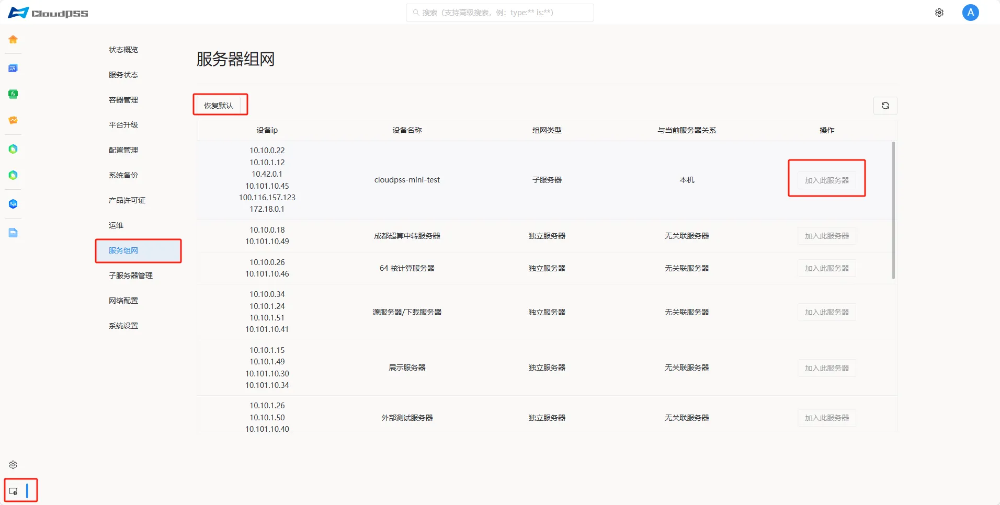

**服务器组网**页面会默认发现当前局域网内全部 **CloudPSS** 服务器并允许用户自行组网。页面显示如下：

+ **设备ip**

+ **设备名称**

+ **组网类型**

+ **与当前服务器关系**

+ **操作：加入此服务器**

## 服务器组网关系介绍

设备的网络配置可以分为三种独立的状态：独立服务器、主服务器和子服务器。这些状态彼此排斥，意味着任一设备同时只能处于其中一种状态。

+ 当设备既不充当主服务器角色，也未作为子服务器时，它默认为独立服务器。

+ 若某设备链接至一个独立服务器，则该设备升级为子服务器，而原独立服务器则转变为主服务器。

+ 子服务器的特点是仅能关联到一个主服务器；相对的，主服务器可以管理多个子服务器。

+ 作为独立服务器的设备，通过简单地点击**加入此服务器**，便可以成为某独立服务器或主服务器下的子服务器。

+ 通过选择**恢复默认**，可以将任何子服务器设备还原为独立服务器状态，并自动通知其所属的主服务器，解除两者之间的连接。

+ 如果设备是主服务器，即使点击恢复默认也不会立即变回独立服务器，只有断开所有子服务器，主服务器才会变为独立服务器。