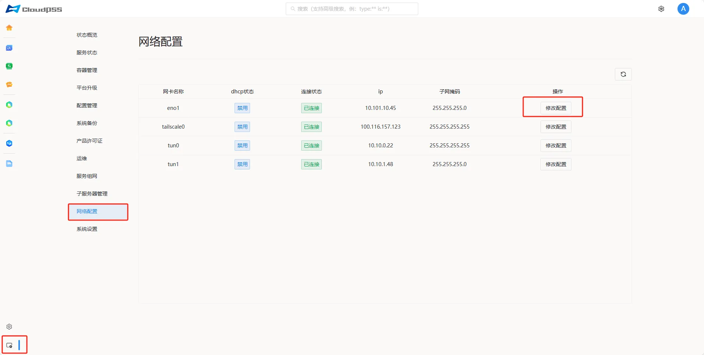
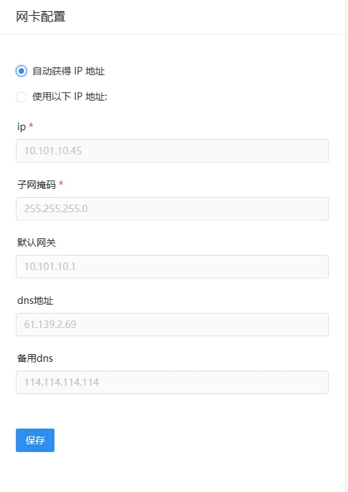
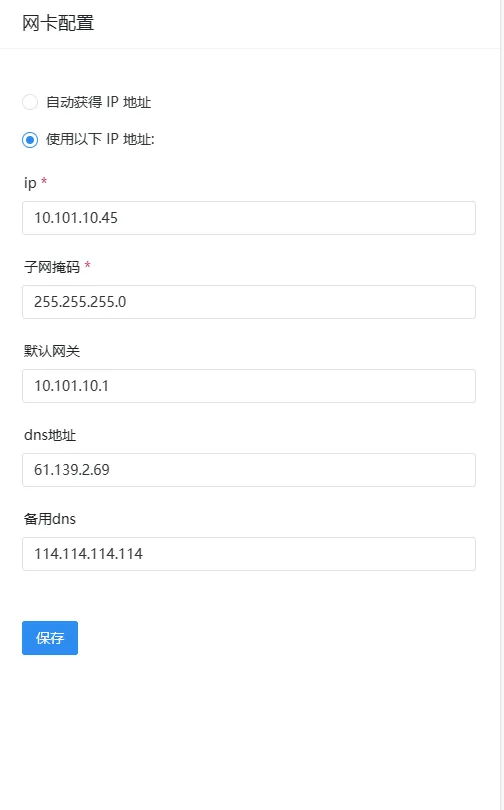
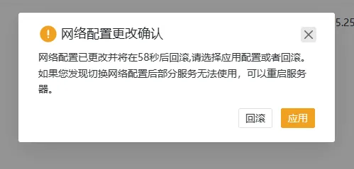

**网络配置**模块允许对设备的网络连接进行设置。页面如下：

> 该模块是基于 **NetworkManager** 开发，如果设备没有启用 **NetworkManager**（比如 Centos6，或者使用 networkd 的 Ubuntu）那么模块将无法使用。

+ **网卡名称**

+ **dhcp状态**

+ **连接状态**：**插头未插入**、**未自动连接**、**自动连接中**、**已连接**

+ **ip**

+ **子网掩码**

+ **操作：修改配置**

## 修改配置

按照以下步骤执行操作：

1. 点击**修改配置**按钮。

2. 在弹出的**网卡配置**页面中，选择**自动获得 IP 地址**或者**使用以下 IP 地址**。
   
3. 选择**自动获得 IP 地址**，各选项均不可编辑，单击**保存**。

4. 选择**使用以下 IP 地址**，需要手动进行网络设置包括 **ip 地址**，**子网掩码**，**默认网关**，**dns 地址**，修改完后单击**保存**。

> 网卡一般默认为自动网络获得ip地址

:::tip 网络配置
**网络配置**应用后，重新访问设备会自动弹出一个确认框，如果 60s 内不点击应用的话，设置会回滚（防止错误的网络配置导致设备无法访问）。如果点击回滚则会立即回滚配置（恢复默认网络配置）。
:::

