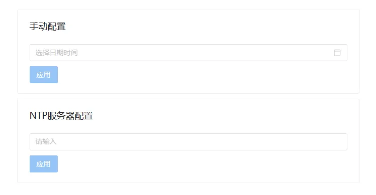

**系统设置**页面允许用户对设备进行**时间配置**、**重启**和**关机**操作。

## 时间设置

按照以下步骤执行操作：

1. 点击**时间设置**按钮。

2. 在手动配置栏选择日期和时间，点击**应用**，手动设置设备日期时间。

3. 或者在 **NTP 服务配置** 栏输入授时服务器地址，点击**应用**同步授时服务器时间。

## 常见问题

什么情况下需要重启设备？

:  **CloudPSS** 服务重要组件更新后需要重启设备