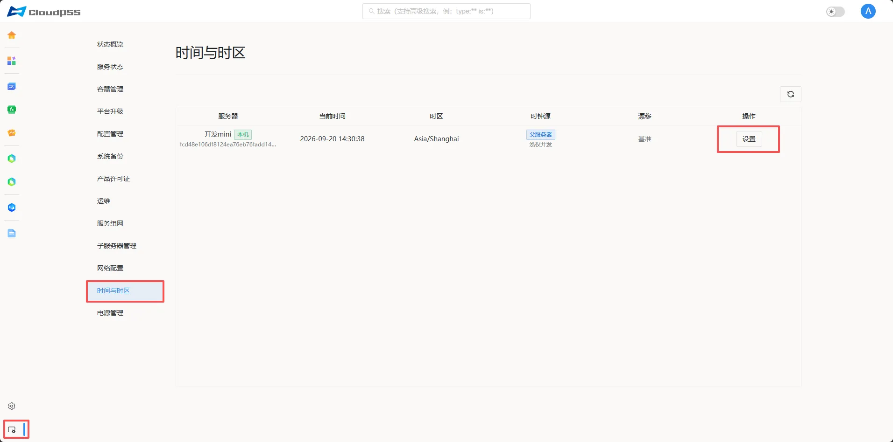
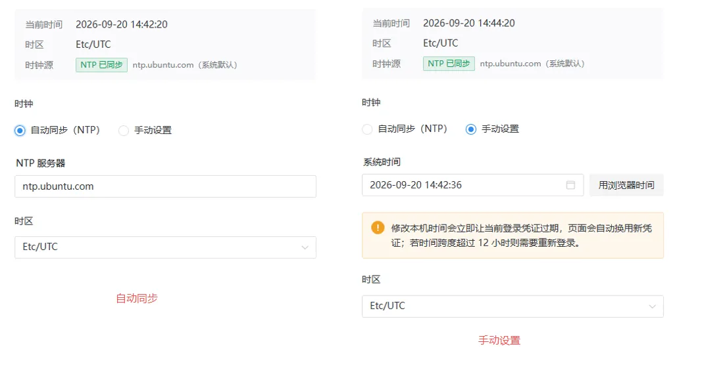
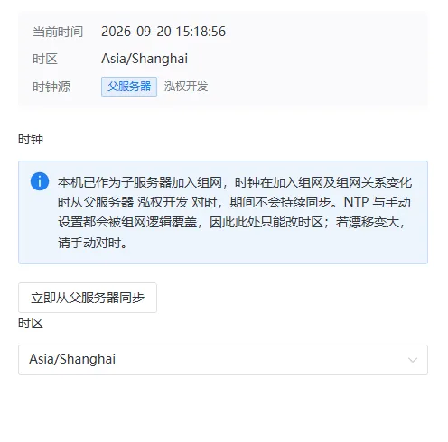

**时间与时区**页面允许用户对设备进行**时间与时区配置**操作，页面如下。

+ **服务器**

+ **当前时间**

+ **时区**

+ **时钟源**

+ **漂移**

+ **操作**：**时间与时区设置**

## 时间与时区设置

按照以下步骤执行操作：

1. 点击**设置**按钮。

2. 在时钟一栏选择**自动同步(NTP)**，输入授时服务器地址，选择时区，点击**保存**同步授时服务器时间

3. 或者在时钟一栏选择手动设置，设置日期和时间，选择时区，点击**保存**手动设置设备日期时间。

## 子服务器时间同步

本机若已作为子服务器加入组网，时钟在加入组网及组网关系变化时从父服务器对时，期间不会持续同步。NTP 与手动设置都会被组网逻辑覆盖，因此此处只能从父服务器同步与改时区；若漂移变大，请手动对时

