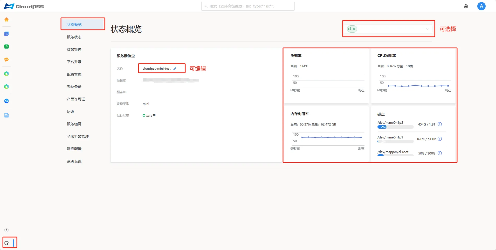

**状态概览**页面展示服务器设备的实时运行状况和基本信息，涵盖从设备出厂时的初始配置到当前的工作负载等系统关键数据。

服务器基本信息包括：

+ **名称**：可编辑，用于服务器组网中识别设备。

+ **设备 ID** 

+ **服务 ID**

+ **设备类型**

+ **运行状态**

页面动态显示当前服务器的**负载率**、**CPU 利用率**、**内存利用率**、**磁盘容量**如下图。

