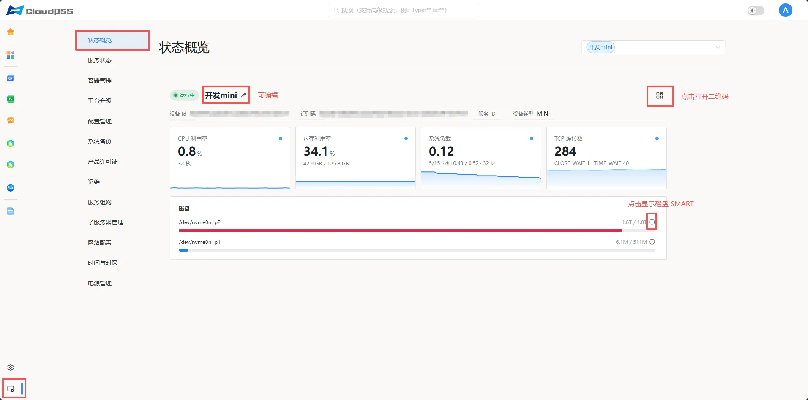
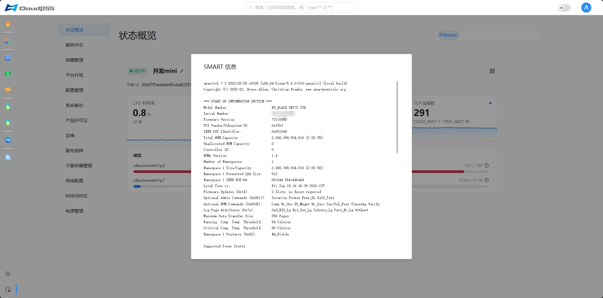

**状态概览**页面展示服务器设备的实时运行状况和基本信息，涵盖从设备出厂时的初始配置到当前的工作负载等系统关键数据。

:::tip 使用技巧
点击页面的二维码标签扫码显示该服务器的基本信息，方便用户运维服务器。
:::

服务器基本信息包括：

+ **名称**：可编辑，用于服务器组网中识别设备。

+ **设备 ID** 

+ **识别码** 

+ **服务 ID**

+ **设备类型**

+ **运行状态**

+ 动态显示当前服务器的**CPU 利用率**、**内存利用率**、**系统负载**、**TCP 连接数**。

+ **磁盘信息**：点击右侧图标，可以打开磁盘 **SMART 信息** 查看

