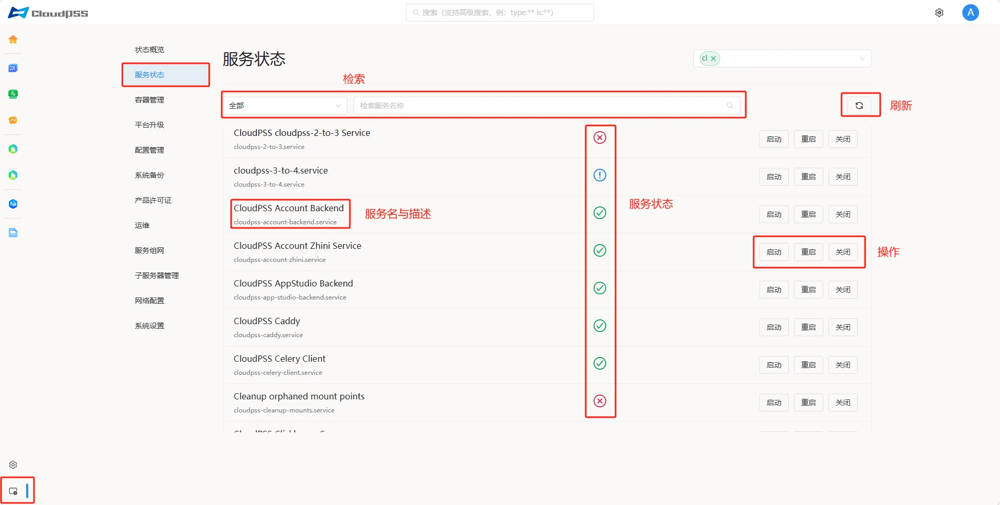
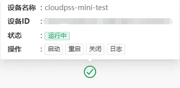
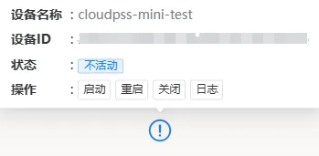
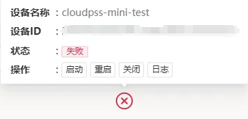
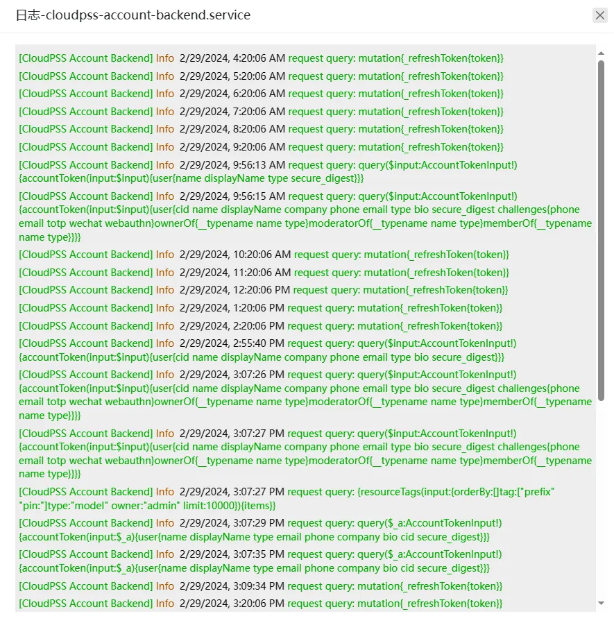

**服务状态**页面显示服务器上所有与 **CloudPSS** 相关的软件服务运行状态，允许对相应服务执行**启动**、**重启**和**关闭**操作。

页面从左到右依次显示如下：

+ **服务名**

+ **服务描述**

+ **状态**：**运行中**、**不活动**、**失败**、**启动中**

+ **操作**：**启动**、**重启**、**关闭**

## 查看日志

按照以下步骤执行操作：

1. 鼠标悬浮于状态图标显示当前服务的运行状态，从上到下依次显示：**设备名称**、**设备ID**、**状态**、**操作**（**启动**、**重启**、**关闭**、**日志**）。

2. 点击**日志**按钮，弹出日志界面。

> 日志界面会显示最近的 1000 条日志，按照时间正向顺序排列。