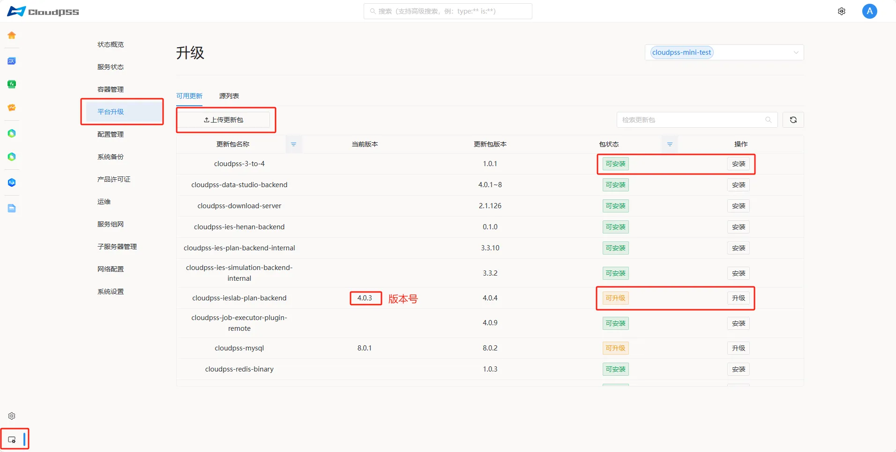
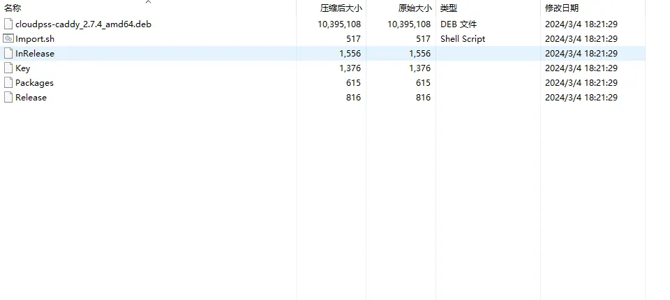
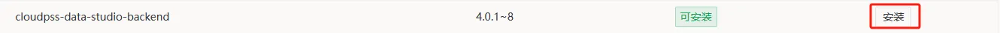
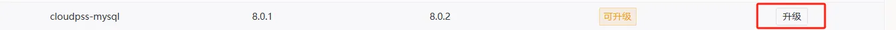

**平台升级**页面支持查看 **CloudPSS** 包版本，以及对包进行安装，升级。**平台升级**页面包括**可用更新**和**源列表**两部分组成。

## 可用更新

**可用更新**页面显示当前服务器的已安装的全部 **CloudPSS** 包软件，并支持上传更新包升级软件包版本。

页面结构如下：

+ **更新包名称**

+ **当前版本**： 如 1.0.0

+ **更新包版本**： 如 1.0.1

+ **包状态**：**可安装**、**可升级**、**已安装**三种包状态，默认显示**可安装**、**可升级**的软件包。
  
+ **操作：安装、升级**

### 上传更新包

> 注意：此功能上传的更新包为 [CloudPSS 产品管理平台](https://admin.local.cloudpss.net/) 下载的 tar 压缩包文件。

以 **CloudPSS Caddy** 为例，解压后的文件包含以下内容：

+ **cloudpss-caddy_2.7.4_amd64.deb**：deb 安装包

+ **Import.sh**

+ **InRelease**

+ **Key**

+ **Packages**

+ **Release**

将该 tar 包上传，等待一段时间，页面会自动刷新更新包的版本号。

### 安装更新包

在服务器拉取过源或者上传了安装包之后，如果当前设备未安装某软件包，操作列就会显示安装按钮，允许用户自行安装该软件包。

### 升级更新包

在服务器拉取过源或者上传了安装包之后，如果当前设备已安装某软件包但是版本落后于新的软件包，操作列就会显示升级按钮，允许用户自行升级该软件包。

