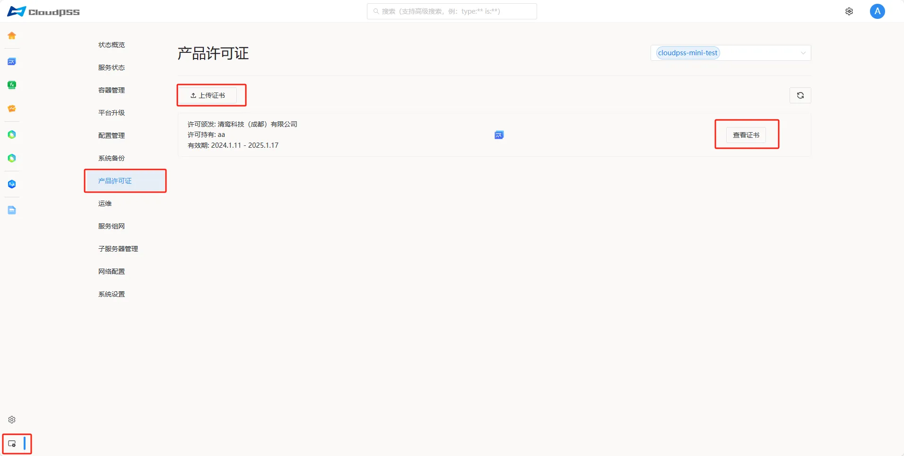
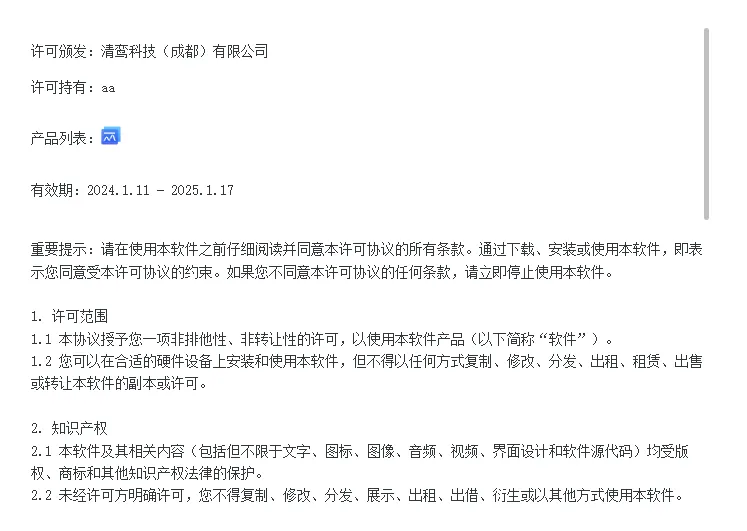

**产品许可证**页面展示从 **CloudPSS** 服务获取的全部产品许可，允许用户**上传**、**查看**证书。页面如下：

+ **许可颁发**

+ **许可持有**

+ **有效期**

## 查看证书

点击**查看证书**，弹出如下**证书**界面

:::tip 用户协议
使用本软件即代表用户同意证书界面的 [用户协议](../../../software/50-user-center/80-user-agreement/index.md)
:::

## 上传证书

点击**上传证书**按钮，上传的证书来自 [CloudPSS 产品管理平台](https://admin.local.cloudpss.net/) 签发的证书文件。