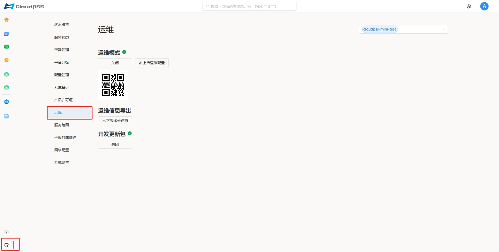

**运维**页面允许用户开启系统运维模式（默认关闭状态），运维模式开启后获得一个运维二维码，将这个二维码截图发给 **CloudPSS** 的工程师，他们就可以通过互联网连接机器进行远程维护。

## 启动运维模式

如果**运维**模式处于关闭状态，点击**启动**按钮。

:::info 异常提醒
如果运维模式无法打开，或者打开后没有二维码显示。请检查设备有没有互联网连接；如果网络连接状态正常，再检查设备的运维配置是否已经过期。
:::

## 上传运维配置

点击**上传运维配置**按钮，上传 **CloudPSS** 的运维 **vpn** 配置。

:::tip 联系我们
如果需要配置文件，请联系我们的运维人员。
:::

## 导出运维信息

点击**下载运维信息**按钮，导出当前服务器的设备信息压缩包，格式为 **zip**。

## 开发更新包

默认**启动**状态，关闭后无法安装签名为开发版（developing）的软件包。