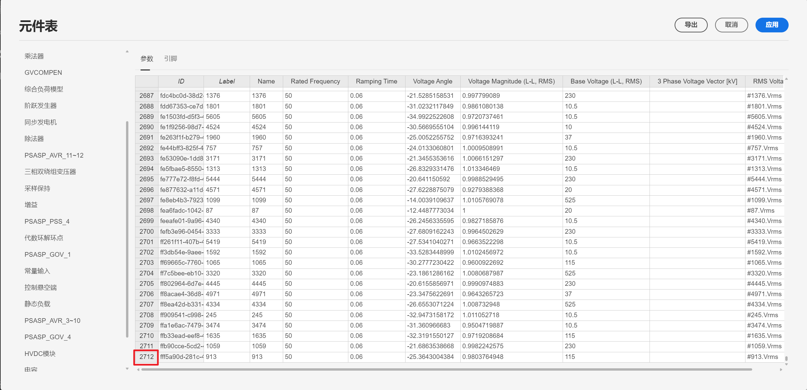
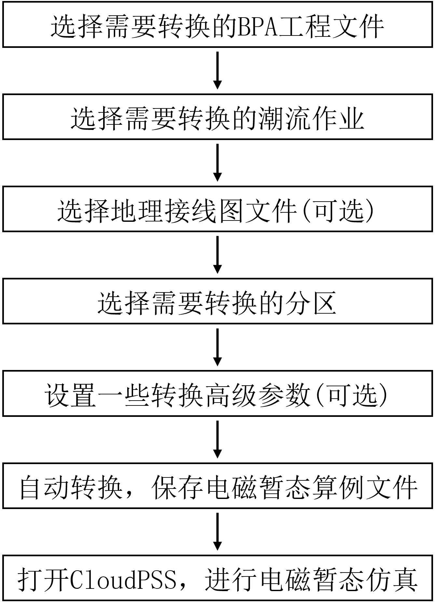
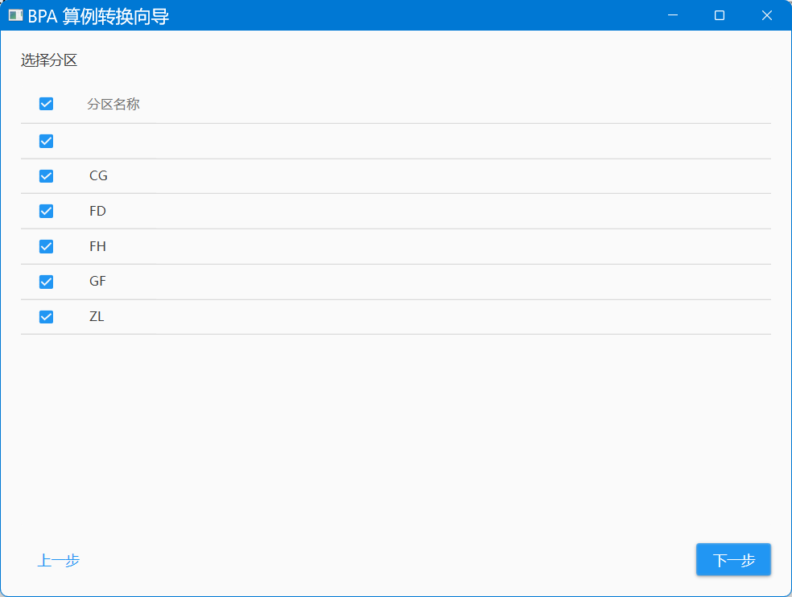
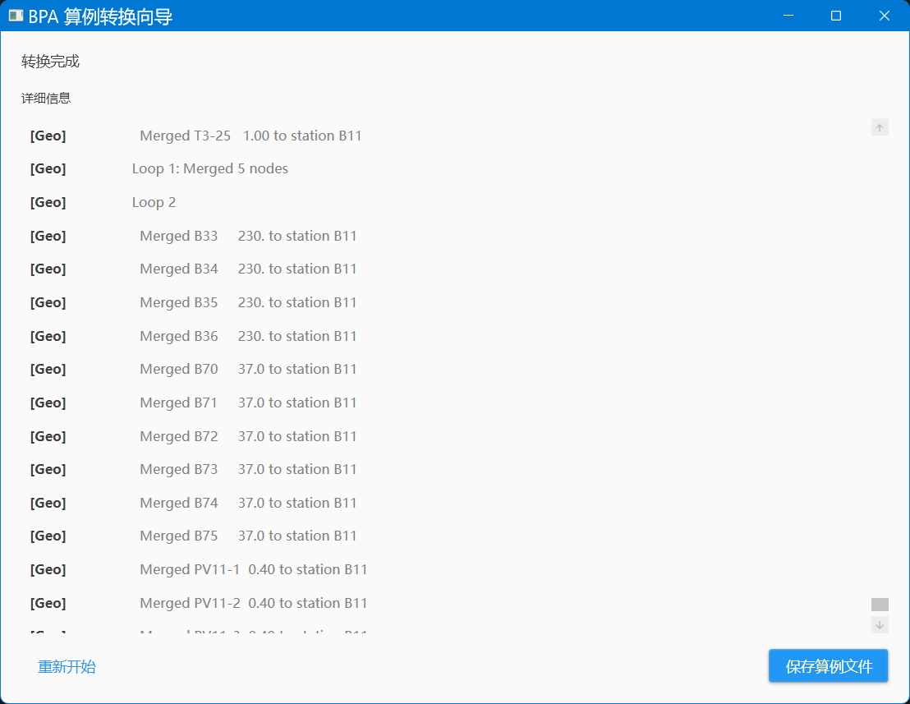
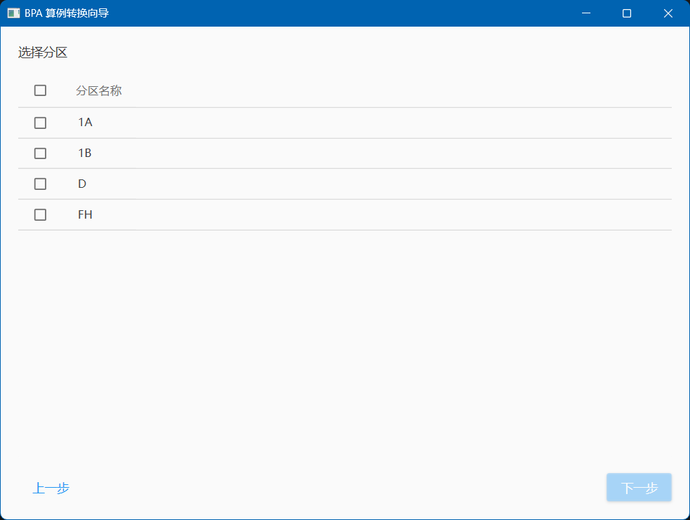

本文档介绍 BPA→CloudPSS 算例自动转换工具的功能特色与使用流程，并以 BPA 标准测试系统算例进行演示。

## 功能定义

CloudPSS 提供了 BPA→CloudPSS 算例自动转换工具，可基于中国电力科学研究院电力系统分析软件（BPA）的算例工程，快速构建大规模交直流电网的全电磁暂态仿真算例。

## 功能说明

### 算例转换工具特性

:::tip
**该算例转换工具具备四大重要特性：**

**1**：**模型丰富，覆盖 64 种交直流系统设备**

**2**：**基于潮流结果，快速初始化电磁暂态仿真**

**3**：**极速转换与高效仿真**

**4**：**基于地理信息图，自动布局场站**

:::

import Tabs from '@theme/Tabs';
import TabItem from '@theme/TabItem';

<Tabs>
<TabItem value="feature1" label="模型丰富">

针对 BPA 软件中的每一种设备模型， CloudPSS 均建立了一一对应的设备模型模板，并设计了参数转换及补全方法，实现了由潮流/机电暂态元件模型向全电磁暂态元件模型的映射。所建立的设备模板与 BPA 进行了详细对比，保证了稳态和暂态计算精度。
下图展示了 CloudPSS 同步发电机设备模板，包含了完整的电机、励磁、调速、 PSS 元件及连接关系。

目前， BPA→CloudPSS 算例转换工具已支持含同步发电机（包括励磁、调速和 PSS ）、负荷、传输线、变压器、串/并补、 SVC 、特高压直流输电系统，风机、光伏发电系统等 64 种设备元件的算例转换。

对于目前尚未支持的电气元件，CloudPSS 提供了电压源/负荷等效的方法，保证任意算例转换后的大规模电磁暂态算例均可稳定仿真。

</TabItem>
<TabItem value="feature2" label="基于潮流结果快速初始化">

为保证转换后的算例可直接从指定潮流断面启动，算例转换工具通过读取 BPA 潮流作业文件和潮流结果数据，将潮流信息直接写入电磁暂态仿真算例中。

转换后的算例首先须通过 CloudPSS 的**潮流计算**功能对 BPA 潮流结果进行调整，将变压器相移等因素考虑在内，生成适用于暂态仿真启动的潮流断面，进而可直接启动电磁暂态仿真，并迅速进入预定的潮流断面。

利用 CloudPSS 潮流计算功能校验后的潮流断面，其母线电压与 BPA 潮流结果完全一致。

借助 CloudPSS 平台提供的**基于“分解-协调”的交直流系统稳态启动**功能，可实现大规模交直流系统指定断面电磁暂态仿真的极速启动，针对包含 2712 条三相电压母线、6 回直流的的大规模交直流电网算例，采用 CloudPSS 仿真内核，仿真 10s 仅需 57s！

</TabItem>
<TabItem value="feature3" label="极速转换与高效仿真">

由于 BPA 软件提供了分区管理功能，在算例转换时，用户可灵活选择一个或多个电网分区，生成省级、区域级甚至全网级电磁暂态算例。区域外的系统将在区域边界被自动等效为电源、负荷或戴维南等值元件。下表列举了相同测试环境下不同规模电网在 CloudPSS 上的算例转换及仿真效率对比。

</TabItem>
<TabItem value="feature4" label="基于地理信息图自动布局场站">

若 BPA 算例工程提供了地理信息接线图文件，算例转换工具可根据地理信息图，按照场站信息对元件进行自动分组和布局，并将低压场站合并至相应高压母线的场站内，自动生成 CloudPSS 上的可视化算例。

</TabItem>
</Tabs>

### 算例转换流程
  
BPA-CloudPSS 算例转换流程如下图所示，包括了 **BPA 工程文件选择**、**分区选择**、**转换参数设置**、**算例上传**等步骤。

#### 选择算例、潮流任务与地理信息接线图文件

选择选择 BPA 算例、潮流任务与地理信息接线图文件。由于转换工具会根据 BPA 潮流结果文件进行转换，转换时请确保 dat 文件所在文件夹下存在 .bse 格式的潮流结果文件。若没有，则需要在 BPA 软件进行一次潮流计算生成 .bse 文件再进行转换。

#### 选择分区

由于 BPA 软件提供了分区管理功能，在算例转换时，用户可灵活选择一个或多个电网分区，生成省级、区域级甚至全网级电磁暂态算例。区域外的系统将在区域边界被自动等效为电源、负荷或戴维南等值元件。BPA 分区的具体含义可在 dat 文件中 NETWORK_DATA 处进行查看。

#### 设置转换参数

用户可选择**启动设置**、**交流线路转换设置**、**输出设置**等转换参数。**启动设置**可设置使用潮流初值进行启动，自动将初值写入电磁暂态仿真模型。**交流线路转换设置**可以限制阻抗参数过小交流线路的最小值，$X1$ 为负数的交流线将被转换为串补; $R1$、$X1$、$B1$ 均小于上述阈值的交流线将被转换为联络线。**输出设置**可以选择需要输出的信号类型。

#### 开始转换

开始转换后，程序会输出全部过程信息，方便用户调试可能出现的错误。

#### 算例上传与进行仿真

转换成功后，需要将所生成的成的 **cmdl 算例文件**上传到 CloudPSS 仿真平台进行潮流计算与电磁暂态仿真。

## 案例介绍

<Tabs>
<TabItem value="case2" label=" BPA 标准算例转换">

- **选择算例、潮流任务与地理信息接线图文件**

- **选择分区**

- **设置转换参数，选择输出信号类型**

- **转换过程**

- **算例上传**

- **潮流计算结果**

- **电磁暂态仿真结果**
 

</TabItem>
</Tabs>

## 常见问题 Q&A

软件无法运行，提示安装 XX.NET 框架。

:   
    按提示下载安装即可。

为什么进行转换时无法选择分区？

:   
    这是由于 dat 文件缺少指定网络数据的控制语句`/NETWORK_DATA\`，在 dat 文件控制语句处添加`/NETWORK_DATA\`后可正常识别分区。  

    

    

    

为什么我的 BPA 算例中有 12 个光伏场站模型（或其他元件模型），转换得到算例只有 6 个光伏场站模型（或其他元件模型）？

:   
    由于 BPA-CloudPSS 算例转换工具是基于潮流结果进行转换的，对于出力为 0 的设备将不会被转换。需要对 dat 文件进行修改，重跑潮流后进行转换。
  
    
  
    
  
    
  
    
  
BPA算例转换得到的算例报错：变压器参数为负。

:   
    这是由于 BPA 数据存在错误，可以在 BPA 的 dat 文件中搜索找到对应的变压器，修改参数后重新转换。也可以直接在 CloudPSS 平台上修改。
  
    
  
    
  
BPA 算例转换得到的算例报错：变压器引脚悬空。

:   
    这是由于 BPA 数据存在错误，需要在 BPA 的 dat 文件中搜索找到对应的变压器，添加对应的母线。
  
    
  
    
  
    
  
    
  
  
潮流计算不收敛时如何排查错误？

:   
    **1、根据潮流仿真报错信息检查相应的元件，常见的潮流仿真报错信息包括：**
    - 缺少 PV 节点或平衡节点，报错码为： `Buses xxx, and xxx are isolated, with neither a slack bus nor a PV bus found in this area.`
    - 母线间短路，报错码为：`xxx is a short circuit. Try eliminating it.`
    - 元件连接了非母线节点，报错码为：`Pin Pin - of xxx is connected to a non-bus node.`
    - 一条传输线连接了不同电压等级的母线，需要检查BPA数据准确性,报错码为:`The base voltage of XXX(525kV) and XXX(800kV) which are on ether side of xxx. does not match`.
      
    **2、通过潮流计算结果表格进行检查：**
    - Buses 表格的 $P_{res}$ 参数按正序或负序排序，如有大于 10 或小于 -10 的参数，检查连接该母线的同步发电机、三相交流电压源、静态负载、变压器等元件的容量、电压等参数是否设置合理。

    

    - Branches 表格的 $P_{loss}$ 参数按正序或负序排序，如有大于 50 或小于 -50 的参数，检查该元件的容量是否设置的太小。

    

电磁暂态仿真报错：`Thread 0: KLU Error: singularin block 145`

:   
    

    - 可能是由于新能源出力为 0 导致，修改后正常运行。  

    

    - 可能是由于直流线路电感参数为 0 导致，修改后正常运行。

    

电磁暂态仿真：启动电机后母线电压异常升高

:   
    一般是由于电机控制器部分上下限参数异常导致，一般**上限需要大于0，下限需要小于0**。  

    

电磁暂态仿真：仿真可以观察到电压（或是其他波形）异常，如何快速定位到参数异常的设备模型？

:   
    以光伏场站模型启动时间为例，可以通过修改设备启动时间，通过异常波形产生的时刻进行定位。  

    