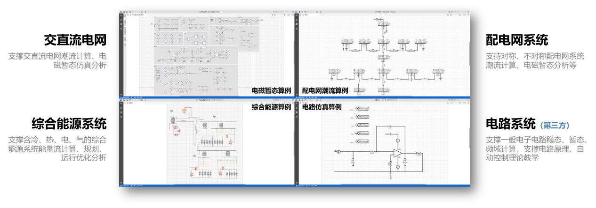
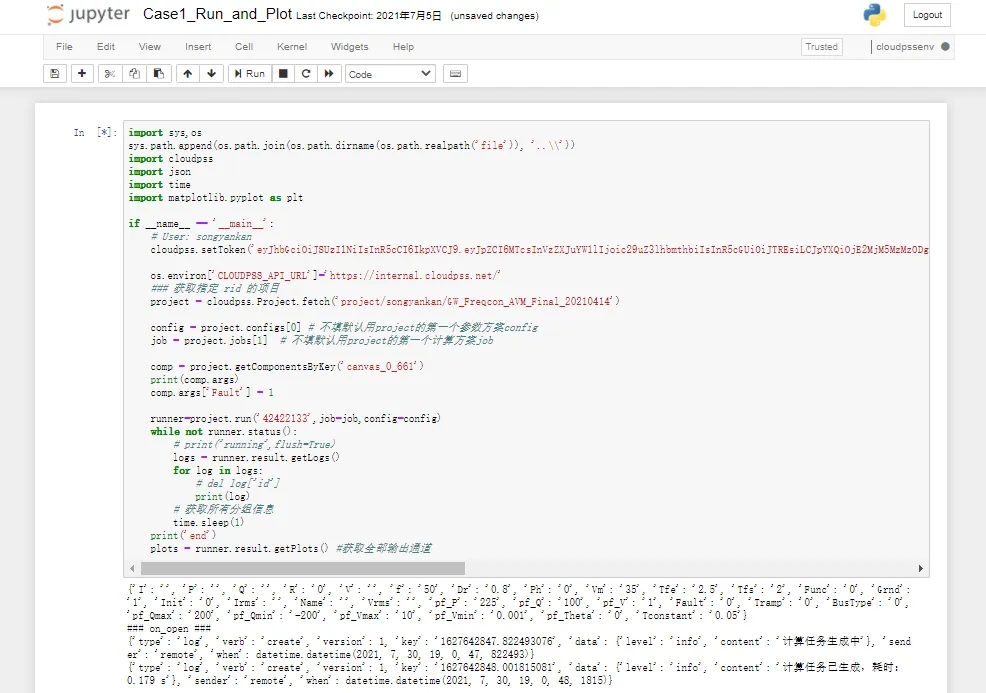
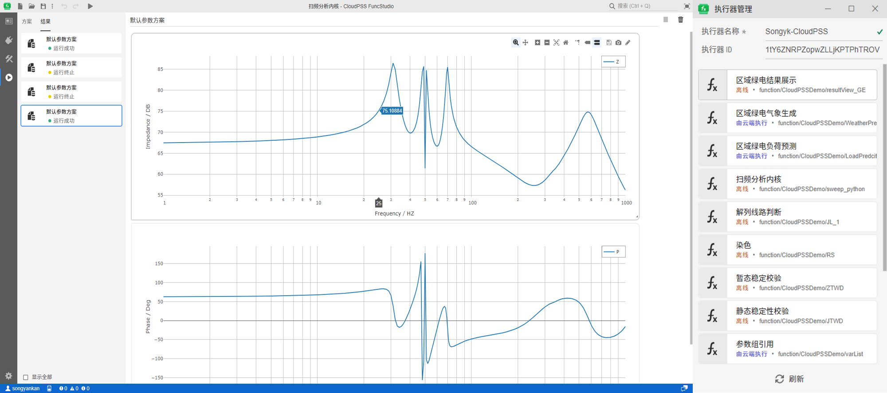
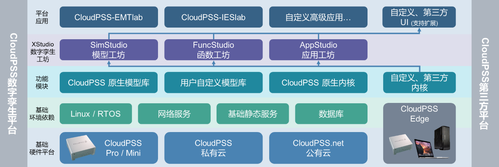
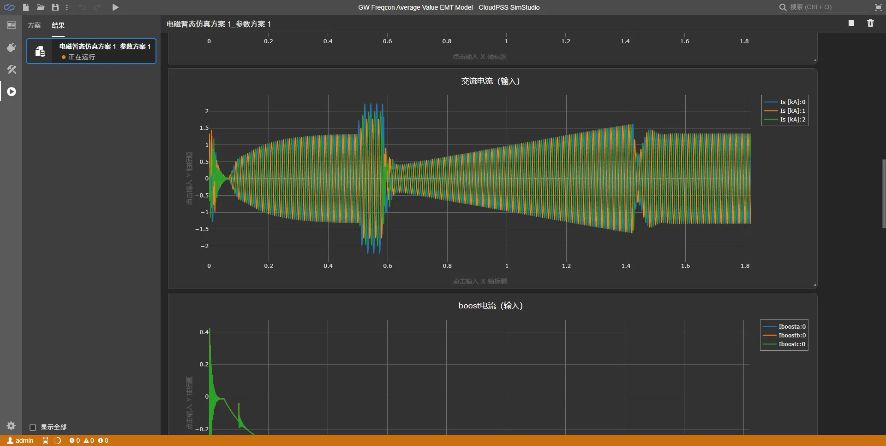
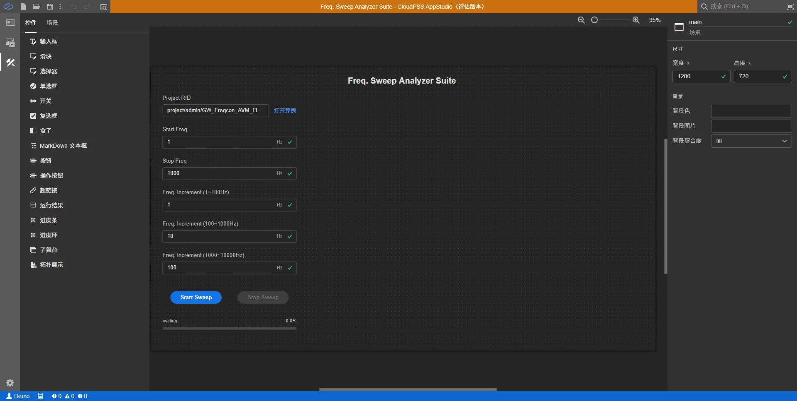
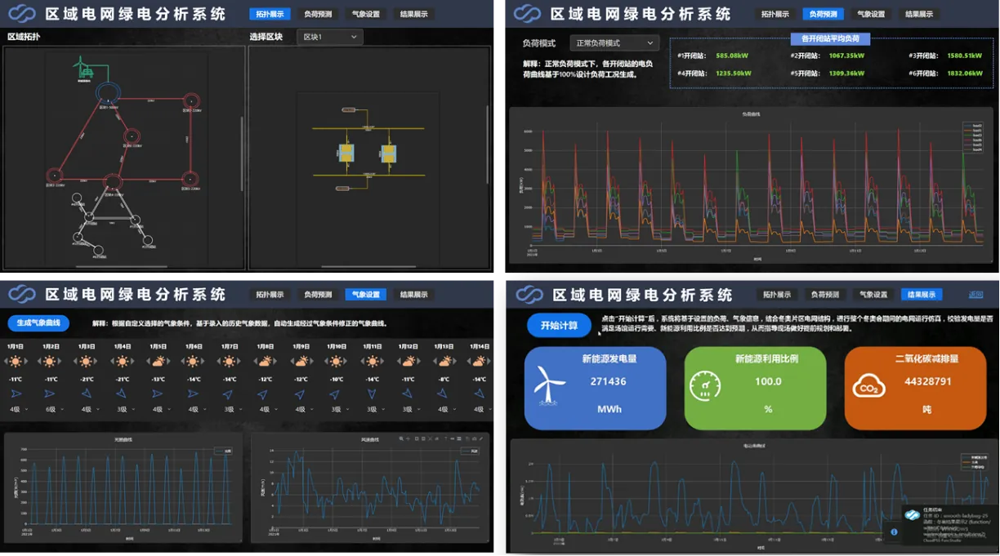

欢迎使用**CloudPSS XStudio 平台**。

## XStudio 介绍

XStudio 数字孪生工坊是一款覆盖能源电力系统**建模仿真**、**第三方内核集成**及**数字孪生应用构建**的基础支撑平台。XStudio 采用低代码、快捷应用构建的设计理念，具备跨平台、易部署的特性，可大大降低数字孪生应用的开发门槛。XStudio 包含三个套件，即

### SimStudio 模型工坊—构建、管理能源电力系统数字孪生仿真模型

SimStudio 采用了图形化、多级嵌套的建模方式，设计了统一参数系统和结构化的模型数据管理方法，方便模型的多样化管理。SimStudio 也内嵌了 CloudPSS 原生潮流计算、能量流计算、电磁暂态计算内核和模型库，为能源电力系统数字孪生应用赋予准确、高效的建模仿真能力。

同时，SimStudio 也提供了开放性接口及模型层、算法层和应用层的软件开发套件（Software Development Kit），支撑用户灵活构建自定义模型，为数字孪生应用中的第三方计算分析内核提供了强大的建模仿真工具。

### FuncStudio 函数工坊—灵活接入能源电力系统数字孪生计算内核

FuncStudio 采用了“函数化”的设计思路，将用户自定义内核或第三方内核以函数的形式快捷、灵活地接入 CloudPSS，为复杂数字孪生应用的构建提供了调试部署、业务管理及计算调度的功能。

如图所示，用户只需在本地计算机中安装 FuncStudio 执行器，建立函数、定义其输入和输出参数格式，指定好用户自定义内核的命令行执行语句，即可将自定义内核接入 FuncStudio 执行器。FuncStudio 也提供了跨平台、跨设备的支持，方便部署云边融合业务。当执行器联网在线时，用户可使用任意一台终端登录 CloudPSS，在网页版 FuncStudio 中远程调用该计算内核并查看计算结果。

### AppStudio 应用工坊—快捷构建能源电力系统数字孪生应用

AppStudio 采用了“所见即所得”的低代码开发方式，提供了丰富的交互式和数据可视化控件，方便用户通过图形化的方式快速构建数字孪生应用和数据可视化界面，助力数字孪生应用的多维度数据洞见。通过 SimStudio、FuncStudio 和 AppStudio 三平台交互，赋能强大的数字孪生应用生态。

## XStudio 云边融合应用体系

为方便快捷部署基于 XStudio 平台开发的数字孪生应用，CloudPSS 设计了面向云边融合部署的数字孪生应用体系。

如图所示，从功能上，数字孪生应用体系自底向上划分为基础硬件平台、基础环境依赖、功能模块、数字孪生工坊和平台应用 5 个部分：

+ 在底层硬件支撑层，CloudPSS 设计了专有计算设备，提供私有云和公有云部署等不同方案；
+ 基础环境依赖层包括 CloudPSS 数字孪生应用对操作系统、网络、数据库和静态服务的需求；
+ 功能模块层包含了 CloudPSS 原生模型库和原生计算内核，同时也包括了用户自定义或第三方内核；
+ 数字孪生工坊层提供了完整的 XStudio 工坊，为构建数字孪生应用提供了基础平台；
+ 平台应用层：在此层，用户可依赖平台中的全部资源构建复杂的数字孪生应用

从物理层面，数字孪生应用体系也可分为“云端”和“边端”两部分。其中，“云端”即集中部署的 CloudPSS 数字孪生平台，“边端”即在安装了 FuncStudio 的第三方物联网设备上部署的计算和分析内核。通过 CloudPSS SDK，海量边缘计算设备可直接接入 CloudPSS 网络，从而支持云边融合的数字孪生应用构建。

## XStudio 应用构建流程

使用 CloudPSS XStudio 平台构建一个完整的数字孪生应用，只需以下 4 个步骤。此处以风电机组数字孪生体的**在线扫频应用**为例，介绍数字孪生应用的构建流程。

1. 在 SimStudio 模型工坊中中构建能源电力系统模型
   
    若所构建的数字孪生应用依赖物理模型，则首先在 SimStudio 中创建相应的能源电力系统模型。在本案例中，首先应在 SimStudio 中构建**风电机组的电磁暂态仿真模型**，并配置好适用于端口频率扫描的仿真参数和监控通道，将模型仿真调试通过后备用。

    

    

2. 编写算法内核，并接入 FuncStudio 函数工坊

    1. 借助 SimStudio SDK，构建扫频分析内核 sweep.py，即：获取实测数据对风机仿真模型进行初始化
    2. 通过多次调用仿真内核实现不同注入频率的端口阻抗计算，形成端口阻抗曲线
    3. 在部署环境安装 FuncStudio 本地执行器，将编写好的扫频分析内核接入 FuncStudio，配置好执行环境和执行命令、输入和输出数据格式
    4. 在 FuncStudio 中将上述内核调试通过
    
    

    

    

3. 在 AppStudio 中设计 UI 和可视化面板，绑定函数与数据
   
    1. 在 AppStudio 中设计扫频分析 APP 的用户交互面板和数据可视化面板
    2. 将 FuncStudio 中 sweep 函数的输入输出数据与 AppStudio 交互面板上的控件数据和事件绑定
   
    

    

4. 调试、运行及发布

    借助 AppStudio 的预览功能，对所构建的应用界面、数据绑定关系和数据可视化效果进行调试；待调试通过，即可发布至 CloudPSS 数字孪生平台中。

    若在私有环境中部署，则用户可在浏览器中输入 IP 地址即可访问所发布的应用；

    若在公有云（cloudpss.net）中部署，CloudPSS 会为每个公开应用分配独立的域名。

    本案例中所构建的示例案例现已发布至公网平台，用户可访问 [风电机组数字孪生体在线扫频应用](https://freqsweepanalyzer.pub.cloudpss.net/) 链接查看。

    

<!-- ## XStudio 典型案例

介绍使用 XStudio 平台构建的**绿电分析系统**和**解列计算系统**两个分别面向电力系统和综合能源系统的数字孪生应用。

import Tabs from '@theme/Tabs';
import TabItem from '@theme/TabItem';

<Tabs>
<TabItem value="js" label="解列计算系统">

基于 CloudPSS XStudio、潮流计算内核和电磁暂态仿真内核制作的 [电网解列计算系统](https://systemsplitting.pub.cloudpss.net/)，用于生成安全、稳定的解列策略，并加以验证。解列计算系统包含以下 3 项功能：

1. 参数输入
   
    用于录入解列计算的对象和参数，即相关算例在 SimStudio 的工程名和解列算法参数。

2. 功能集合
   
    1. 解列策略生成

    基于贪心算法计算解列线路，生成解列策略；同时在 SimStudio 拓扑图上通过染色方式展示贪心算法解列过程。

    2. 静态稳定校验

    对解列后的各孤岛进行潮流计算；展示解列前后静态工作点节点电压的变化；最后展示解列前后静态工作点发电机功率的变化。

    3. 暂态稳定校验

    对系统解列瞬间进行电磁暂态仿真；展示解列前后发电机机端电压变化；最后展示解列前后发电机转子转速变化。

3. 结果汇总

    展示解列计算系统的输出结果，包括开断线路表、多馈入短路比表、孤岛功率情况表和平衡节点信息表。

    

</TabItem>
<TabItem value="py" label="绿电分析系统">

借助数字孪生工坊套件，我们快速构建了面向综合能源系统的数字孪生应用——[XX 园区绿电分析系统](https://greenenergy.pub.cloudpss.net/)。

园区绿电分析系统基于 SimStudio 能量流计算内核和气象预测数据，分析某区域电网在一段时间内的发电及负荷利用情况。该系统主要包含 1 个 500kV 和 5 个 220kV 变电站，在其中 1 处 220kV 变电站下挂接了 6 处 10kV 开闭站及其负荷，另外 4 处 220kV 变电站下都接入了新能源电厂，主要新能源设备包括风机和光伏。现需通过仿真计算分析在未来 2 周内系统的负荷情况、气象条件以及新能源的发电利用情况。该系统主要包含**拓扑展示**、**负荷预测**、**气象设置**和**结果展示**4 个模块。

1. 拓扑展示模块
   
    拓扑展示模块的左半部分主要用于显示在 SimStudio 中构建的系统数字孪生模型整体拓扑。在这里可以清晰看到系统结构和各区块间的连接关系，而模块的右半部分主要用于显示各区块内部的详细拓扑，在这里可以查看每个区块内的新能源电厂内部的风机、光伏以及相互之间的连接方式。

2. 负荷预测模块
   
    负荷预测模块包含一个函数（LoadPrediction），可以对不同负荷工况模式下区块 4 所挂接负荷的负荷曲线以及平均负荷进行预测，主要的负荷工况模式包括低负荷、正常负荷以及高负荷三种模式。

3. 气象设置模块
   
    在气象设置模块包含 3 个函数（sunVarList，windVarList 和 WeatherPrediction），可对未来 2 周内每天的气象数据进行设置，从而预设每天的平均温度以及光照和风速曲线，其中可设置的气象参数包括天气条件（晴、多云、雨、雪）和风速等级。该部分数据也可通过接入气象预测数据自动配置。

4. 结果展示模块
   
    结果展示模块包含 1 个函数（ResultView），其读取前面所设置的负荷以及气象条件，基于 SimStudio 能量流计算内核，对未来 2 周的系统运行情况进行仿真，并利用仿真结果计算新能源发电量、新能源利用率以及二氧化碳减排量等关键指标

    

</TabItem>
</Tabs> -->